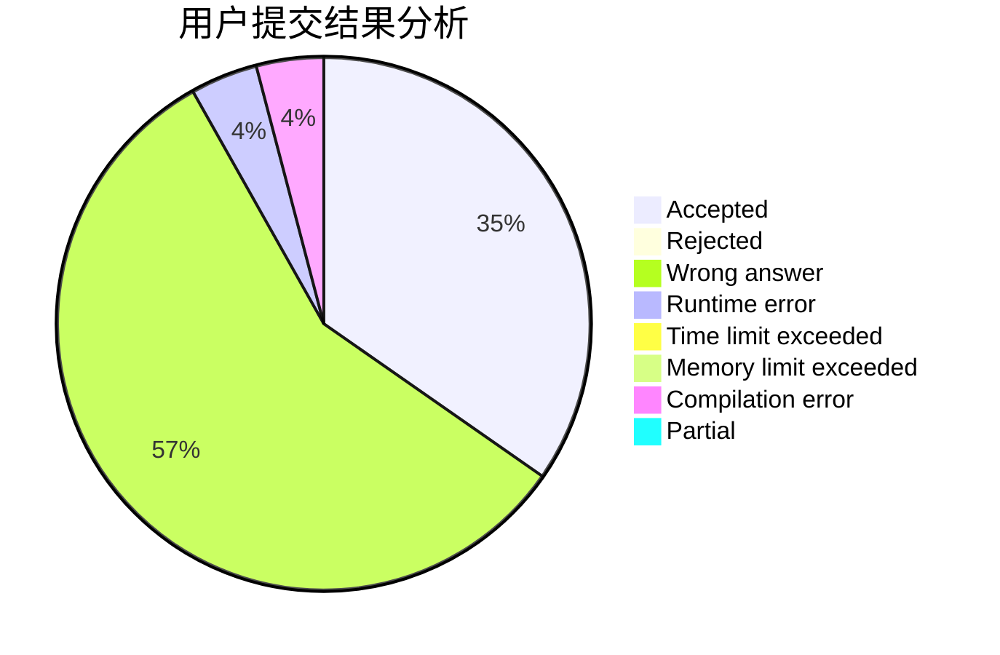
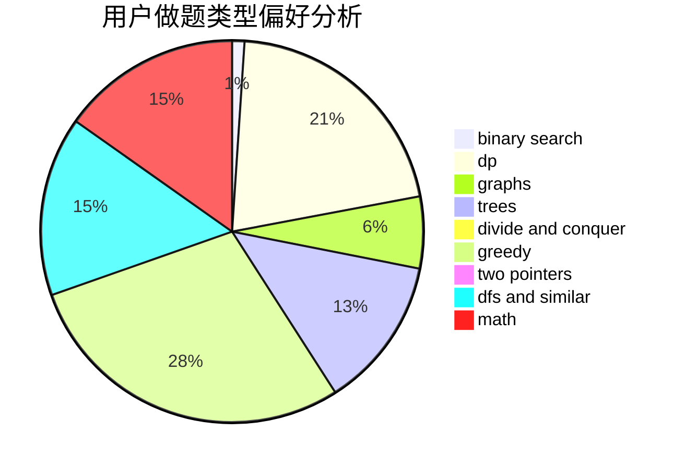

# Yz_zny

<!-- tabs:start -->

#### **用户提交结果分析**

#### **用户做题类型偏好分析**

<!-- tabs:end -->
# 推荐题目
[766E](https://codeforces.com/contest/766/problem/E)
[1310C](https://codeforces.com/contest/1310/problem/C)
[998D](https://codeforces.com/contest/998/problem/D)
[856E](https://codeforces.com/contest/856/problem/E)
[431D](https://codeforces.com/contest/431/problem/D)
[297C](https://codeforces.com/contest/297/problem/C)
[542F](https://codeforces.com/contest/542/problem/F)
[879C](https://codeforces.com/contest/879/problem/C)
[1276A](https://codeforces.com/contest/1276/problem/A)
[148A](https://codeforces.com/contest/148/problem/A)
