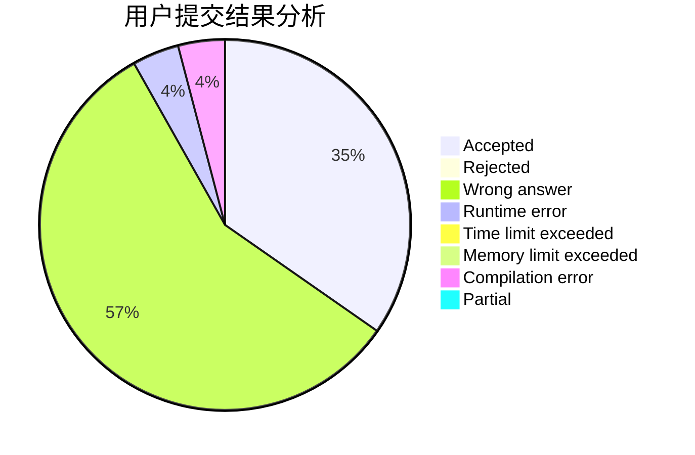
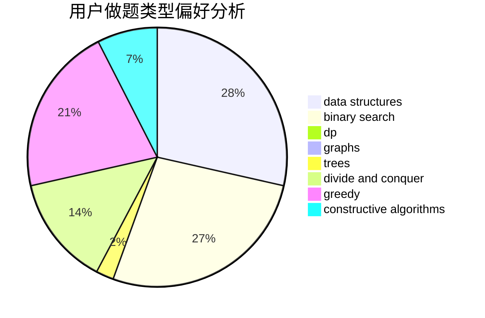
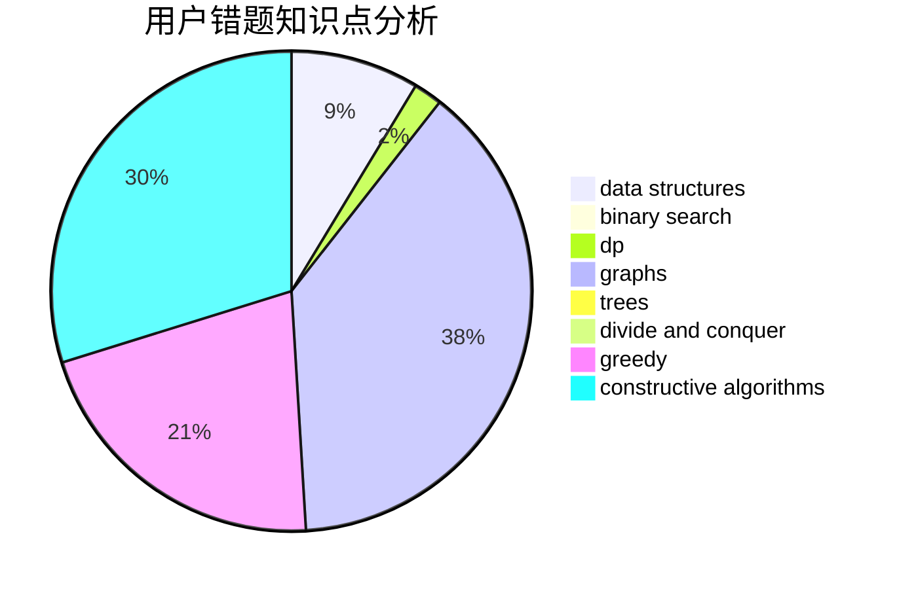

# Yz_zny

<!-- tabs:start -->

#### **用户提交结果分析**

#### **用户做题类型偏好分析**

#### **用户错题知识点分析**

<!-- tabs:end -->
# 推荐题目
[747B](https://codeforces.com/contest/747/problem/B)		implementation,
                        strings		  
[1300E](https://codeforces.com/contest/1300/problem/E)		dsu,graphs,sortings,trees		  
[982F](https://codeforces.com/contest/982/problem/F)		dfs and similar,
                        graphs		  
[838E](https://codeforces.com/contest/838/problem/E)		dp		  
[403C](https://codeforces.com/contest/403/problem/C)		dsu,graphs,sortings,trees		  
[281A](https://codeforces.com/contest/281/problem/A)		implementation,
                        strings		  
[515E](https://codeforces.com/contest/515/problem/E)		data structures		  
[861C](https://codeforces.com/contest/861/problem/C)		dsu,graphs,sortings,trees		  
[1267E](https://codeforces.com/contest/1267/problem/E)		greedy		  
[1481F](https://codeforces.com/contest/1481/problem/F)		dp,
                        greedy,
                        trees		  
