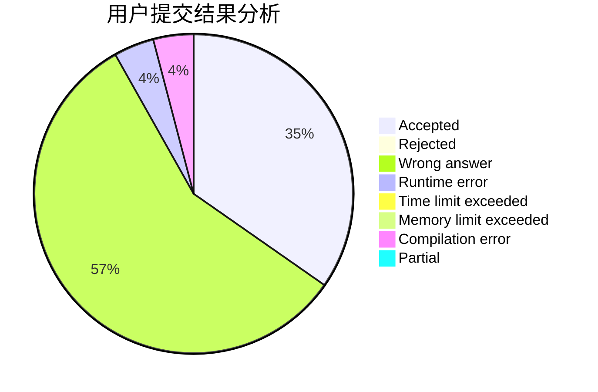
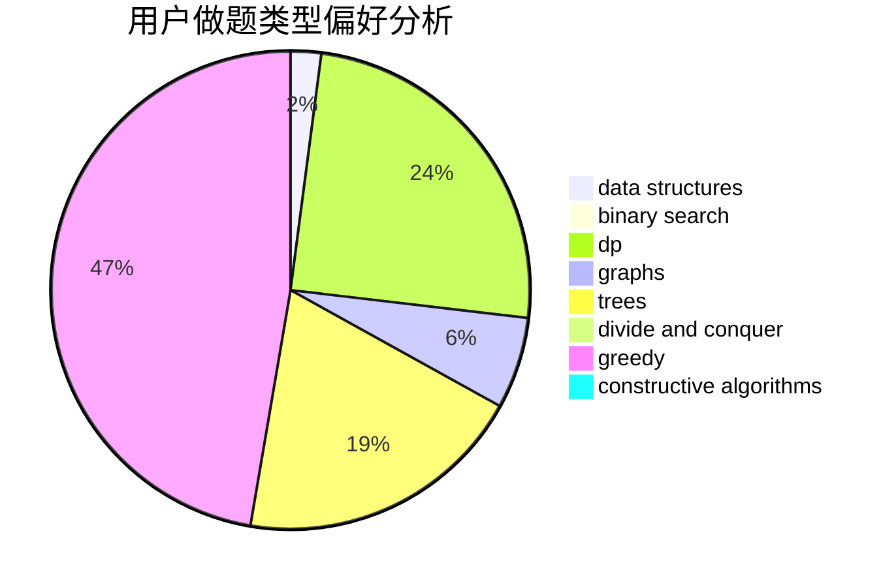
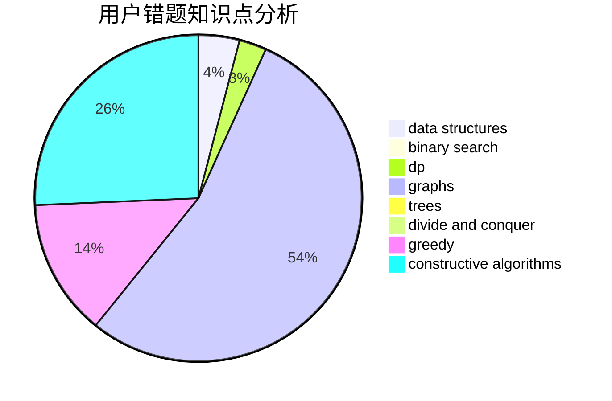

# Yz_zny

<!-- tabs:start -->

#### **用户提交结果分析**

#### **用户做题类型偏好分析**

#### **用户错题知识点分析**

<!-- tabs:end -->
# 推荐题目
[766E](https://codeforces.com/contest/766/problem/E)		bitmasks,
                        constructive algorithms,
                        data structures,
                        dfs and similar,
                        dp,
                        math,
                        trees		  
[1310C](https://codeforces.com/contest/1310/problem/C)		binary search,
                        dp,
                        strings		  
[998D](https://codeforces.com/contest/998/problem/D)		dsu,graphs,sortings,trees		  
[856E](https://codeforces.com/contest/856/problem/E)		nan		  
[431D](https://codeforces.com/contest/431/problem/D)		binary search,
                        bitmasks,
                        combinatorics,
                        dp,
                        math		  
[297C](https://codeforces.com/contest/297/problem/C)		constructive algorithms		  
[542F](https://codeforces.com/contest/542/problem/F)		dp,
                        greedy		  
[879C](https://codeforces.com/contest/879/problem/C)		dsu,graphs,sortings,trees		  
[1276A](https://codeforces.com/contest/1276/problem/A)		dp,
                        greedy		  
[148A](https://codeforces.com/contest/148/problem/A)		constructive algorithms,
                        implementation,
                        math		  
