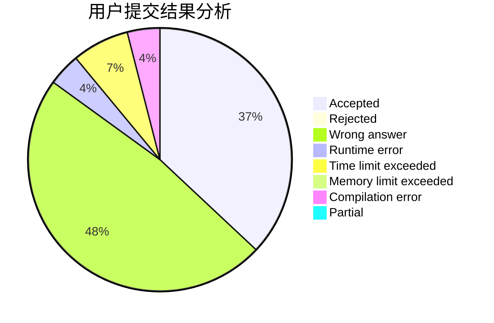
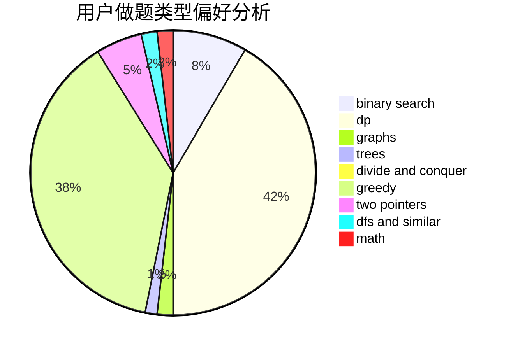

# Yzm007

<!-- tabs:start -->

#### **用户提交结果分析**

#### **用户做题类型偏好分析**

<!-- tabs:end -->
# 推荐题目
[1365B](https://codeforces.com/contest/1365/problem/B)
[1055A](https://codeforces.com/contest/1055/problem/A)
[424B](https://codeforces.com/contest/424/problem/B)
[1155F](https://codeforces.com/contest/1155/problem/F)
[733A](https://codeforces.com/contest/733/problem/A)
[573B](https://codeforces.com/contest/573/problem/B)
[1043E](https://codeforces.com/contest/1043/problem/E)
[1379A](https://codeforces.com/contest/1379/problem/A)
[1179A](https://codeforces.com/contest/1179/problem/A)
[472D](https://codeforces.com/contest/472/problem/D)
