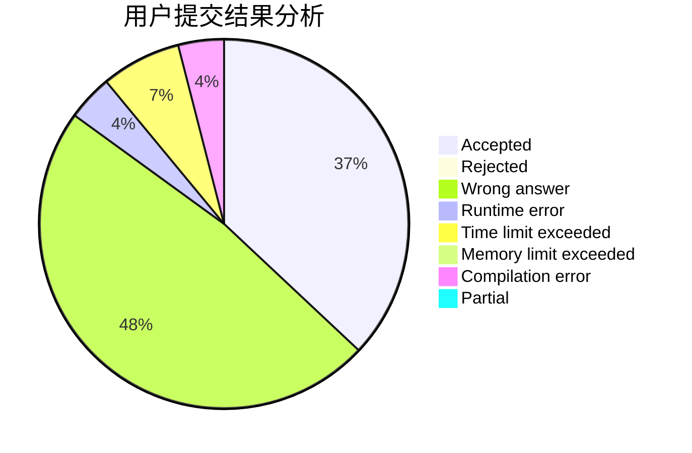
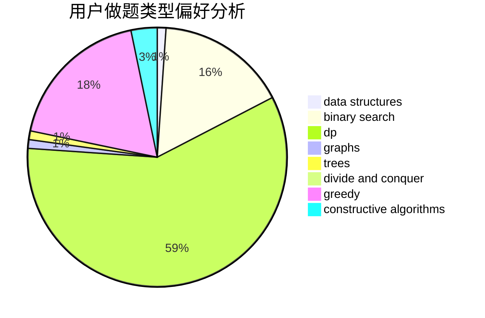

# Yzm007

<!-- tabs:start -->

#### **用户提交结果分析**

#### **用户做题类型偏好分析**

#### **用户错题知识点分析**

<!-- tabs:end -->
# 推荐题目
[1357C2](https://codeforces.com/contest/1357C/problem/2)		nan		  
[1054F](https://codeforces.com/contest/1054/problem/F)		flows,
                        graph matchings		  
[396C](https://codeforces.com/contest/396/problem/C)		data structures,
                        graphs,
                        trees		  
[1153F](https://codeforces.com/contest/1153/problem/F)		combinatorics,
                        dp,
                        math,
                        probabilities		  
[714B](https://codeforces.com/contest/714/problem/B)		implementation,
                        sortings		  
[547E](https://codeforces.com/contest/547/problem/E)		data structures,
                        string suffix structures,
                        strings,
                        trees		  
[1043B](https://codeforces.com/contest/1043/problem/B)		implementation		  
[1370D](https://codeforces.com/contest/1370/problem/D)		binary search,
                        dp,
                        dsu,
                        greedy,
                        implementation		  
[1175G](https://codeforces.com/contest/1175/problem/G)		data structures,
                        divide and conquer,
                        dp,
                        geometry,
                        two pointers		  
[451A](https://codeforces.com/contest/451/problem/A)		implementation		  
