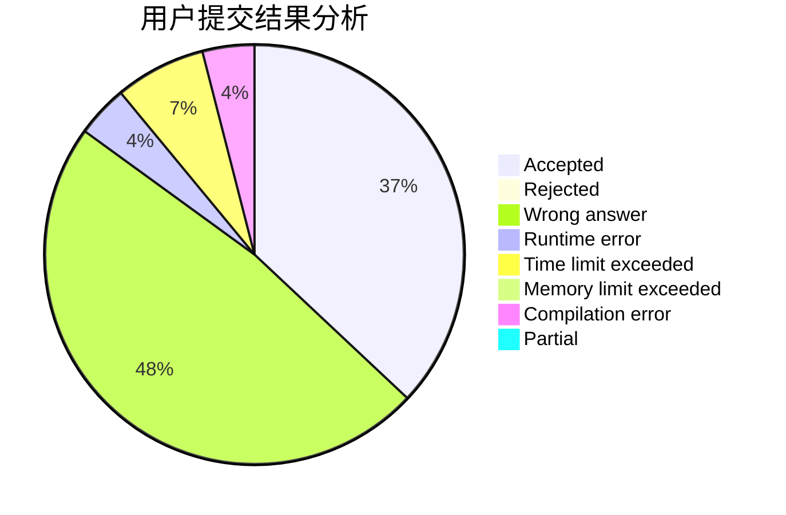
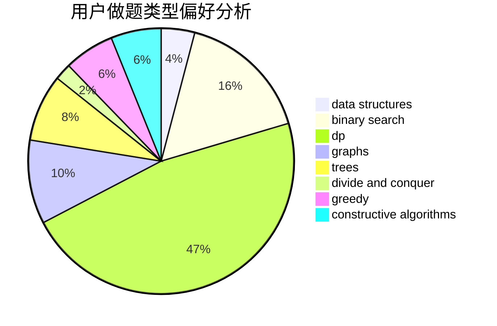

# Yzm007

<!-- tabs:start -->

#### **用户提交结果分析**

#### **用户做题类型偏好分析**

#### **用户错题知识点分析**

<!-- tabs:end -->
# 推荐题目
[1365B](https://codeforces.com/contest/1365/problem/B)		constructive algorithms,
                        implementation		  
[1055A](https://codeforces.com/contest/1055/problem/A)		graphs		  
[424B](https://codeforces.com/contest/424/problem/B)		binary search,
                        greedy,
                        implementation,
                        sortings		  
[1155F](https://codeforces.com/contest/1155/problem/F)		brute force,
                        dp,
                        graphs		  
[733A](https://codeforces.com/contest/733/problem/A)		implementation		  
[573B](https://codeforces.com/contest/573/problem/B)		binary search,
                        data structures,
                        dp,
                        math		  
[1043E](https://codeforces.com/contest/1043/problem/E)		constructive algorithms,
                        greedy,
                        math,
                        sortings		  
[1379A](https://codeforces.com/contest/1379/problem/A)		brute force,
                        implementation,
                        strings		  
[1179A](https://codeforces.com/contest/1179/problem/A)		data structures,
                        implementation		  
[472D](https://codeforces.com/contest/472/problem/D)		dfs and similar,
                        dsu,
                        shortest paths,
                        trees		  
