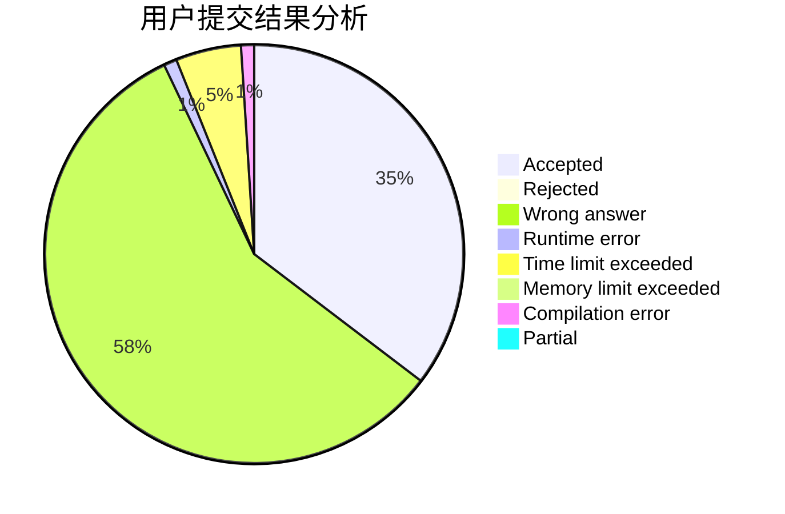
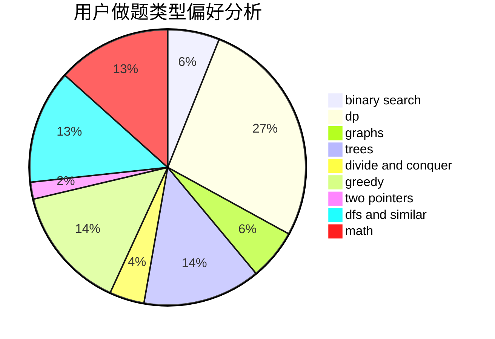

# Z1234S5678Z

<!-- tabs:start -->

#### **用户提交结果分析**

#### **用户做题类型偏好分析**

<!-- tabs:end -->
# 推荐题目
[766E](https://codeforces.com/contest/766/problem/E)
[975E](https://codeforces.com/contest/975/problem/E)
[1102B](https://codeforces.com/contest/1102/problem/B)
[152E](https://codeforces.com/contest/152/problem/E)
[581B](https://codeforces.com/contest/581/problem/B)
[720C](https://codeforces.com/contest/720/problem/C)
[1276F](https://codeforces.com/contest/1276/problem/F)
[443D](https://codeforces.com/contest/443/problem/D)
[1156D](https://codeforces.com/contest/1156/problem/D)
[1246F](https://codeforces.com/contest/1246/problem/F)
