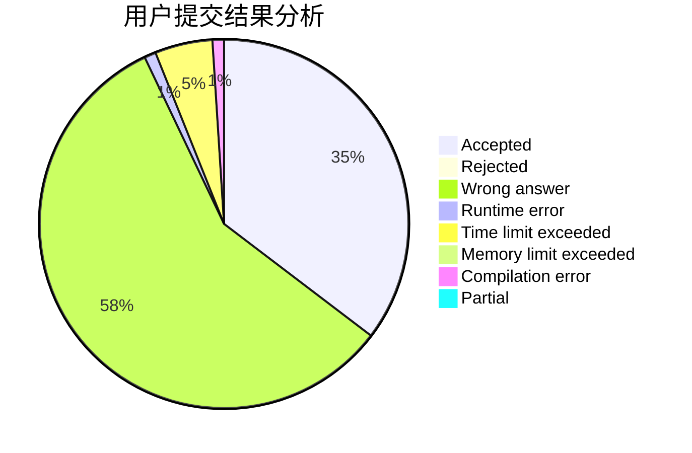
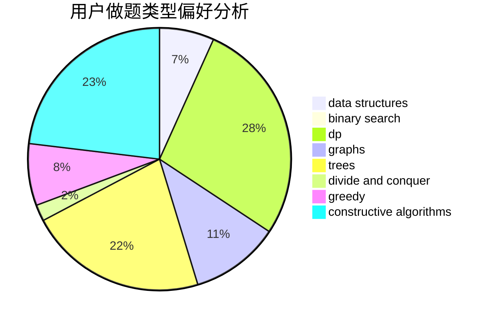
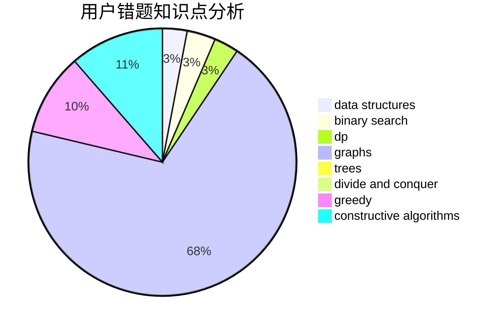

# Z1234S5678Z

<!-- tabs:start -->

#### **用户提交结果分析**

#### **用户做题类型偏好分析**

#### **用户错题知识点分析**

<!-- tabs:end -->
# 推荐题目
[766E](https://codeforces.com/contest/766/problem/E)		bitmasks,
                        constructive algorithms,
                        data structures,
                        dfs and similar,
                        dp,
                        math,
                        trees		  
[975E](https://codeforces.com/contest/975/problem/E)		geometry		  
[1102B](https://codeforces.com/contest/1102/problem/B)		greedy,
                        sortings		  
[152E](https://codeforces.com/contest/152/problem/E)		bitmasks,
                        dp,
                        graphs,
                        trees		  
[581B](https://codeforces.com/contest/581/problem/B)		implementation,
                        math		  
[720C](https://codeforces.com/contest/720/problem/C)		constructive algorithms		  
[1276F](https://codeforces.com/contest/1276/problem/F)		string suffix structures		  
[443D](https://codeforces.com/contest/443/problem/D)		dsu,graphs,sortings,trees		  
[1156D](https://codeforces.com/contest/1156/problem/D)		dfs and similar,
                        divide and conquer,
                        dp,
                        dsu,
                        trees		  
[1246F](https://codeforces.com/contest/1246/problem/F)		nan		  
