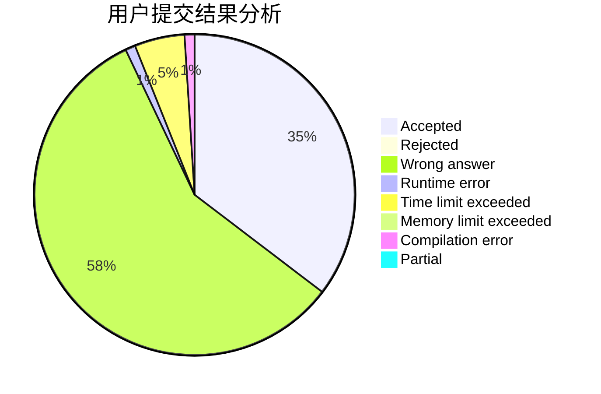
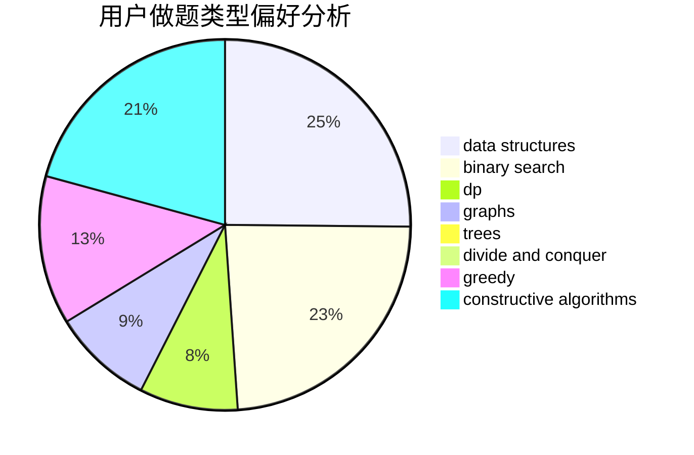
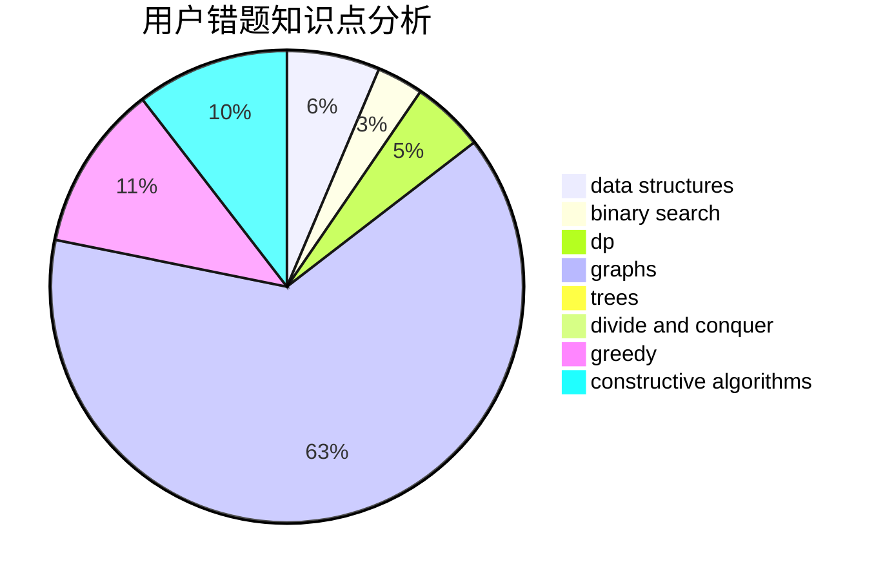

# Z1234S5678Z

<!-- tabs:start -->

#### **用户提交结果分析**

#### **用户做题类型偏好分析**

#### **用户错题知识点分析**

<!-- tabs:end -->
# 推荐题目
[747B](https://codeforces.com/contest/747/problem/B)		implementation,
                        strings		  
[952F](https://codeforces.com/contest/952/problem/F)		nan		  
[1101F](https://codeforces.com/contest/1101/problem/F)		binary search,
                        dp		  
[1505D](https://codeforces.com/contest/1505/problem/D)		number theory		  
[558D](https://codeforces.com/contest/558/problem/D)		data structures,
                        implementation,
                        sortings		  
[701F](https://codeforces.com/contest/701/problem/F)		dsu,graphs,sortings,trees		  
[1267K](https://codeforces.com/contest/1267/problem/K)		combinatorics,
                        math		  
[418C](https://codeforces.com/contest/418/problem/C)		dsu,graphs,sortings,trees		  
[1154D](https://codeforces.com/contest/1154/problem/D)		greedy		  
[1241B](https://codeforces.com/contest/1241/problem/B)		dsu,graphs,sortings,trees		  
