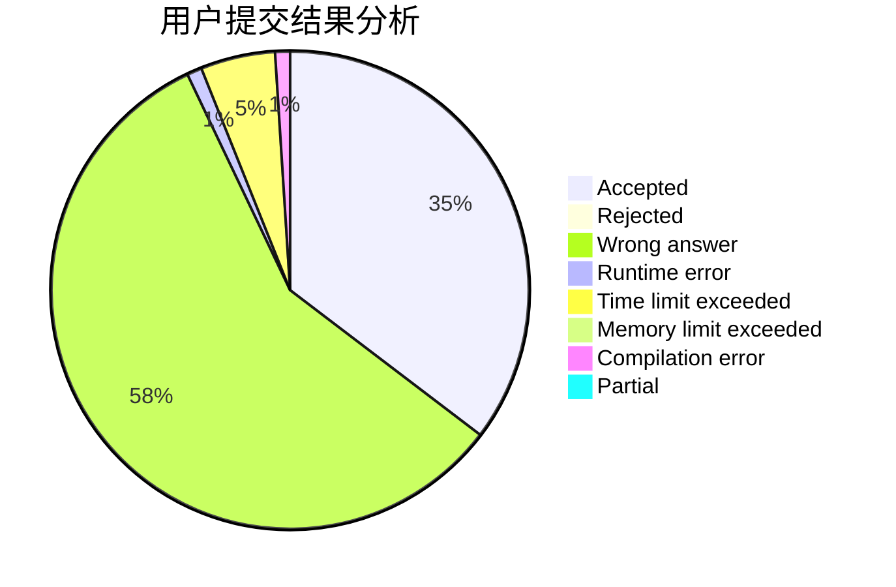
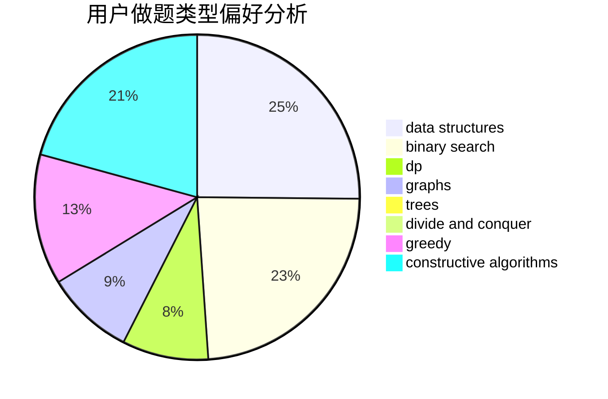
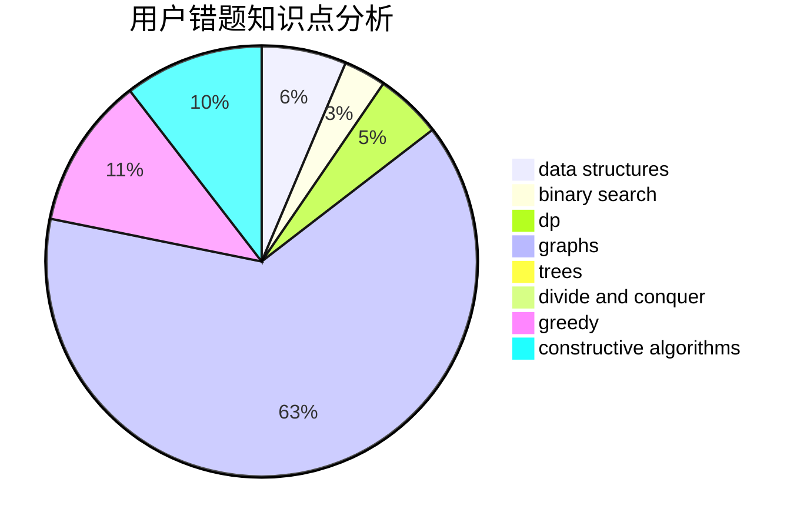

# Z1234S5678Z
<!-- tabs:start -->
#### **用户提交结果分析**

#### **用户做题类型偏好分析**

#### **用户错题知识点分析**

<!-- tabs:end -->
# 推荐题目
[Xenolith? Hippodrome?](http://codeforces.com/problemset/problem/1505/D)		number theory		  
[Mammoth's Genome Decoding](http://codeforces.com/problemset/problem/747/B)		implementation,
                        strings		  
[Trucks and Cities](http://codeforces.com/problemset/problem/1101/F)		binary search,
                        dp		  
[Key Storage](http://codeforces.com/problemset/problem/1267/K)		combinatorics,
                        math		  
[2 + 2 != 4](http://codeforces.com/problemset/problem/952/F)		nan		  
[Break Up](https://codeforces.com/contest/701/problem/F)		dfs and similar,
                        graphs		  
[Guess Your Way Out! II](http://codeforces.com/problemset/problem/558/D)		data structures,
                        implementation,
                        sortings		  
[Walking Robot](http://codeforces.com/problemset/problem/1154/D)		greedy		  
[Wooden Raft](http://codeforces.com/problemset/problem/1223/G)		binary search,
                        math,
                        number theory		  
[Selection of Personnel](http://codeforces.com/problemset/problem/630/F)		combinatorics,
                        math		  
<!-- tabs:start -->
#### **data structures**
[Xenolith? Hippodrome?](http://codeforces.com/problemset/problem/558/D)		data structures,
                        implementation,
                        sortings		  
[Mammoth's Genome Decoding](http://codeforces.com/problemset/problem/486/E)		data structures,
                        dp,
                        greedy,
                        hashing,
                        math		  
[Trucks and Cities](http://codeforces.com/problemset/problem/306/B)		data structures,
                        greedy,
                        sortings		  
[Key Storage](http://codeforces.com/problemset/problem/359/D)		binary search,
                        brute force,
                        data structures,
                        math,
                        two pointers		  
[2 + 2 != 4](http://codeforces.com/problemset/problem/877/F)		data structures,
                        flows,
                        hashing		  
[Break Up](http://codeforces.com/problemset/problem/980/E)		data structures,
                        greedy,
                        trees		  
[Guess Your Way Out! II](http://codeforces.com/problemset/problem/1428/E)		binary search,
                        data structures,
                        greedy,
                        math,
                        sortings		  
[Walking Robot](http://codeforces.com/problemset/problem/1492/C)		binary search,
                        data structures,
                        dp,
                        greedy,
                        two pointers		  
[Wooden Raft](http://codeforces.com/problemset/problem/1490/G)		binary search,
                        data structures,
                        math		  
[Selection of Personnel](http://codeforces.com/problemset/problem/1479/D)		binary search,
                        bitmasks,
                        brute force,
                        data structures,
                        probabilities,
                        trees		  
#### **binary search**
[Xenolith? Hippodrome?](http://codeforces.com/problemset/problem/1101/F)		binary search,
                        dp		  
[Mammoth's Genome Decoding](http://codeforces.com/problemset/problem/1223/G)		binary search,
                        math,
                        number theory		  
[Trucks and Cities](https://codeforces.com/contest/1362/problem/F)		binary search,
                        bitmasks,
                        constructive algorithms,
                        dfs and similar,
                        dsu,
                        graphs		  
[Key Storage](http://codeforces.com/problemset/problem/1371/E1)		binary search,
                        brute force,
                        combinatorics,
                        math,
                        number theory,
                        sortings		  
[2 + 2 != 4](http://codeforces.com/problemset/problem/359/D)		binary search,
                        brute force,
                        data structures,
                        math,
                        two pointers		  
[Break Up](http://codeforces.com/problemset/problem/1184/B1)		binary search,
                        sortings		  
[Guess Your Way Out! II](http://codeforces.com/problemset/problem/1428/E)		binary search,
                        data structures,
                        greedy,
                        math,
                        sortings		  
[Walking Robot](http://codeforces.com/problemset/problem/1168/A)		binary search,
                        greedy		  
[Wooden Raft](http://codeforces.com/problemset/problem/1492/C)		binary search,
                        data structures,
                        dp,
                        greedy,
                        two pointers		  
[Selection of Personnel](http://codeforces.com/problemset/problem/1463/D)		binary search,
                        constructive algorithms,
                        greedy,
                        two pointers		  
#### **dp**
[Xenolith? Hippodrome?](http://codeforces.com/problemset/problem/1101/F)		binary search,
                        dp		  
[Mammoth's Genome Decoding](http://codeforces.com/problemset/problem/486/E)		data structures,
                        dp,
                        greedy,
                        hashing,
                        math		  
[Trucks and Cities](http://codeforces.com/problemset/problem/363/B)		brute force,
                        dp		  
[Key Storage](http://codeforces.com/problemset/problem/497/E)		dp,
                        matrices		  
[2 + 2 != 4](http://codeforces.com/problemset/problem/732/B)		dp,
                        greedy		  
[Break Up](http://codeforces.com/problemset/problem/1225/G)		bitmasks,
                        constructive algorithms,
                        dp,
                        greedy,
                        number theory		  
[Guess Your Way Out! II](http://codeforces.com/problemset/problem/1492/C)		binary search,
                        data structures,
                        dp,
                        greedy,
                        two pointers		  
[Walking Robot](https://codeforces.com/contest/1457/problem/C)		brute force,
                        dp,
                        implementation		  
[Wooden Raft](http://codeforces.com/problemset/problem/1491/C)		brute force,
                        data structures,
                        dp,
                        greedy,
                        implementation		  
[Selection of Personnel](http://codeforces.com/problemset/problem/1437/C)		dp,
                        flows,
                        graph matchings,
                        greedy,
                        math,
                        sortings		  
#### **graph**
[Xenolith? Hippodrome?](https://codeforces.com/contest/701/problem/F)		dfs and similar,
                        graphs		  
[Mammoth's Genome Decoding](https://codeforces.com/contest/1362/problem/F)		binary search,
                        bitmasks,
                        constructive algorithms,
                        dfs and similar,
                        dsu,
                        graphs		  
[Trucks and Cities](http://codeforces.com/problemset/problem/1095/F)		dsu,
                        graphs,
                        greedy		  
[Key Storage](http://codeforces.com/problemset/problem/1006/E)		dfs and similar,
                        graphs,
                        trees		  
[2 + 2 != 4](http://codeforces.com/problemset/problem/1268/D)		brute force,
                        divide and conquer,
                        graphs,
                        math		  
[Break Up](http://codeforces.com/problemset/problem/1228/D)		brute force,
                        constructive algorithms,
                        graphs,
                        hashing,
                        implementation		  
[Guess Your Way Out! II](http://codeforces.com/problemset/problem/1487/C)		brute force,
                        constructive algorithms,
                        dfs and similar,
                        graphs,
                        greedy,
                        implementation,
                        math		  
[Walking Robot](http://codeforces.com/problemset/problem/1437/C)		dp,
                        flows,
                        graph matchings,
                        greedy,
                        math,
                        sortings		  
[Wooden Raft](http://codeforces.com/problemset/problem/1470/D)		constructive algorithms,
                        dfs and similar,
                        graph matchings,
                        graphs,
                        greedy		  
[Selection of Personnel](http://codeforces.com/problemset/problem/1476/C)		dp,
                        graphs,
                        greedy		  
#### **trees**
[Xenolith? Hippodrome?](http://codeforces.com/problemset/problem/1055/F)		strings,
                        trees		  
[Mammoth's Genome Decoding](http://codeforces.com/problemset/problem/980/E)		data structures,
                        greedy,
                        trees		  
[Trucks and Cities](http://codeforces.com/problemset/problem/1006/E)		dfs and similar,
                        graphs,
                        trees		  
[Key Storage](http://codeforces.com/problemset/problem/1479/D)		binary search,
                        bitmasks,
                        brute force,
                        data structures,
                        probabilities,
                        trees		  
[2 + 2 != 4](http://codeforces.com/problemset/problem/1511/C)		brute force,
                        data structures,
                        implementation,
                        trees		  
[Break Up](http://codeforces.com/problemset/problem/1499/F)		combinatorics,
                        dfs and similar,
                        dp,
                        trees		  
[Guess Your Way Out! II](http://codeforces.com/problemset/problem/1491/E)		brute force,
                        dfs and similar,
                        divide and conquer,
                        number theory,
                        trees		  
[Walking Robot](http://codeforces.com/problemset/problem/1466/D)		data structures,
                        greedy,
                        sortings,
                        trees		  
[Wooden Raft](http://codeforces.com/problemset/problem/1495/D)		combinatorics,
                        dfs and similar,
                        graphs,
                        math,
                        shortest paths,
                        trees		  
[Selection of Personnel](http://codeforces.com/problemset/problem/1303/G)		data structures,
                        divide and conquer,
                        geometry,
                        trees		  
#### **divide and conquer**
[Xenolith? Hippodrome?](http://codeforces.com/problemset/problem/1268/D)		brute force,
                        divide and conquer,
                        graphs,
                        math		  
[Mammoth's Genome Decoding](http://codeforces.com/problemset/problem/1461/D)		binary search,
                        brute force,
                        data structures,
                        divide and conquer,
                        implementation,
                        sortings		  
[Trucks and Cities](http://codeforces.com/problemset/problem/1466/G)		combinatorics,
                        divide and conquer,
                        hashing,
                        math,
                        string suffix structures,
                        strings		  
[Key Storage](http://codeforces.com/problemset/problem/1490/D)		dfs and similar,
                        divide and conquer,
                        implementation		  
[2 + 2 != 4](https://codeforces.com/contest/1483/problem/C)		data structures,
                        divide and conquer,
                        dp		  
[Break Up](http://codeforces.com/problemset/problem/1491/E)		brute force,
                        dfs and similar,
                        divide and conquer,
                        number theory,
                        trees		  
[Guess Your Way Out! II](http://codeforces.com/problemset/problem/1303/G)		data structures,
                        divide and conquer,
                        geometry,
                        trees		  
[Walking Robot](http://codeforces.com/problemset/problem/1494/D)		constructive algorithms,
                        data structures,
                        dfs and similar,
                        divide and conquer,
                        dsu,
                        greedy,
                        sortings,
                        trees		  
[Wooden Raft](http://codeforces.com/problemset/problem/1482/E)		data structures,
                        divide and conquer,
                        dp		  
[Selection of Personnel](http://codeforces.com/problemset/problem/566/C)		dfs and similar,
                        divide and conquer,
                        trees		  
#### **greedy**
[Xenolith? Hippodrome?](http://codeforces.com/problemset/problem/1154/D)		greedy		  
[Mammoth's Genome Decoding](http://codeforces.com/problemset/problem/486/E)		data structures,
                        dp,
                        greedy,
                        hashing,
                        math		  
[Trucks and Cities](http://codeforces.com/problemset/problem/950/B)		greedy,
                        implementation		  
[Key Storage](http://codeforces.com/problemset/problem/306/B)		data structures,
                        greedy,
                        sortings		  
[2 + 2 != 4](http://codeforces.com/problemset/problem/732/B)		dp,
                        greedy		  
[Break Up](http://codeforces.com/problemset/problem/1225/G)		bitmasks,
                        constructive algorithms,
                        dp,
                        greedy,
                        number theory		  
[Guess Your Way Out! II](http://codeforces.com/problemset/problem/1095/F)		dsu,
                        graphs,
                        greedy		  
[Walking Robot](http://codeforces.com/problemset/problem/980/E)		data structures,
                        greedy,
                        trees		  
[Wooden Raft](http://codeforces.com/problemset/problem/1173/B)		constructive algorithms,
                        greedy		  
[Selection of Personnel](http://codeforces.com/problemset/problem/1428/E)		binary search,
                        data structures,
                        greedy,
                        math,
                        sortings		  
#### **constructive algorithms**
[Xenolith? Hippodrome?](https://codeforces.com/contest/418/problem/C)		constructive algorithms,
                        math,
                        probabilities		  
[Mammoth's Genome Decoding](https://codeforces.com/contest/1362/problem/F)		binary search,
                        bitmasks,
                        constructive algorithms,
                        dfs and similar,
                        dsu,
                        graphs		  
[Trucks and Cities](http://codeforces.com/problemset/problem/1225/G)		bitmasks,
                        constructive algorithms,
                        dp,
                        greedy,
                        number theory		  
[Key Storage](http://codeforces.com/problemset/problem/1173/B)		constructive algorithms,
                        greedy		  
[2 + 2 != 4](http://codeforces.com/problemset/problem/1404/D)		constructive algorithms,
                        dfs and similar,
                        interactive,
                        math,
                        number theory		  
[Break Up](http://codeforces.com/problemset/problem/1228/D)		brute force,
                        constructive algorithms,
                        graphs,
                        hashing,
                        implementation		  
[Guess Your Way Out! II](http://codeforces.com/problemset/problem/1497/B)		constructive algorithms,
                        greedy,
                        math		  
[Walking Robot](http://codeforces.com/problemset/problem/1493/A)		constructive algorithms,
                        greedy		  
[Wooden Raft](http://codeforces.com/problemset/problem/1463/D)		binary search,
                        constructive algorithms,
                        greedy,
                        two pointers		  
[Selection of Personnel](https://codeforces.com/contest/1456/problem/B)		bitmasks,
                        brute force,
                        constructive algorithms		  
#### **sortings**
[Xenolith? Hippodrome?](http://codeforces.com/problemset/problem/558/D)		data structures,
                        implementation,
                        sortings		  
[Mammoth's Genome Decoding](http://codeforces.com/problemset/problem/1005/E1)		sortings		  
[Trucks and Cities](http://codeforces.com/problemset/problem/1371/E1)		binary search,
                        brute force,
                        combinatorics,
                        math,
                        number theory,
                        sortings		  
[Key Storage](http://codeforces.com/problemset/problem/306/B)		data structures,
                        greedy,
                        sortings		  
[2 + 2 != 4](http://codeforces.com/problemset/problem/1184/B1)		binary search,
                        sortings		  
[Break Up](http://codeforces.com/problemset/problem/653/A)		brute force,
                        implementation,
                        sortings		  
[Guess Your Way Out! II](http://codeforces.com/problemset/problem/1428/E)		binary search,
                        data structures,
                        greedy,
                        math,
                        sortings		  
[Walking Robot](https://codeforces.com/contest/1496/problem/C)		geometry,
                        greedy,
                        math,
                        sortings		  
[Wooden Raft](http://codeforces.com/problemset/problem/1495/A)		geometry,
                        greedy,
                        math,
                        sortings		  
[Selection of Personnel](http://codeforces.com/problemset/problem/1497/A)		brute force,
                        data structures,
                        greedy,
                        sortings		  
<!-- tabs:end -->
