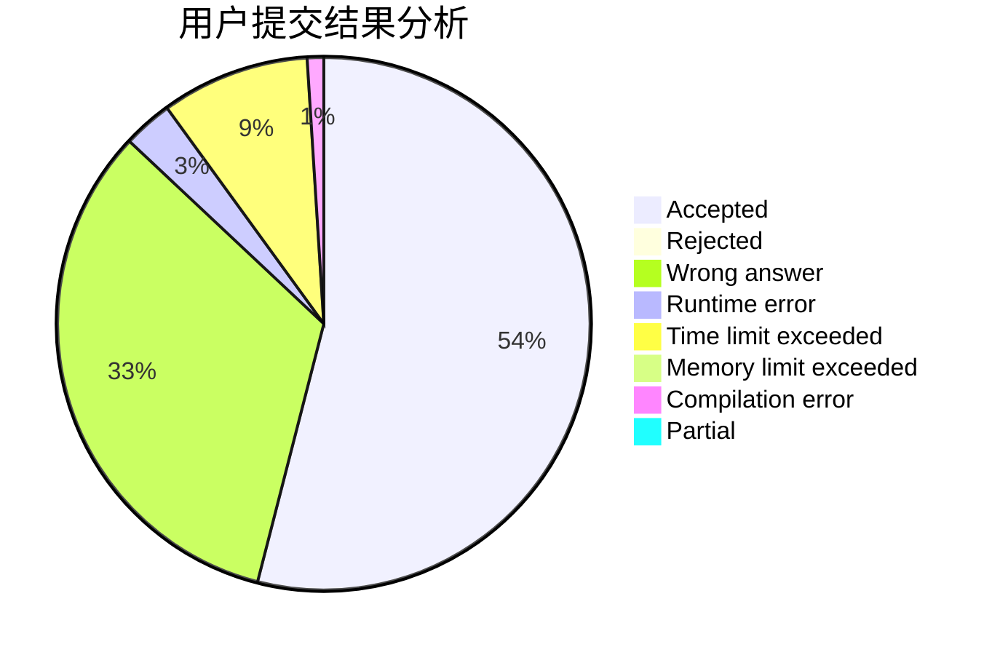
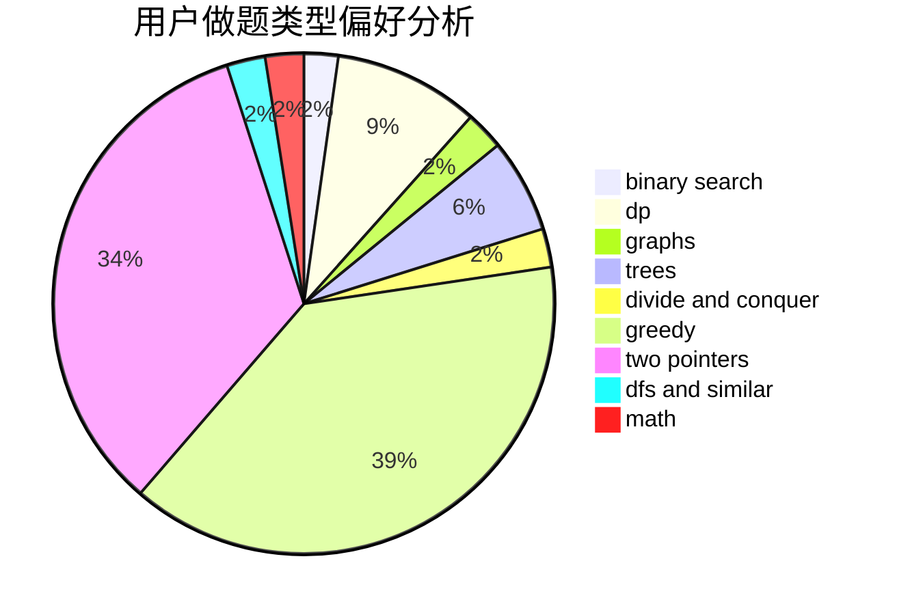

# ZAwei

<!-- tabs:start -->

#### **用户提交结果分析**

#### **用户做题类型偏好分析**

<!-- tabs:end -->
# 推荐题目
[36C](https://codeforces.com/contest/36/problem/C)
[1252L](https://codeforces.com/contest/1252/problem/L)
[115B](https://codeforces.com/contest/115/problem/B)
[1403A](https://codeforces.com/contest/1403/problem/A)
[424D](https://codeforces.com/contest/424/problem/D)
[1045C](https://codeforces.com/contest/1045/problem/C)
[761F](https://codeforces.com/contest/761/problem/F)
[585D](https://codeforces.com/contest/585/problem/D)
[864D](https://codeforces.com/contest/864/problem/D)
[224B](https://codeforces.com/contest/224/problem/B)
