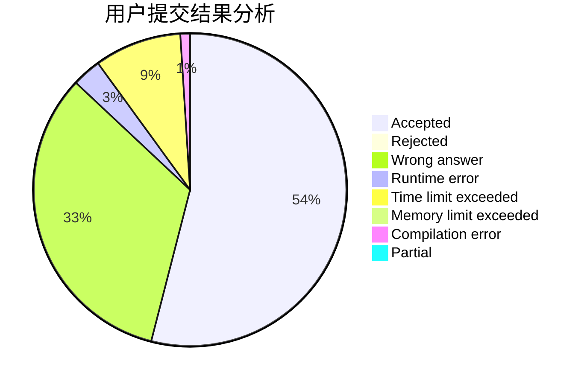
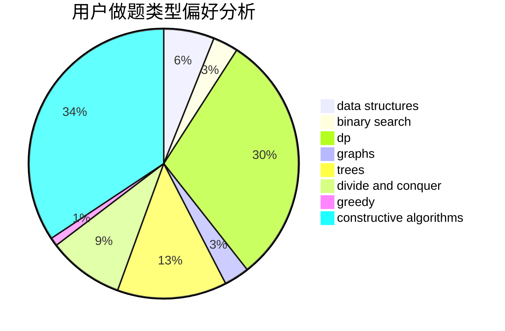
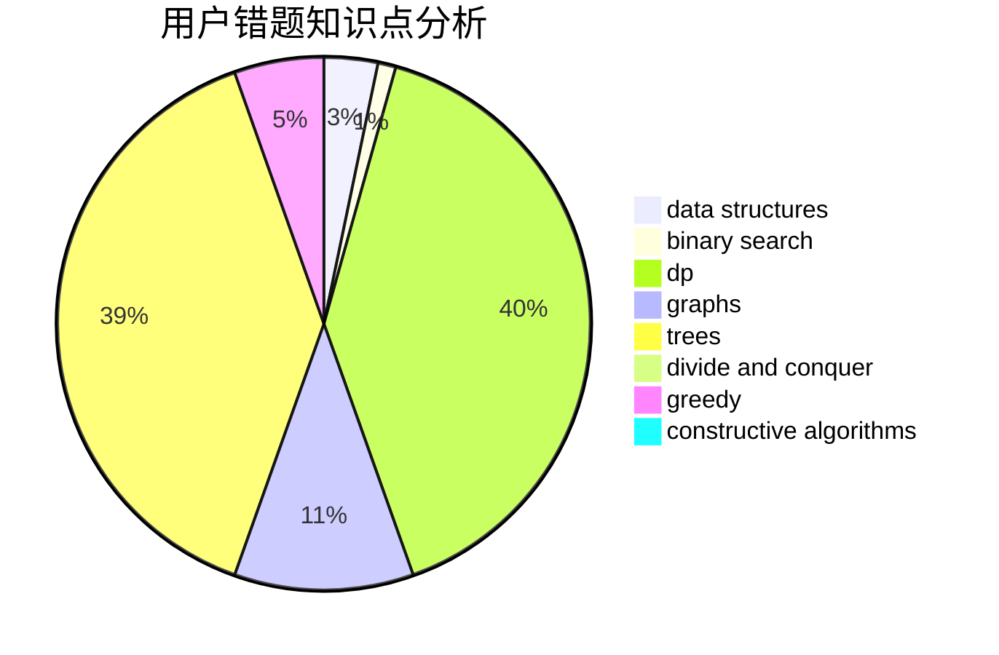

# ZAwei

<!-- tabs:start -->

#### **用户提交结果分析**

#### **用户做题类型偏好分析**

#### **用户错题知识点分析**

<!-- tabs:end -->
# 推荐题目
[36C](https://codeforces.com/contest/36/problem/C)		geometry,
                        implementation		  
[1252L](https://codeforces.com/contest/1252/problem/L)		flows,
                        graphs		  
[115B](https://codeforces.com/contest/115/problem/B)		greedy,
                        sortings		  
[1403A](https://codeforces.com/contest/1403/problem/A)		*special problem,
                        2-sat,
                        binary search,
                        data structures,
                        graphs,
                        interactive,
                        sortings,
                        two pointers		  
[424D](https://codeforces.com/contest/424/problem/D)		binary search,
                        brute force,
                        constructive algorithms,
                        data structures,
                        dp		  
[1045C](https://codeforces.com/contest/1045/problem/C)		dfs and similar,
                        graphs,
                        trees		  
[761F](https://codeforces.com/contest/761/problem/F)		brute force,
                        data structures,
                        dp,
                        implementation		  
[585D](https://codeforces.com/contest/585/problem/D)		meet-in-the-middle		  
[864D](https://codeforces.com/contest/864/problem/D)		greedy,
                        implementation,
                        math		  
[224B](https://codeforces.com/contest/224/problem/B)		bitmasks,
                        implementation,
                        two pointers		  
