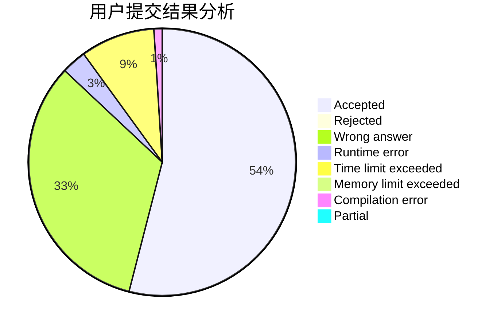
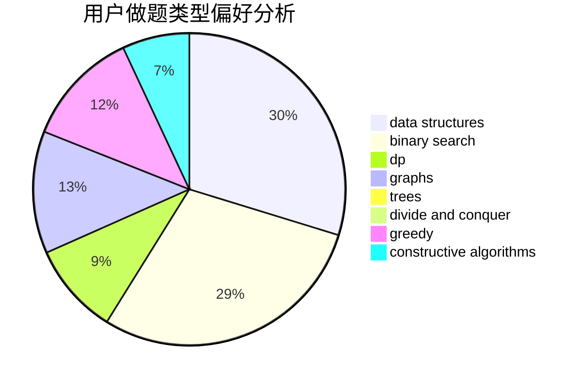
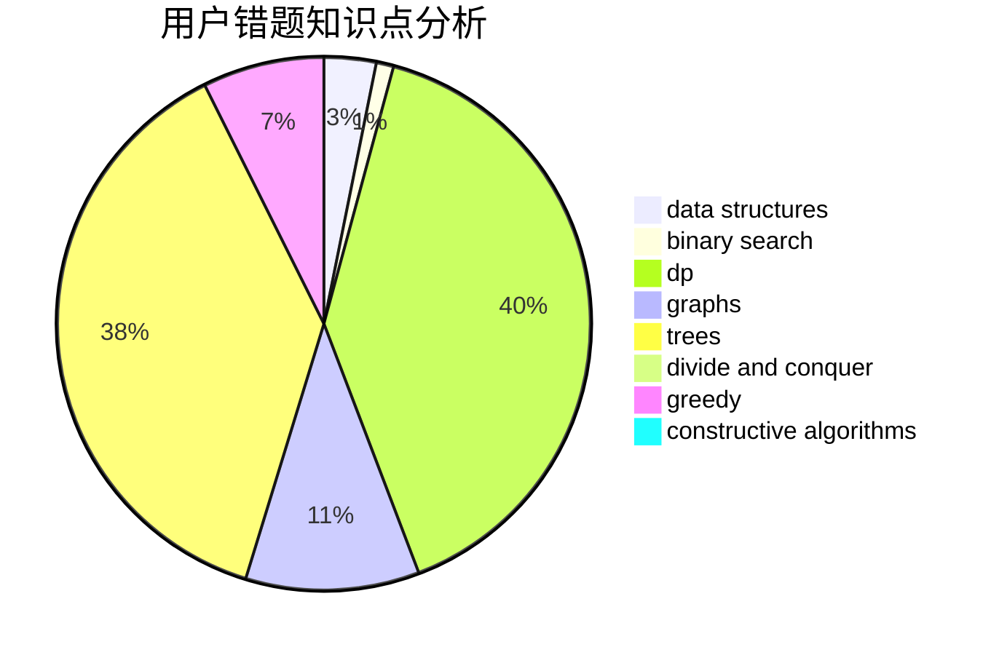

# ZAwei

<!-- tabs:start -->

#### **用户提交结果分析**

#### **用户做题类型偏好分析**

#### **用户错题知识点分析**

<!-- tabs:end -->
# 推荐题目
[343B](https://codeforces.com/contest/343/problem/B)		data structures,
                        greedy,
                        implementation		  
[1249C1](https://codeforces.com/contest/1249C/problem/1)		brute force,
                        greedy,
                        implementation		  
[1157F](https://codeforces.com/contest/1157/problem/F)		constructive algorithms,
                        dp,
                        greedy,
                        two pointers		  
[1394E](https://codeforces.com/contest/1394/problem/E)		strings		  
[398A](https://codeforces.com/contest/398/problem/A)		constructive algorithms,
                        implementation		  
[1044B](https://codeforces.com/contest/1044/problem/B)		dfs and similar,
                        interactive,
                        trees		  
[740D](https://codeforces.com/contest/740/problem/D)		dsu,graphs,sortings,trees		  
[566E](https://codeforces.com/contest/566/problem/E)		bitmasks,
                        constructive algorithms,
                        trees		  
[846B](https://codeforces.com/contest/846/problem/B)		brute force,
                        greedy		  
[1C](https://codeforces.com/contest/1/problem/C)		geometry,
                        math		  
