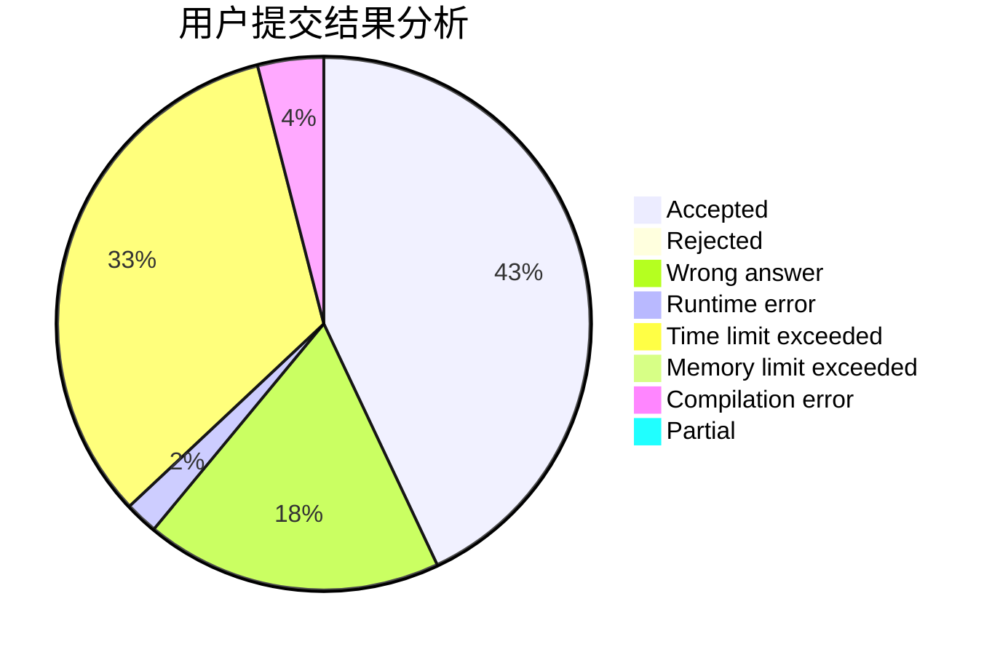
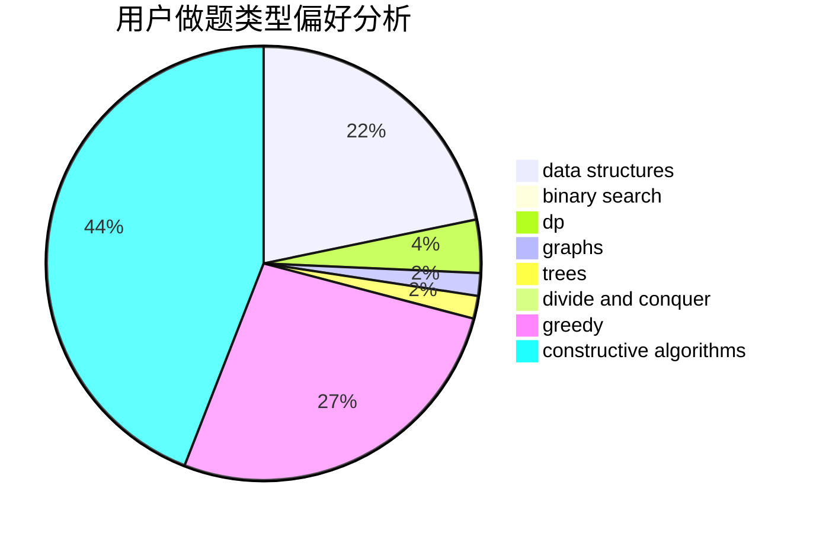
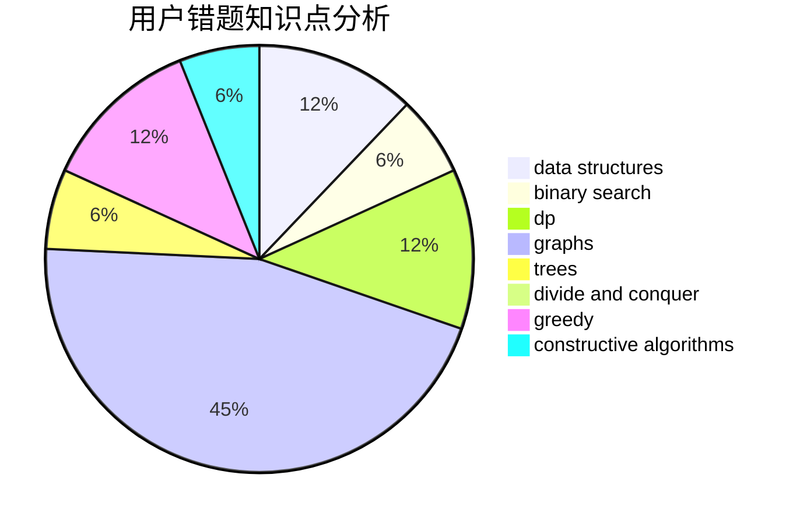

# ZERO.

<!-- tabs:start -->

#### **用户提交结果分析**

#### **用户做题类型偏好分析**

#### **用户错题知识点分析**

<!-- tabs:end -->
# 推荐题目
[1445D](https://codeforces.com/contest/1445/problem/D)		dsu,graphs,sortings,trees		  
[228B](https://codeforces.com/contest/228/problem/B)		brute force,
                        implementation		  
[396C](https://codeforces.com/contest/396/problem/C)		data structures,
                        graphs,
                        trees		  
[61E](https://codeforces.com/contest/61/problem/E)		data structures,
                        trees		  
[290C](https://codeforces.com/contest/290/problem/C)		*special problem,
                        graph matchings,
                        implementation,
                        trees		  
[766D](https://codeforces.com/contest/766/problem/D)		data structures,
                        dfs and similar,
                        dp,
                        dsu,
                        graphs		  
[176B](https://codeforces.com/contest/176/problem/B)		dp		  
[780B](https://codeforces.com/contest/780/problem/B)		binary search		  
[436F](https://codeforces.com/contest/436/problem/F)		brute force,
                        data structures,
                        dp		  
[755D](https://codeforces.com/contest/755/problem/D)		data structures		  
