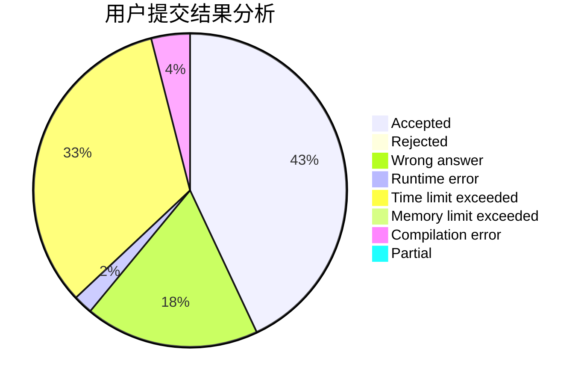
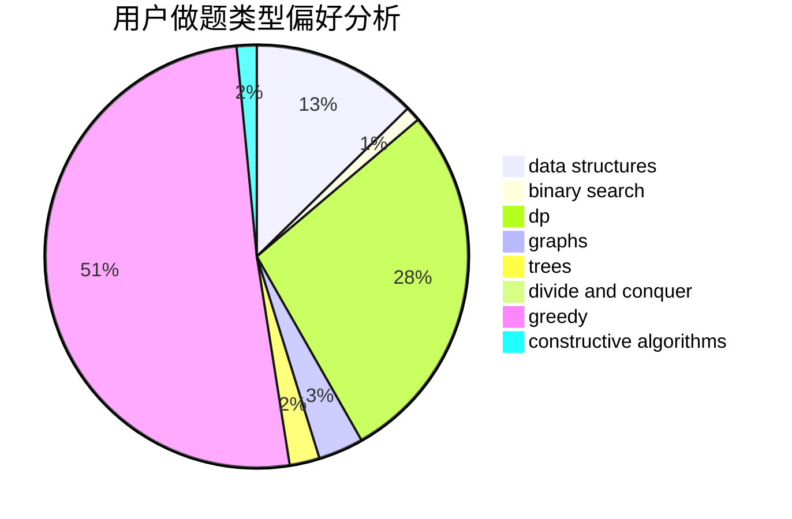
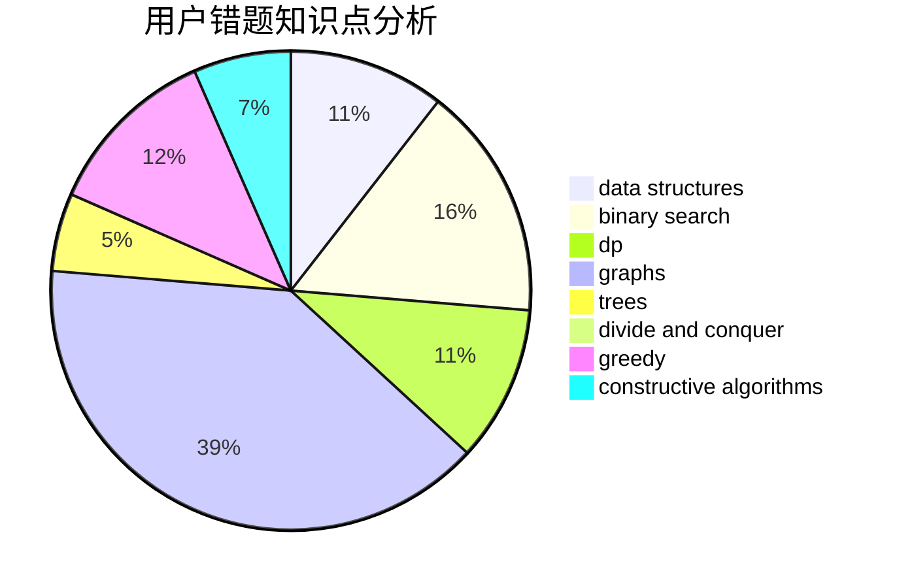

# ZERO.

<!-- tabs:start -->

#### **用户提交结果分析**

#### **用户做题类型偏好分析**

#### **用户错题知识点分析**

<!-- tabs:end -->
# 推荐题目
[1435D](https://codeforces.com/contest/1435/problem/D)		dsu,graphs,sortings,trees		  
[204C](https://codeforces.com/contest/204/problem/C)		math,
                        probabilities		  
[366D](https://codeforces.com/contest/366/problem/D)		binary search,
                        data structures,
                        dfs and similar,
                        dsu,
                        shortest paths,
                        two pointers		  
[600D](https://codeforces.com/contest/600/problem/D)		geometry		  
[276C](https://codeforces.com/contest/276/problem/C)		data structures,
                        greedy,
                        implementation,
                        sortings		  
[747A](https://codeforces.com/contest/747/problem/A)		brute force,
                        math		  
[154C](https://codeforces.com/contest/154/problem/C)		graphs,
                        hashing,
                        sortings		  
[761A](https://codeforces.com/contest/761/problem/A)		brute force,
                        constructive algorithms,
                        implementation,
                        math		  
[409F](https://codeforces.com/contest/409/problem/F)		*special problem		  
[734E](https://codeforces.com/contest/734/problem/E)		dfs and similar,
                        dp,
                        trees		  
