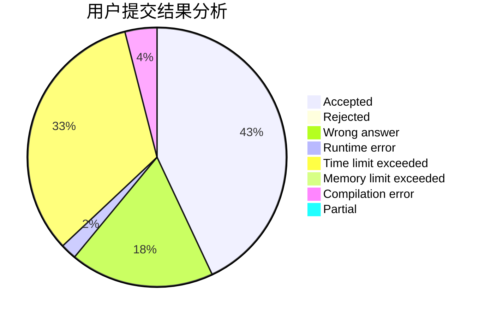
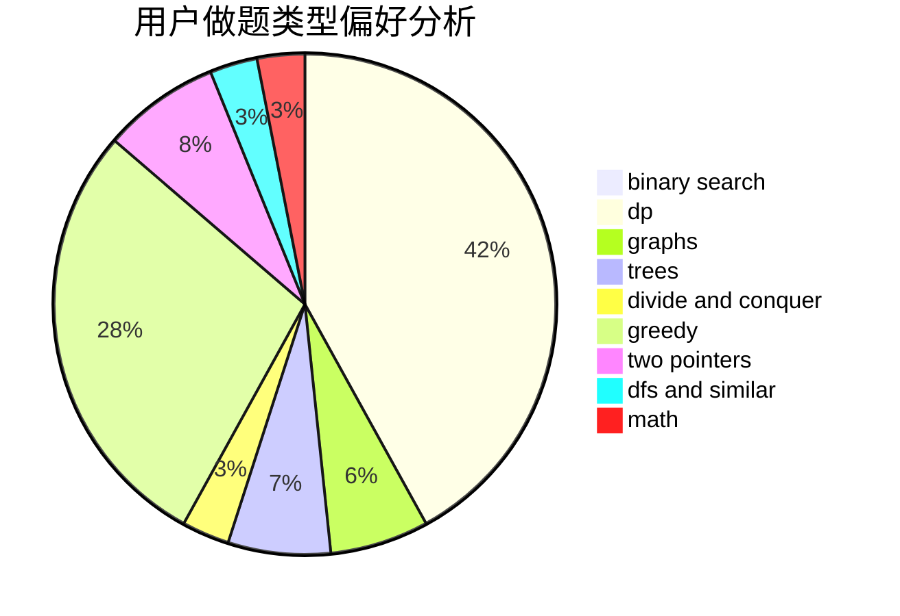

# ZERO.

<!-- tabs:start -->

#### **用户提交结果分析**

#### **用户做题类型偏好分析**

<!-- tabs:end -->
# 推荐题目
[1445D](https://codeforces.com/contest/1445/problem/D)
[228B](https://codeforces.com/contest/228/problem/B)
[396C](https://codeforces.com/contest/396/problem/C)
[61E](https://codeforces.com/contest/61/problem/E)
[290C](https://codeforces.com/contest/290/problem/C)
[766D](https://codeforces.com/contest/766/problem/D)
[176B](https://codeforces.com/contest/176/problem/B)
[780B](https://codeforces.com/contest/780/problem/B)
[436F](https://codeforces.com/contest/436/problem/F)
[755D](https://codeforces.com/contest/755/problem/D)
