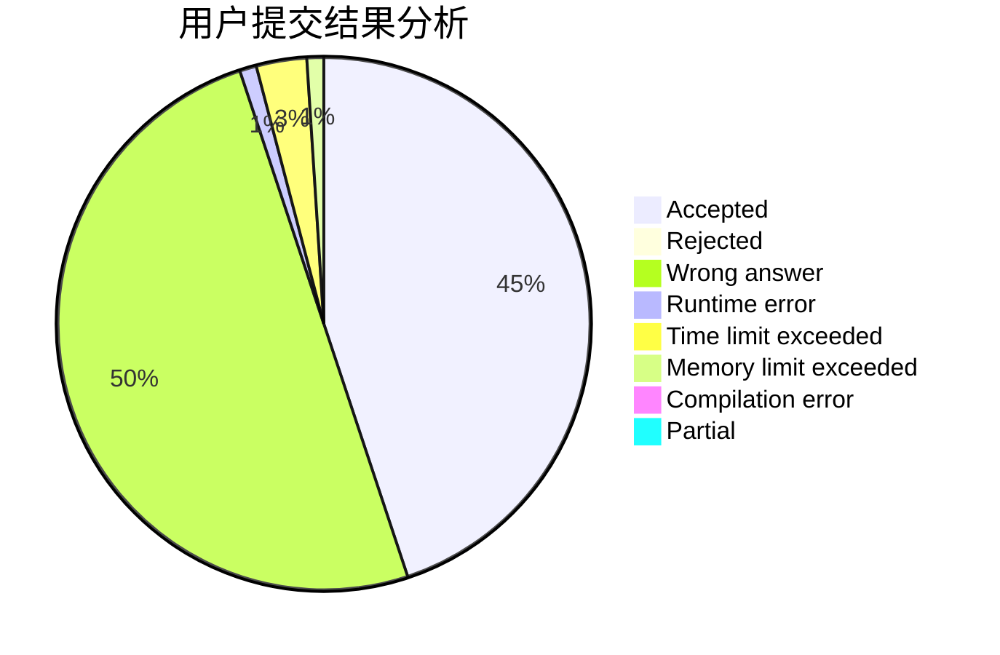
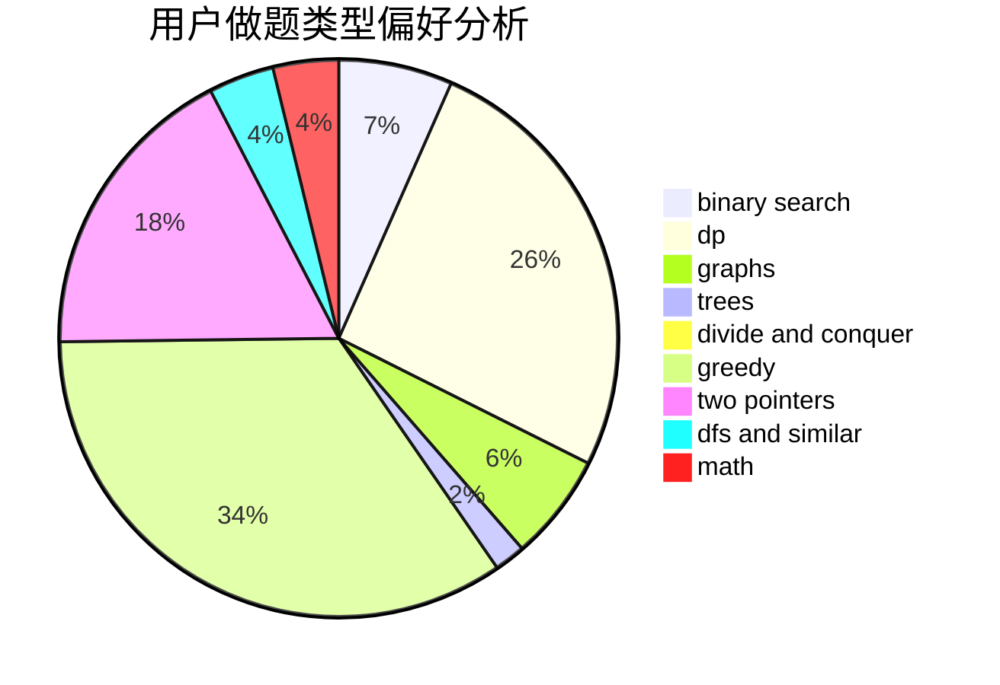

# ZGS_WZY

<!-- tabs:start -->

#### **用户提交结果分析**

#### **用户做题类型偏好分析**

<!-- tabs:end -->
# 推荐题目
[883C](https://codeforces.com/contest/883/problem/C)
[1033E](https://codeforces.com/contest/1033/problem/E)
[559A](https://codeforces.com/contest/559/problem/A)
[380A](https://codeforces.com/contest/380/problem/A)
[144B](https://codeforces.com/contest/144/problem/B)
[11292](https://codeforces.com/contest/1129/problem/2)
[600C](https://codeforces.com/contest/600/problem/C)
[592B](https://codeforces.com/contest/592/problem/B)
[732B](https://codeforces.com/contest/732/problem/B)
[849A](https://codeforces.com/contest/849/problem/A)
