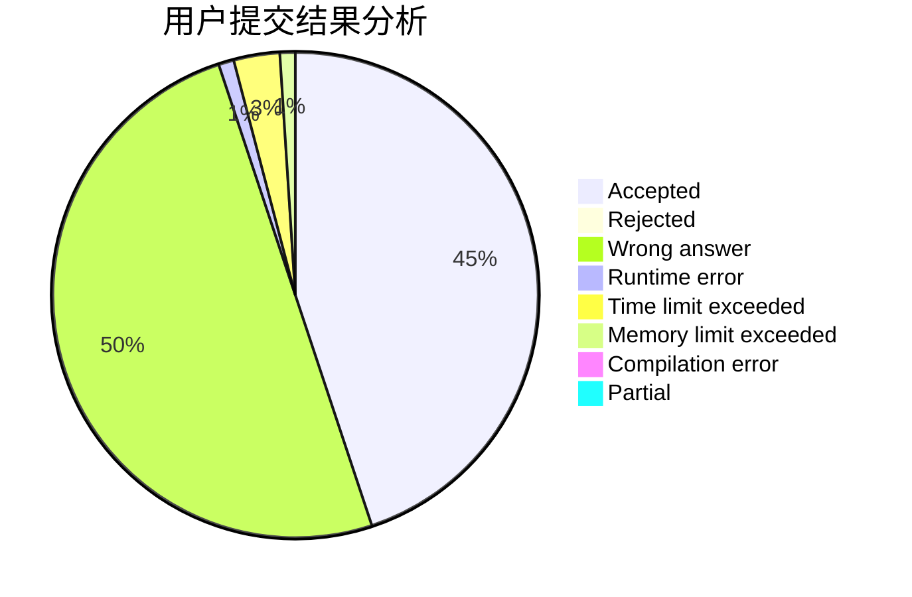
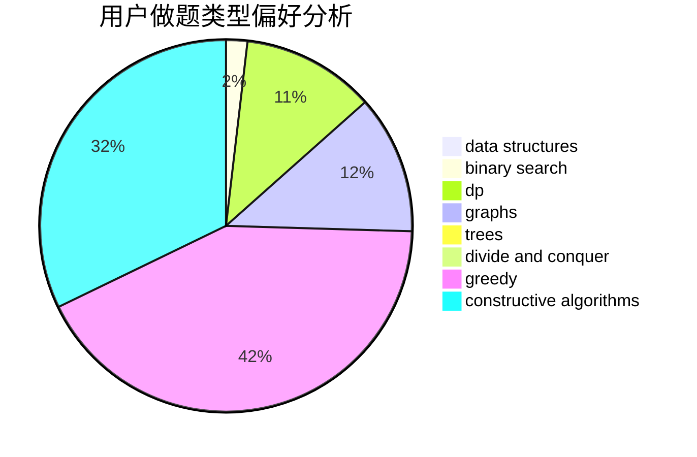
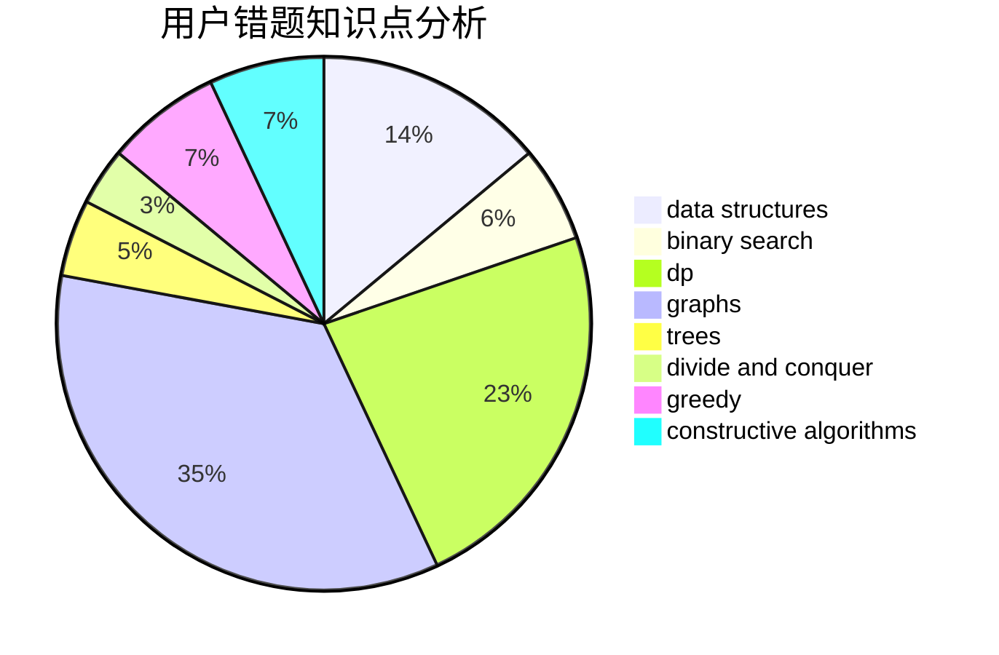

# ZGS_WZY

<!-- tabs:start -->

#### **用户提交结果分析**

#### **用户做题类型偏好分析**

#### **用户错题知识点分析**

<!-- tabs:end -->
# 推荐题目
[863A](https://codeforces.com/contest/863/problem/A)		brute force,
                        implementation		  
[1033B](https://codeforces.com/contest/1033/problem/B)		math,
                        number theory		  
[536D](https://codeforces.com/contest/536/problem/D)		dp,
                        games		  
[354B](https://codeforces.com/contest/354/problem/B)		bitmasks,
                        dp,
                        games		  
[1438B](https://codeforces.com/contest/1438/problem/B)		constructive algorithms,
                        data structures,
                        greedy,
                        sortings		  
[1119E](https://codeforces.com/contest/1119/problem/E)		brute force,
                        dp,
                        fft,
                        greedy,
                        ternary search		  
[580A](https://codeforces.com/contest/580/problem/A)		brute force,
                        dp,
                        implementation		  
[571E](https://codeforces.com/contest/571/problem/E)		math		  
[713A](https://codeforces.com/contest/713/problem/A)		data structures,
                        implementation		  
[831A](https://codeforces.com/contest/831/problem/A)		implementation		  
