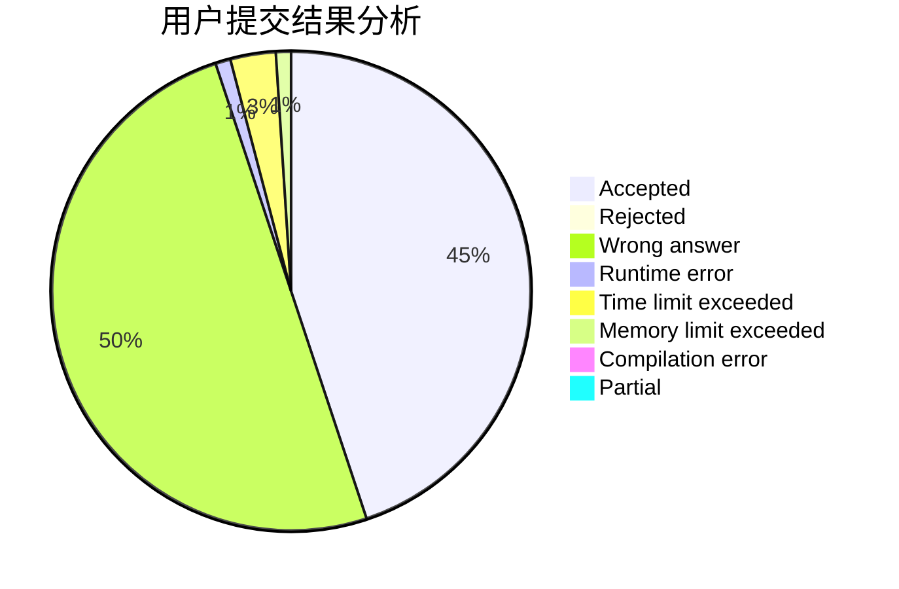
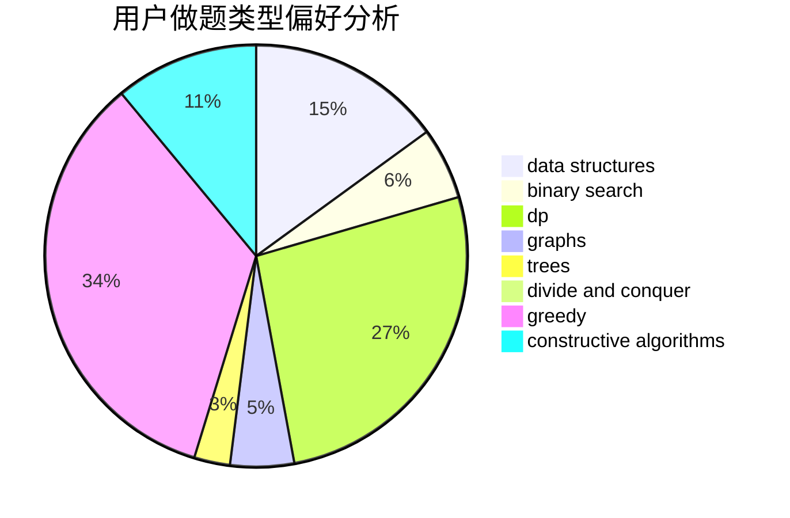
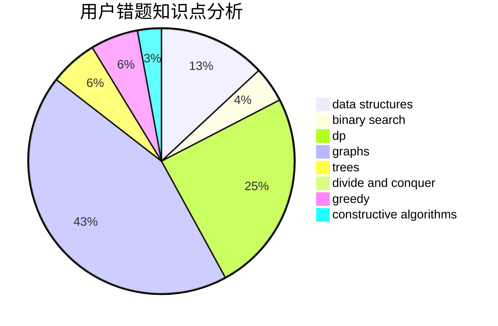

# ZGS_WZY

<!-- tabs:start -->

#### **用户提交结果分析**

#### **用户做题类型偏好分析**

#### **用户错题知识点分析**

<!-- tabs:end -->
# 推荐题目
[883C](https://codeforces.com/contest/883/problem/C)		binary search,
                        implementation		  
[1033E](https://codeforces.com/contest/1033/problem/E)		binary search,
                        constructive algorithms,
                        dfs and similar,
                        graphs,
                        interactive		  
[559A](https://codeforces.com/contest/559/problem/A)		brute force,
                        geometry,
                        math		  
[380A](https://codeforces.com/contest/380/problem/A)		binary search,
                        brute force		  
[144B](https://codeforces.com/contest/144/problem/B)		implementation		  
[11292](https://codeforces.com/contest/1129/problem/2)		dsu,graphs,sortings,trees		  
[600C](https://codeforces.com/contest/600/problem/C)		constructive algorithms,
                        greedy,
                        strings		  
[592B](https://codeforces.com/contest/592/problem/B)		math		  
[732B](https://codeforces.com/contest/732/problem/B)		dp,
                        greedy		  
[849A](https://codeforces.com/contest/849/problem/A)		implementation		  
