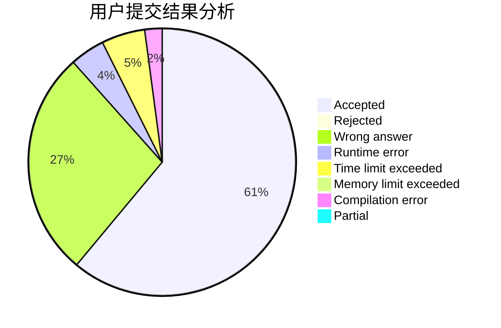
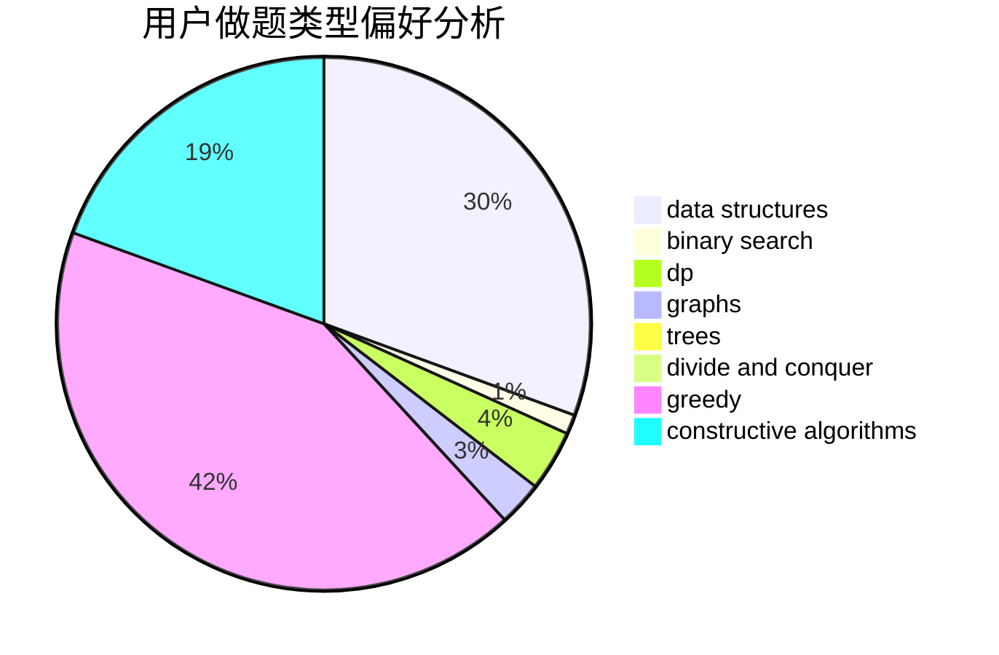
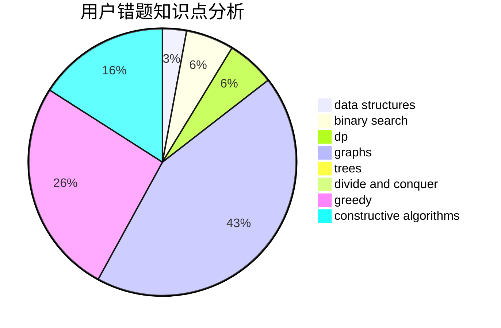

# ZHUHAORENQaQ

<!-- tabs:start -->

#### **用户提交结果分析**

#### **用户做题类型偏好分析**

#### **用户错题知识点分析**

<!-- tabs:end -->
# 推荐题目
[631B](https://codeforces.com/contest/631/problem/B)		constructive algorithms,
                        implementation		  
[727E](https://codeforces.com/contest/727/problem/E)		data structures,
                        hashing,
                        string suffix structures,
                        strings		  
[1167E](https://codeforces.com/contest/1167/problem/E)		binary search,
                        combinatorics,
                        data structures,
                        two pointers		  
[55C](https://codeforces.com/contest/55/problem/C)		games		  
[1169B](https://codeforces.com/contest/1169/problem/B)		graphs,
                        implementation		  
[277C](https://codeforces.com/contest/277/problem/C)		games,
                        implementation		  
[916C](https://codeforces.com/contest/916/problem/C)		constructive algorithms,
                        graphs,
                        shortest paths		  
[570E](https://codeforces.com/contest/570/problem/E)		combinatorics,
                        dp		  
[749D](https://codeforces.com/contest/749/problem/D)		binary search,
                        data structures		  
[884A](https://codeforces.com/contest/884/problem/A)		implementation		  
