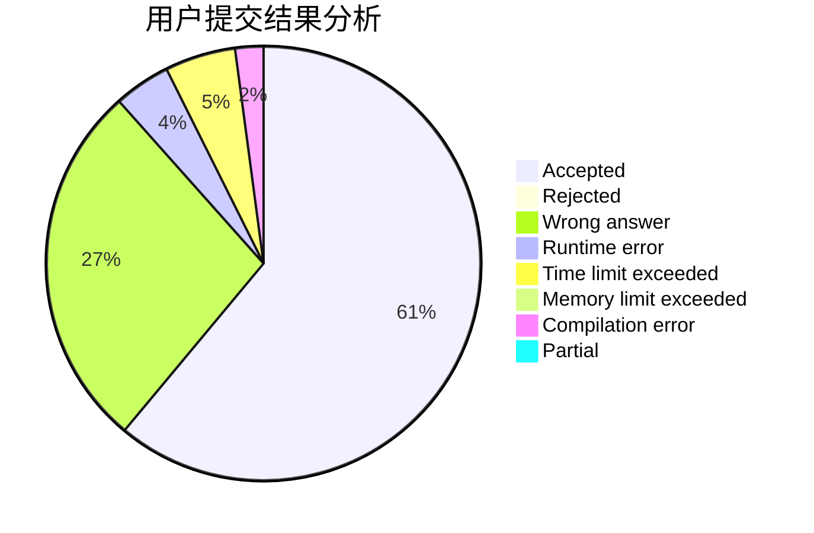
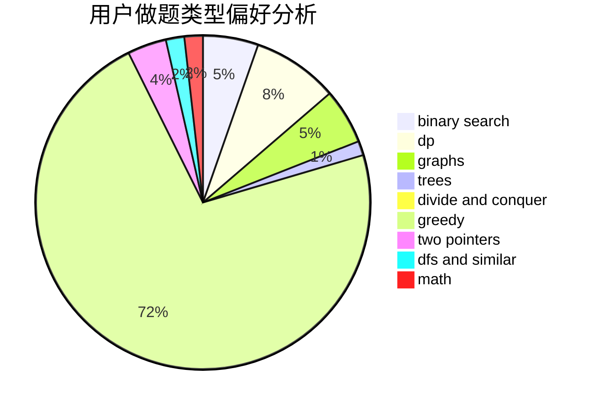

# ZHUHAORENQaQ

<!-- tabs:start -->

#### **用户提交结果分析**

#### **用户做题类型偏好分析**

<!-- tabs:end -->
# 推荐题目
[631B](https://codeforces.com/contest/631/problem/B)
[727E](https://codeforces.com/contest/727/problem/E)
[1167E](https://codeforces.com/contest/1167/problem/E)
[55C](https://codeforces.com/contest/55/problem/C)
[1169B](https://codeforces.com/contest/1169/problem/B)
[277C](https://codeforces.com/contest/277/problem/C)
[916C](https://codeforces.com/contest/916/problem/C)
[570E](https://codeforces.com/contest/570/problem/E)
[749D](https://codeforces.com/contest/749/problem/D)
[884A](https://codeforces.com/contest/884/problem/A)
