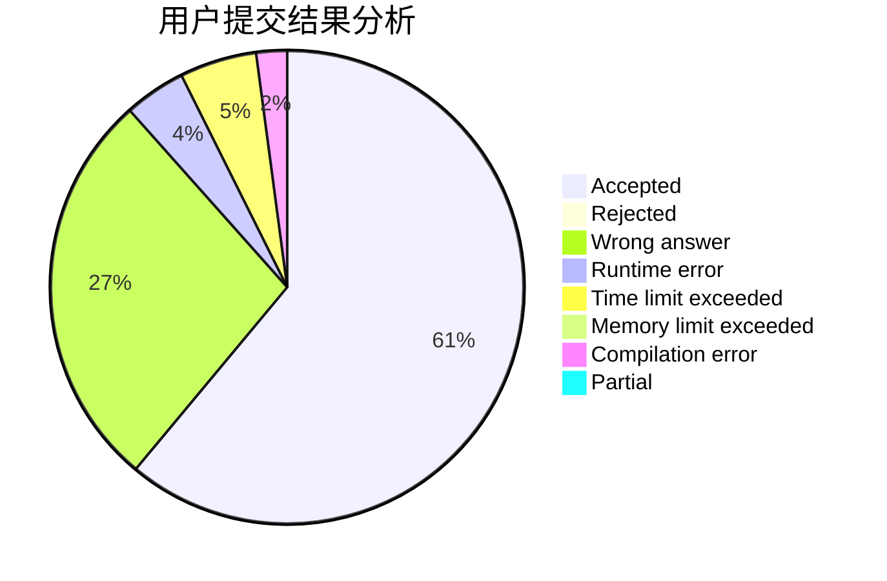
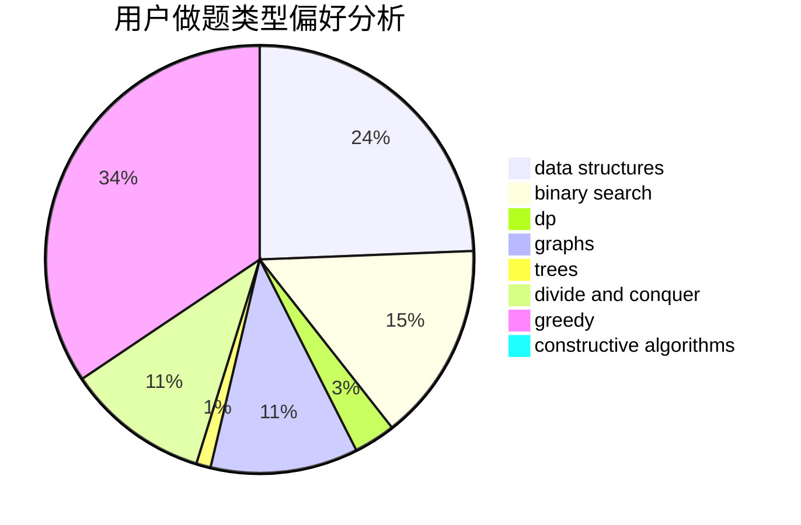
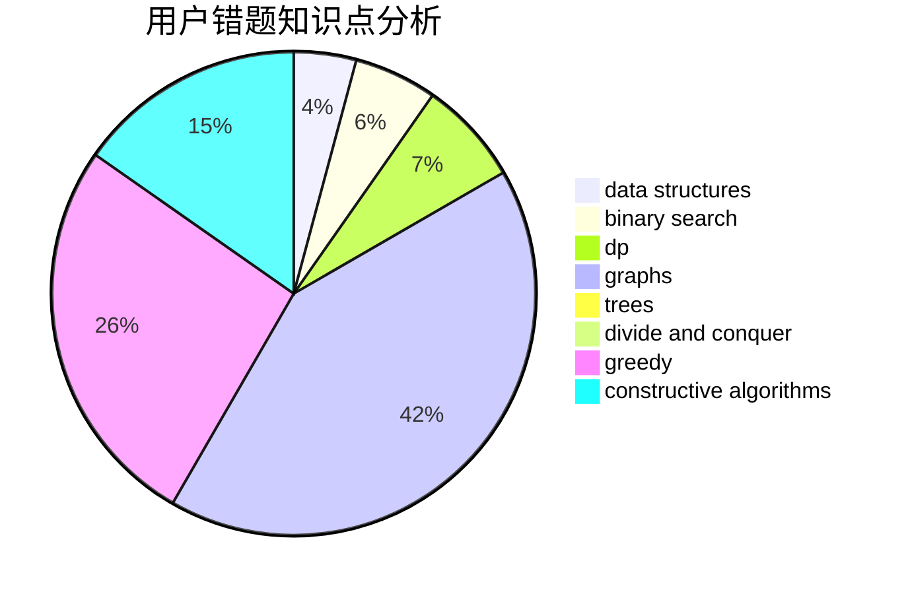

# ZHUHAORENQaQ

<!-- tabs:start -->

#### **用户提交结果分析**

#### **用户做题类型偏好分析**

#### **用户错题知识点分析**

<!-- tabs:end -->
# 推荐题目
[612A](https://codeforces.com/contest/612/problem/A)		brute force,
                        implementation,
                        strings		  
[708C](https://codeforces.com/contest/708/problem/C)		data structures,
                        dfs and similar,
                        dp,
                        graphs,
                        greedy,
                        trees		  
[1165C](https://codeforces.com/contest/1165/problem/C)		greedy		  
[538H](https://codeforces.com/contest/538/problem/H)		2-sat,
                        data structures,
                        dfs and similar,
                        greedy		  
[1166C](https://codeforces.com/contest/1166/problem/C)		binary search,
                        sortings,
                        two pointers		  
[25C](https://codeforces.com/contest/25/problem/C)		graphs,
                        shortest paths		  
[8E](https://codeforces.com/contest/8/problem/E)		dp,
                        graphs		  
[546D](https://codeforces.com/contest/546/problem/D)		constructive algorithms,
                        dp,
                        math,
                        number theory		  
[731C](https://codeforces.com/contest/731/problem/C)		dfs and similar,
                        dsu,
                        graphs,
                        greedy		  
[864D](https://codeforces.com/contest/864/problem/D)		greedy,
                        implementation,
                        math		  
