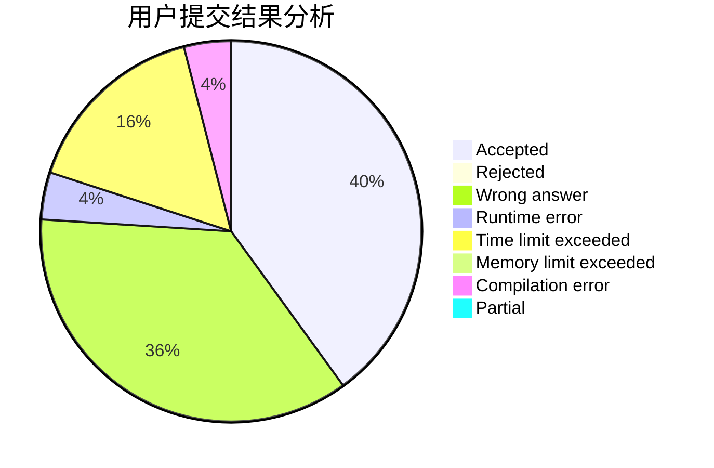
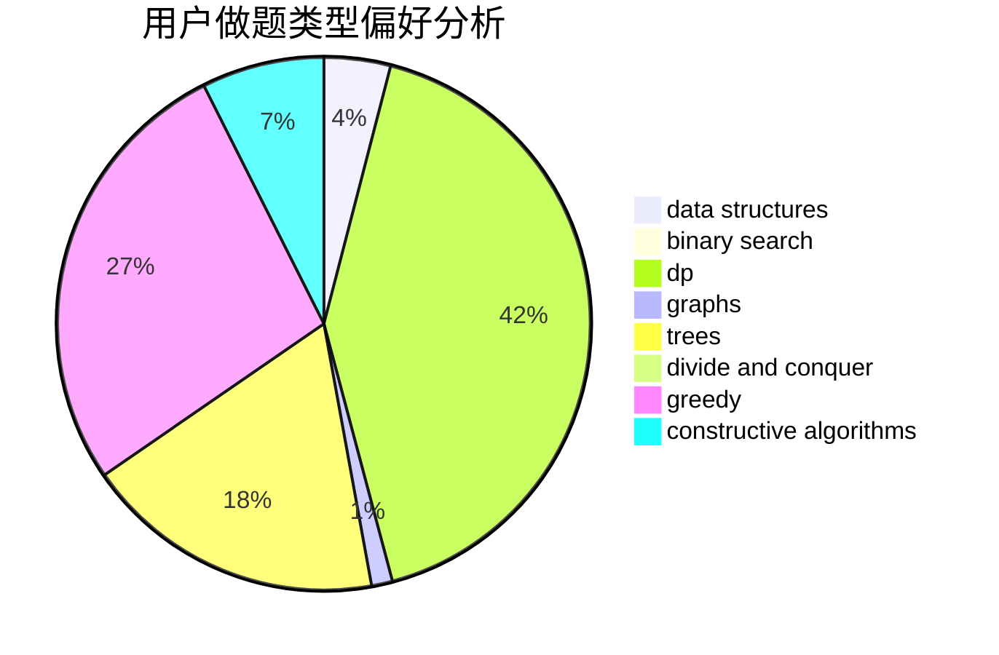
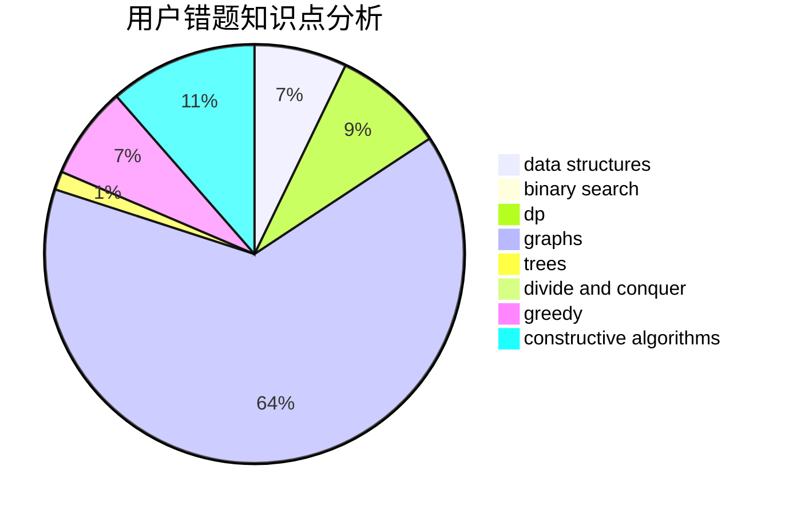

# ZJUT-20-QC

<!-- tabs:start -->

#### **用户提交结果分析**

#### **用户做题类型偏好分析**

#### **用户错题知识点分析**

<!-- tabs:end -->
# 推荐题目
[14791](https://codeforces.com/contest/1479/problem/1)		dsu,graphs,sortings,trees		  
[825E](https://codeforces.com/contest/825/problem/E)		data structures,
                        dfs and similar,
                        graphs,
                        greedy		  
[782E](https://codeforces.com/contest/782/problem/E)		dsu,graphs,sortings,trees		  
[314C](https://codeforces.com/contest/314/problem/C)		data structures,
                        dp		  
[23B](https://codeforces.com/contest/23/problem/B)		constructive algorithms,
                        graphs,
                        math		  
[996F](https://codeforces.com/contest/996/problem/F)		dsu,graphs,sortings,trees		  
[1150B](https://codeforces.com/contest/1150/problem/B)		greedy,
                        implementation		  
[911C](https://codeforces.com/contest/911/problem/C)		brute force,
                        constructive algorithms		  
[157C](https://codeforces.com/contest/157/problem/C)		dsu,graphs,sortings,trees		  
[334A](https://codeforces.com/contest/334/problem/A)		implementation		  
