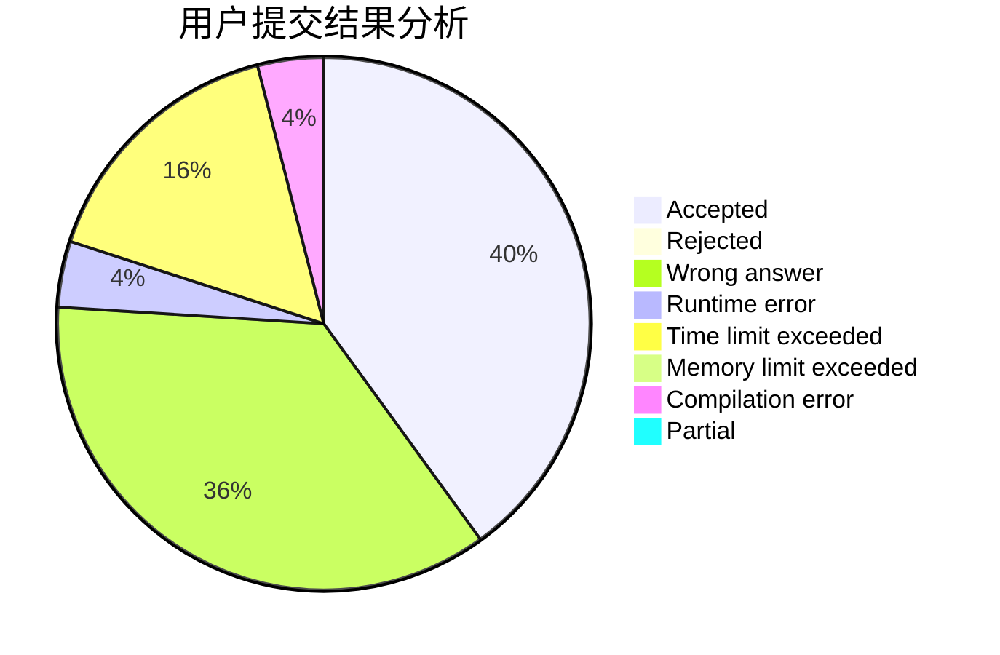
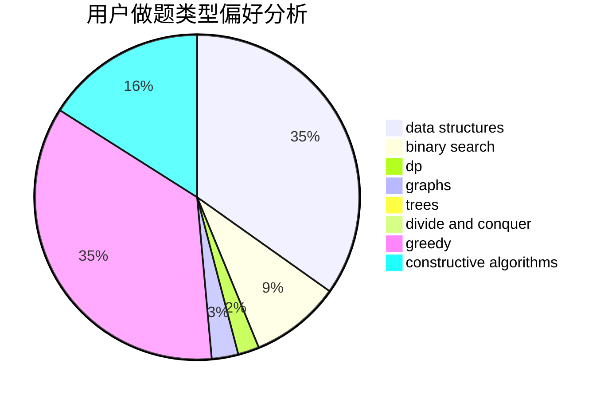
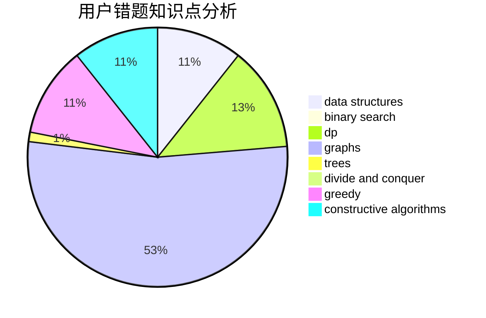

# ZJUT-20-QC

<!-- tabs:start -->

#### **用户提交结果分析**

#### **用户做题类型偏好分析**

#### **用户错题知识点分析**

<!-- tabs:end -->
# 推荐题目
[1470D](https://codeforces.com/contest/1470/problem/D)		constructive algorithms,
                        dfs and similar,
                        graph matchings,
                        graphs,
                        greedy		  
[808F](https://codeforces.com/contest/808/problem/F)		binary search,
                        flows,
                        graphs		  
[764B](https://codeforces.com/contest/764/problem/B)		constructive algorithms,
                        implementation		  
[297D](https://codeforces.com/contest/297/problem/D)		constructive algorithms		  
[21D](https://codeforces.com/contest/21/problem/D)		bitmasks,
                        graph matchings,
                        graphs		  
[981E](https://codeforces.com/contest/981/problem/E)		bitmasks,
                        data structures,
                        divide and conquer,
                        dp		  
[1148G](https://codeforces.com/contest/1148/problem/G)		constructive algorithms,
                        graphs,
                        math,
                        number theory,
                        probabilities		  
[893C](https://codeforces.com/contest/893/problem/C)		dfs and similar,
                        graphs,
                        greedy		  
[1506B](https://codeforces.com/contest/1506/problem/B)		greedy,
                        implementation		  
[311A](https://codeforces.com/contest/311/problem/A)		constructive algorithms,
                        implementation		  
