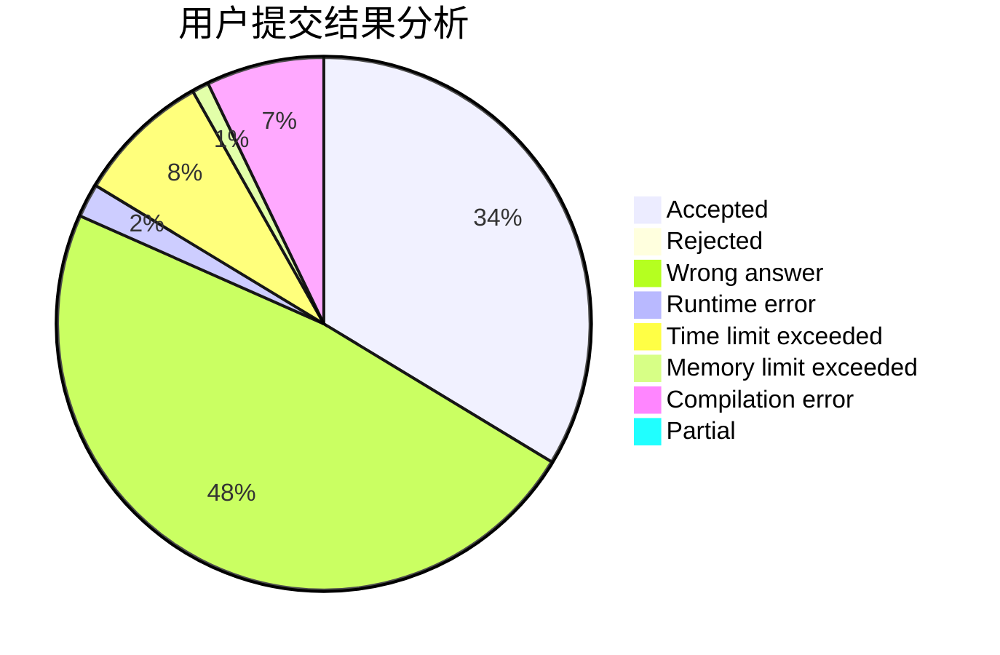
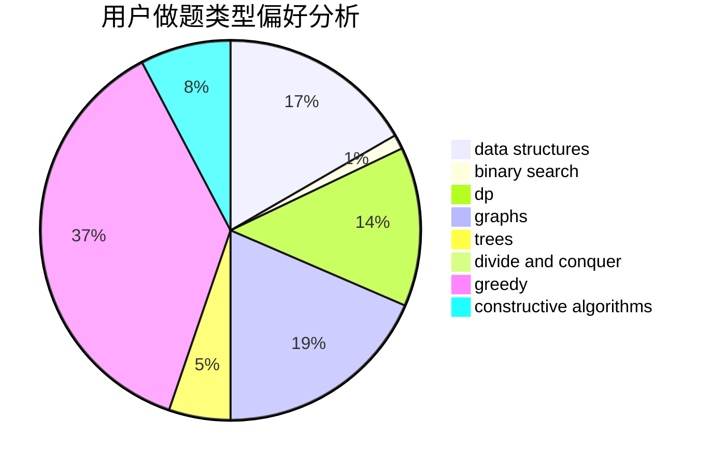

# ZJiaQ

<!-- tabs:start -->

#### **用户提交结果分析**

#### **用户做题类型偏好分析**

#### **用户错题知识点分析**

<!-- tabs:end -->
# 推荐题目
[567D](https://codeforces.com/contest/567/problem/D)		binary search,
                        data structures,
                        greedy,
                        sortings		  
[22E](https://codeforces.com/contest/22/problem/E)		dfs and similar,
                        graphs,
                        trees		  
[721D](https://codeforces.com/contest/721/problem/D)		constructive algorithms,
                        data structures,
                        greedy,
                        math		  
[720C](https://codeforces.com/contest/720/problem/C)		constructive algorithms		  
[1482C](https://codeforces.com/contest/1482/problem/C)		brute force,
                        constructive algorithms,
                        greedy,
                        implementation		  
[131A](https://codeforces.com/contest/131/problem/A)		implementation,
                        strings		  
[445B](https://codeforces.com/contest/445/problem/B)		dfs and similar,
                        dsu,
                        greedy		  
[152E](https://codeforces.com/contest/152/problem/E)		bitmasks,
                        dp,
                        graphs,
                        trees		  
[12621](https://codeforces.com/contest/1262/problem/1)		dsu,graphs,sortings,trees		  
[1447E](https://codeforces.com/contest/1447/problem/E)		dsu,graphs,sortings,trees		  
