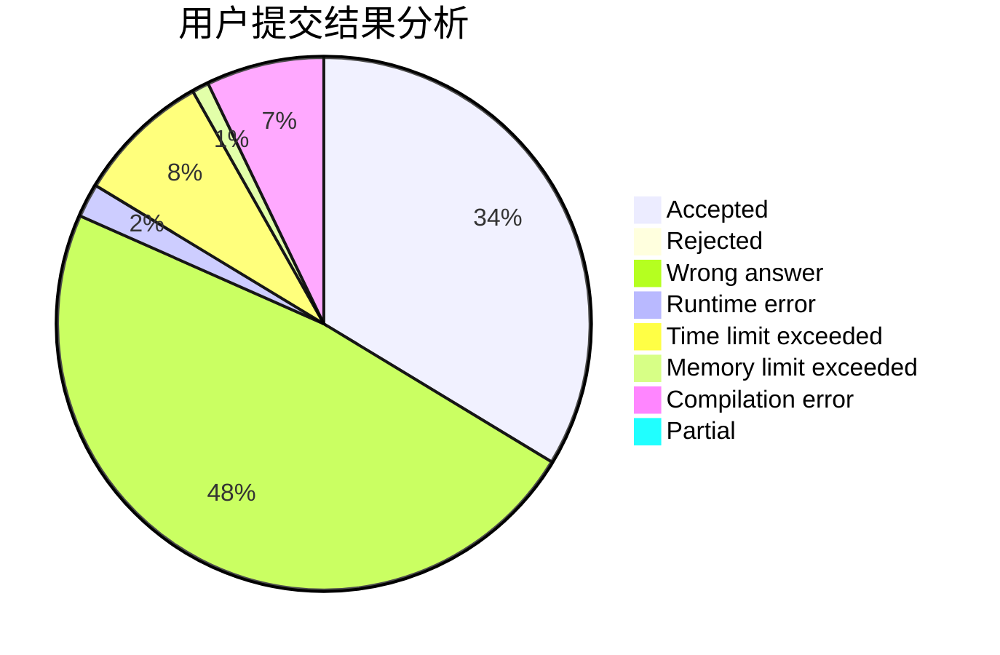
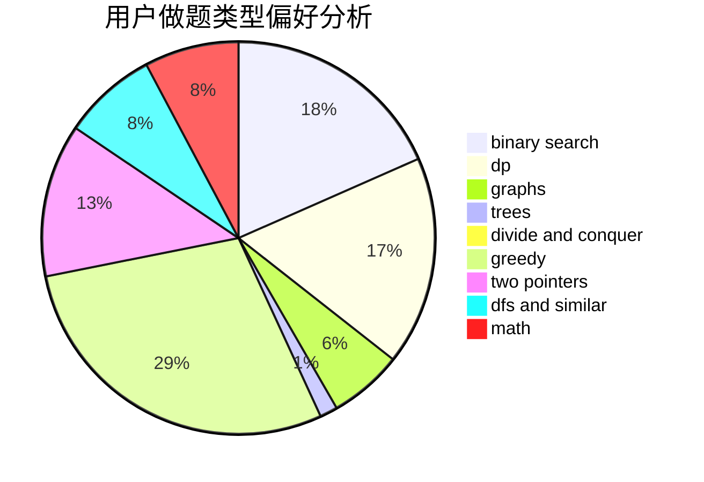

# ZJiaQ

<!-- tabs:start -->

#### **用户提交结果分析**

#### **用户做题类型偏好分析**

<!-- tabs:end -->
# 推荐题目
[567D](https://codeforces.com/contest/567/problem/D)
[22E](https://codeforces.com/contest/22/problem/E)
[721D](https://codeforces.com/contest/721/problem/D)
[720C](https://codeforces.com/contest/720/problem/C)
[1482C](https://codeforces.com/contest/1482/problem/C)
[131A](https://codeforces.com/contest/131/problem/A)
[445B](https://codeforces.com/contest/445/problem/B)
[152E](https://codeforces.com/contest/152/problem/E)
[12621](https://codeforces.com/contest/1262/problem/1)
[1447E](https://codeforces.com/contest/1447/problem/E)
