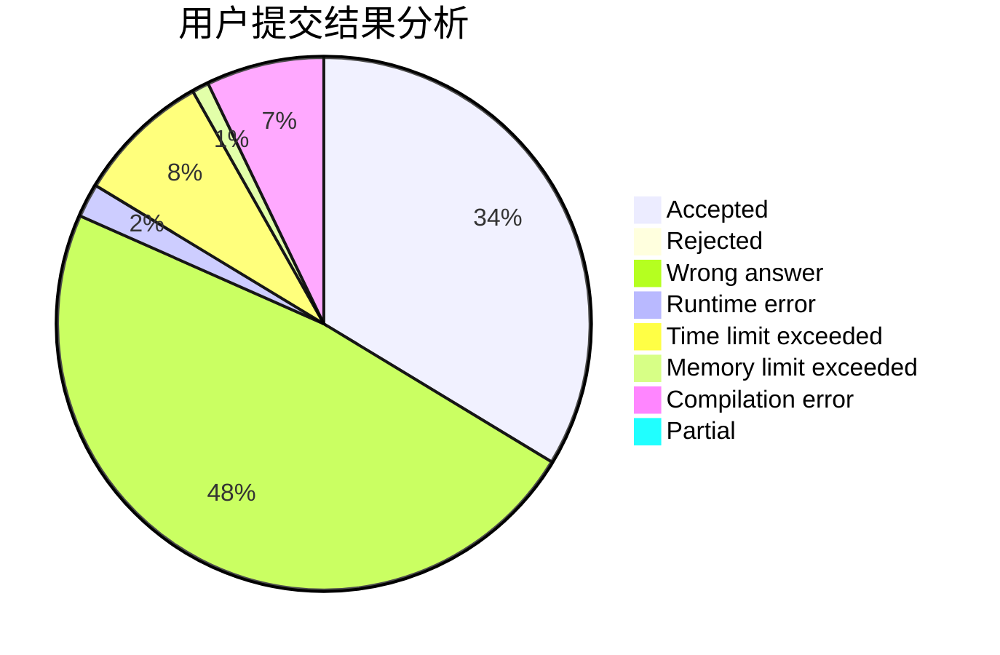
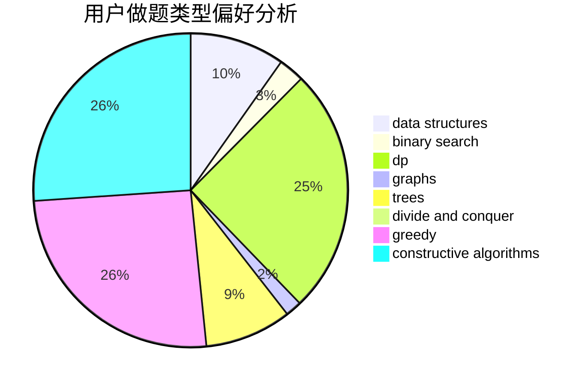
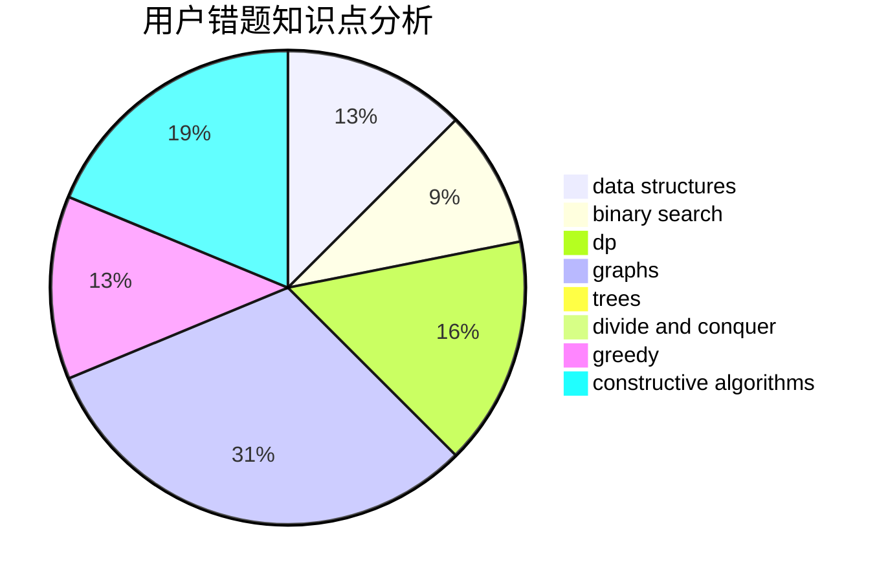

# ZJiaQ

<!-- tabs:start -->

#### **用户提交结果分析**

#### **用户做题类型偏好分析**

#### **用户错题知识点分析**

<!-- tabs:end -->
# 推荐题目
[543B](https://codeforces.com/contest/543/problem/B)		constructive algorithms,
                        graphs,
                        shortest paths		  
[208C](https://codeforces.com/contest/208/problem/C)		dp,
                        graphs,
                        shortest paths		  
[702F](https://codeforces.com/contest/702/problem/F)		data structures		  
[701F](https://codeforces.com/contest/701/problem/F)		dsu,graphs,sortings,trees		  
[1473F](https://codeforces.com/contest/1473/problem/F)		flows,
                        math		  
[1310D](https://codeforces.com/contest/1310/problem/D)		dp,
                        graphs,
                        probabilities		  
[41D](https://codeforces.com/contest/41/problem/D)		dp		  
[1505D](https://codeforces.com/contest/1505/problem/D)		number theory		  
[1254D](https://codeforces.com/contest/1254/problem/D)		data structures,
                        probabilities,
                        trees		  
[1438A](https://codeforces.com/contest/1438/problem/A)		constructive algorithms,
                        implementation		  
