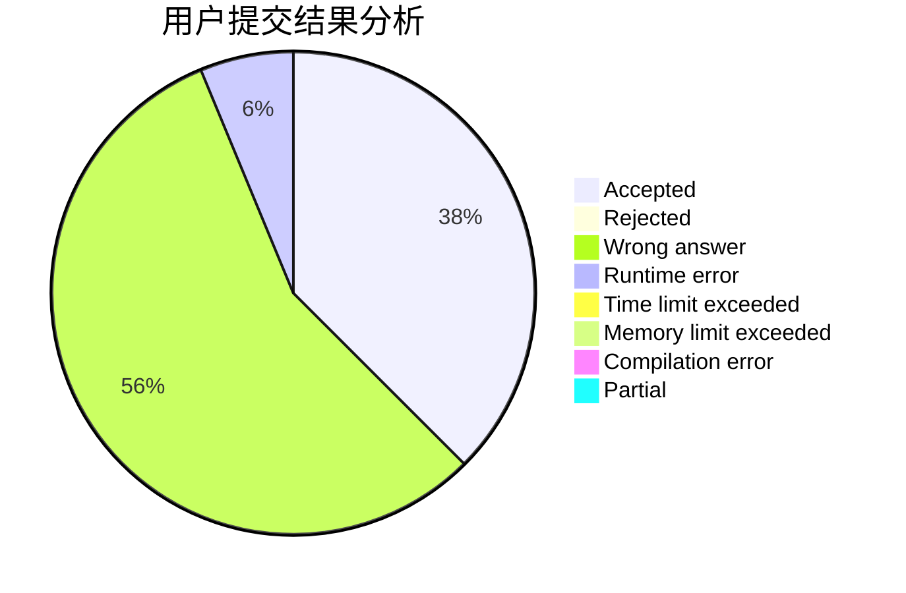
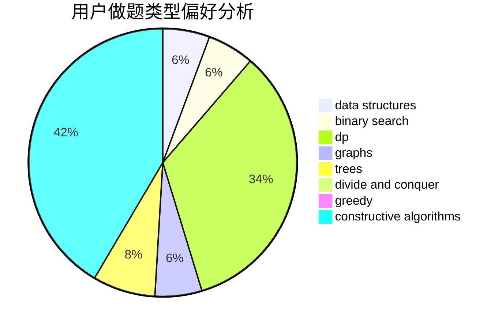

# ZJsheep

<!-- tabs:start -->

#### **用户提交结果分析**

#### **用户做题类型偏好分析**

#### **用户错题知识点分析**

<!-- tabs:end -->
# 推荐题目
[1144F](https://codeforces.com/contest/1144/problem/F)		dfs and similar,
                        graphs		  
[360D](https://codeforces.com/contest/360/problem/D)		number theory		  
[618D](https://codeforces.com/contest/618/problem/D)		dfs and similar,
                        dp,
                        graph matchings,
                        greedy,
                        trees		  
[409B](https://codeforces.com/contest/409/problem/B)		*special problem		  
[1223B](https://codeforces.com/contest/1223/problem/B)		strings		  
[1097B](https://codeforces.com/contest/1097/problem/B)		bitmasks,
                        brute force,
                        dp		  
[1268B](https://codeforces.com/contest/1268/problem/B)		dp,
                        greedy,
                        math		  
[4A](https://codeforces.com/contest/4/problem/A)		brute force,
                        math		  
[1432B](https://codeforces.com/contest/1432/problem/B)		dsu,graphs,sortings,trees		  
[1490C](https://codeforces.com/contest/1490/problem/C)		binary search,
                        brute force,
                        brute force,
                        math		  
