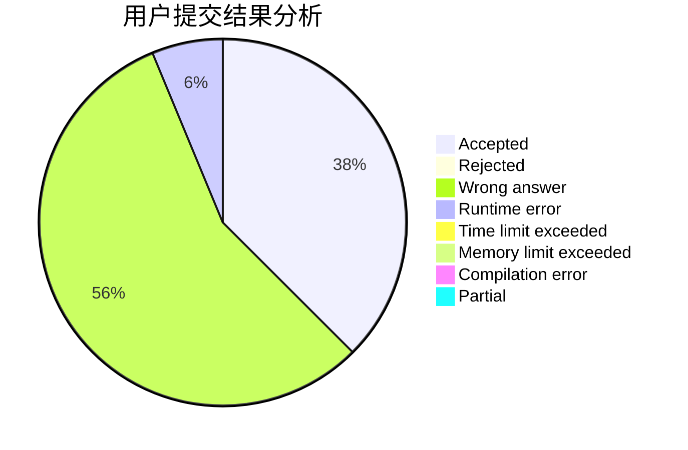
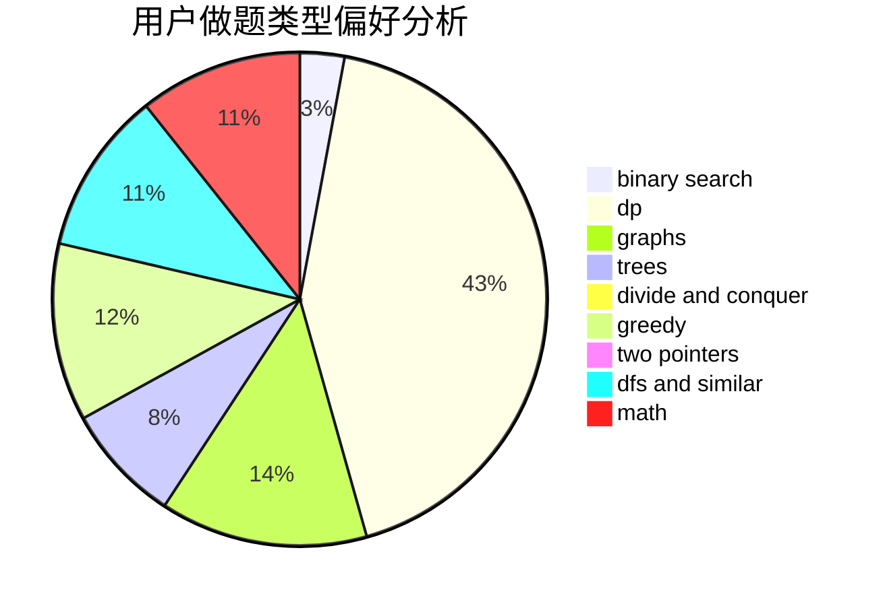

# ZJsheep

<!-- tabs:start -->

#### **用户提交结果分析**

#### **用户做题类型偏好分析**

<!-- tabs:end -->
# 推荐题目
[1144F](https://codeforces.com/contest/1144/problem/F)
[360D](https://codeforces.com/contest/360/problem/D)
[618D](https://codeforces.com/contest/618/problem/D)
[409B](https://codeforces.com/contest/409/problem/B)
[1223B](https://codeforces.com/contest/1223/problem/B)
[1097B](https://codeforces.com/contest/1097/problem/B)
[1268B](https://codeforces.com/contest/1268/problem/B)
[4A](https://codeforces.com/contest/4/problem/A)
[1432B](https://codeforces.com/contest/1432/problem/B)
[1490C](https://codeforces.com/contest/1490/problem/C)
