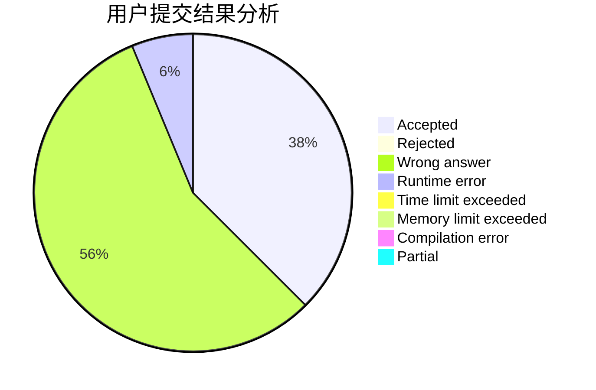
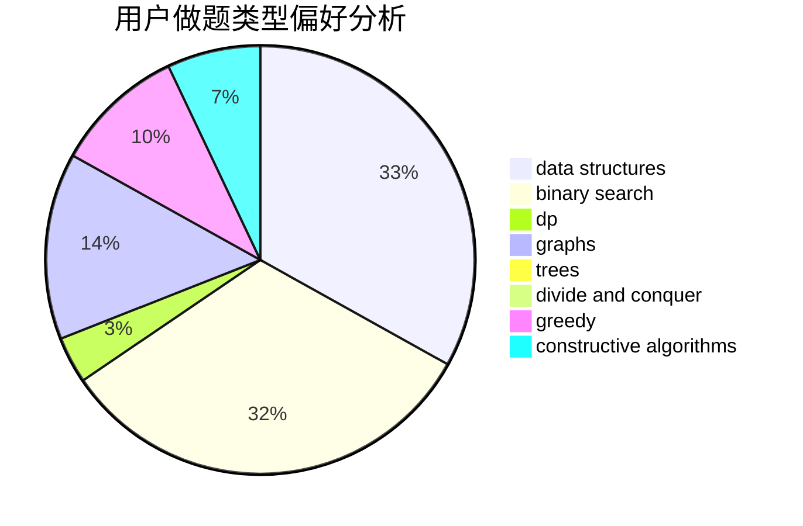

# ZJsheep

<!-- tabs:start -->

#### **用户提交结果分析**

#### **用户做题类型偏好分析**

#### **用户错题知识点分析**

<!-- tabs:end -->
# 推荐题目
[1142D](https://codeforces.com/contest/1142/problem/D)		dp		  
[334B](https://codeforces.com/contest/334/problem/B)		sortings		  
[59E](https://codeforces.com/contest/59/problem/E)		graphs,
                        shortest paths		  
[379D](https://codeforces.com/contest/379/problem/D)		bitmasks,
                        brute force,
                        dp		  
[1216E2](https://codeforces.com/contest/1216E/problem/2)		binary search,
                        math		  
[1096F](https://codeforces.com/contest/1096/problem/F)		dp,
                        math,
                        probabilities		  
[1262E](https://codeforces.com/contest/1262/problem/E)		dsu,graphs,sortings,trees		  
[479E](https://codeforces.com/contest/479/problem/E)		combinatorics,
                        dp		  
[1423L](https://codeforces.com/contest/1423/problem/L)		meet-in-the-middle		  
[1482E](https://codeforces.com/contest/1482/problem/E)		data structures,
                        divide and conquer,
                        dp		  
