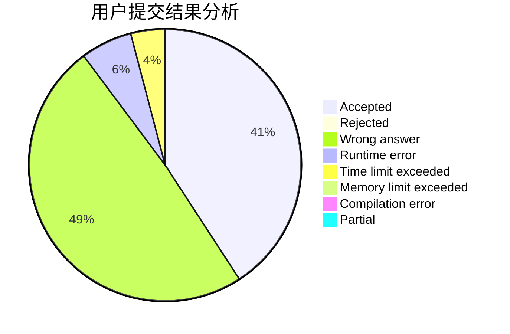
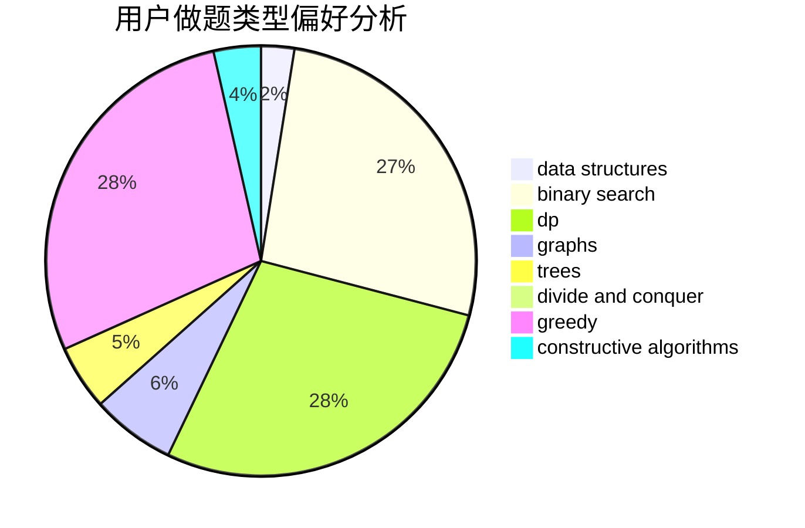
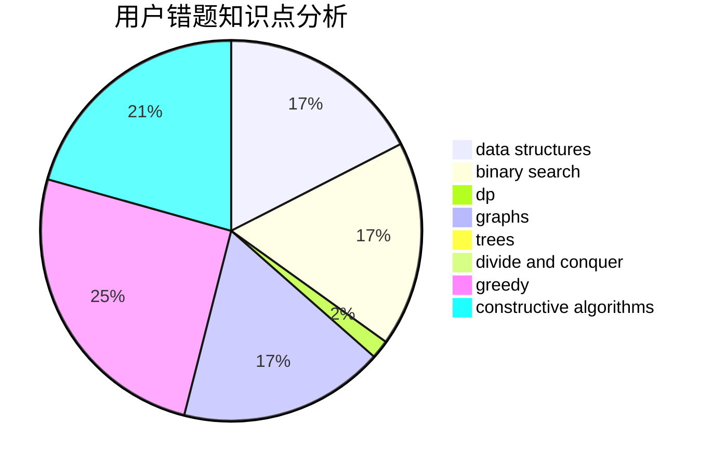

# AliceLiCF

<!-- tabs:start -->

#### **用户提交结果分析**

#### **用户做题类型偏好分析**

#### **用户错题知识点分析**

<!-- tabs:end -->
# 推荐题目
[1299A](https://codeforces.com/contest/1299/problem/A)		brute force,
                        greedy,
                        math		  
[280C](https://codeforces.com/contest/280/problem/C)		implementation,
                        math,
                        probabilities,
                        trees		  
[1282D](https://codeforces.com/contest/1282/problem/D)		constructive algorithms,
                        interactive,
                        strings		  
[27A](https://codeforces.com/contest/27/problem/A)		implementation,
                        sortings		  
[281A](https://codeforces.com/contest/281/problem/A)		implementation,
                        strings		  
[1208E](https://codeforces.com/contest/1208/problem/E)		data structures,
                        implementation		  
[280B](https://codeforces.com/contest/280/problem/B)		data structures,
                        implementation,
                        two pointers		  
[1282A](https://codeforces.com/contest/1282/problem/A)		implementation,
                        math		  
[281D](https://codeforces.com/contest/281/problem/D)		dsu,graphs,sortings,trees		  
[280E](https://codeforces.com/contest/280/problem/E)		data structures,
                        dp,
                        implementation,
                        math		  
