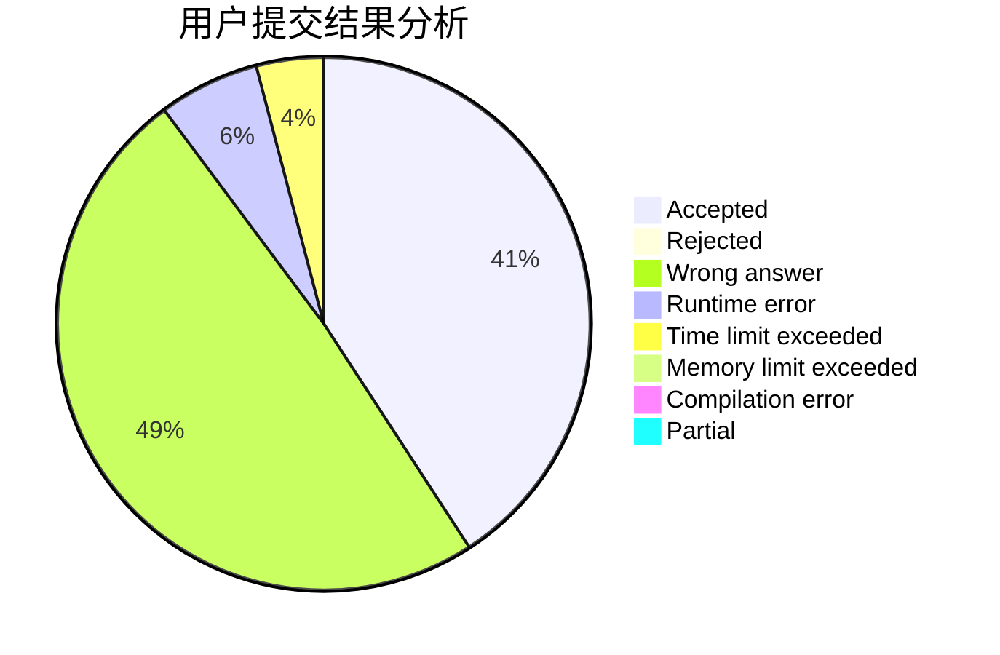
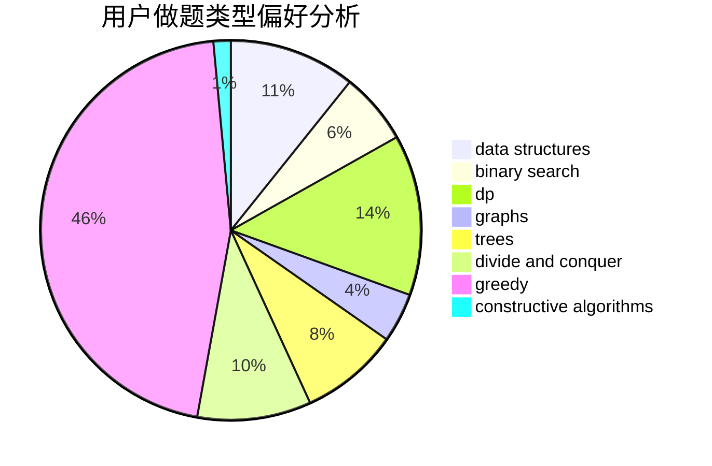
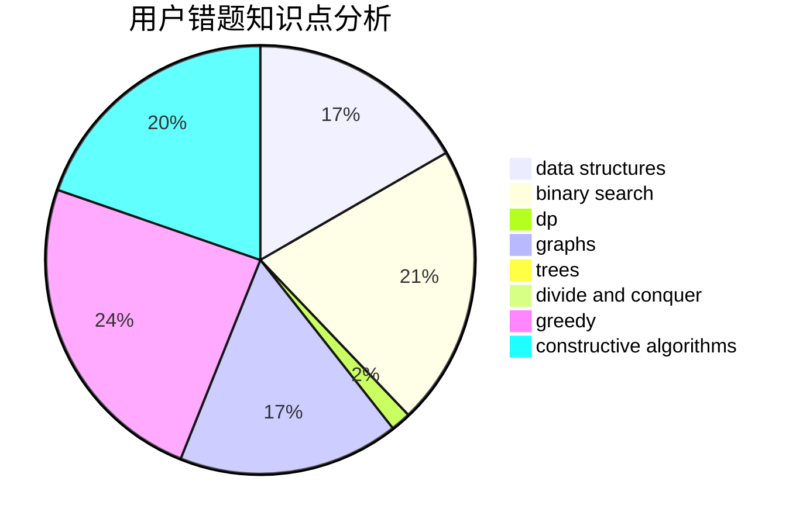

# AliceLiCF

<!-- tabs:start -->

#### **用户提交结果分析**

#### **用户做题类型偏好分析**

#### **用户错题知识点分析**

<!-- tabs:end -->
# 推荐题目
[1292A](https://codeforces.com/contest/1292/problem/A)		data structures,
                        dsu,
                        implementation		  
[264C](https://codeforces.com/contest/264/problem/C)		dp		  
[1276C](https://codeforces.com/contest/1276/problem/C)		brute force,
                        combinatorics,
                        constructive algorithms,
                        data structures,
                        greedy,
                        math		  
[261C](https://codeforces.com/contest/261/problem/C)		constructive algorithms,
                        dp,
                        math		  
[265D](https://codeforces.com/contest/265/problem/D)		dsu,graphs,sortings,trees		  
[1203F2](https://codeforces.com/contest/1203F/problem/2)		dp,
                        greedy		  
[264B](https://codeforces.com/contest/264/problem/B)		dp,
                        number theory		  
[1276A](https://codeforces.com/contest/1276/problem/A)		dp,
                        greedy		  
[266A](https://codeforces.com/contest/266/problem/A)		implementation		  
[264E](https://codeforces.com/contest/264/problem/E)		data structures,
                        dp		  
