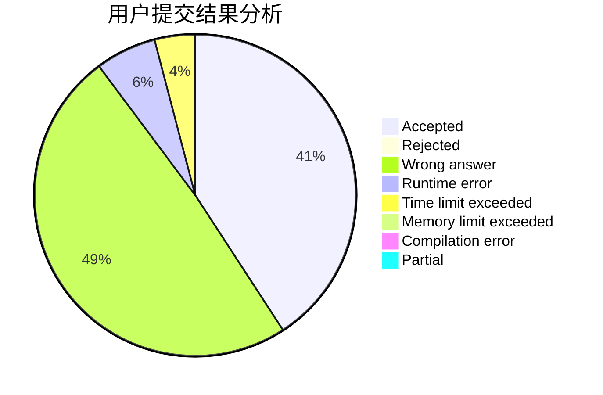
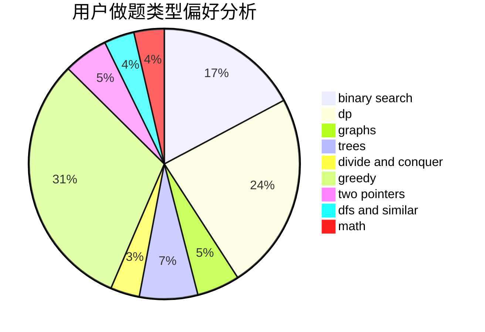

# AliceLiCF

<!-- tabs:start -->

#### **用户提交结果分析**

#### **用户做题类型偏好分析**

<!-- tabs:end -->
# 推荐题目
[1299A](https://codeforces.com/contest/1299/problem/A)
[280C](https://codeforces.com/contest/280/problem/C)
[1282D](https://codeforces.com/contest/1282/problem/D)
[27A](https://codeforces.com/contest/27/problem/A)
[281A](https://codeforces.com/contest/281/problem/A)
[1208E](https://codeforces.com/contest/1208/problem/E)
[280B](https://codeforces.com/contest/280/problem/B)
[1282A](https://codeforces.com/contest/1282/problem/A)
[281D](https://codeforces.com/contest/281/problem/D)
[280E](https://codeforces.com/contest/280/problem/E)
