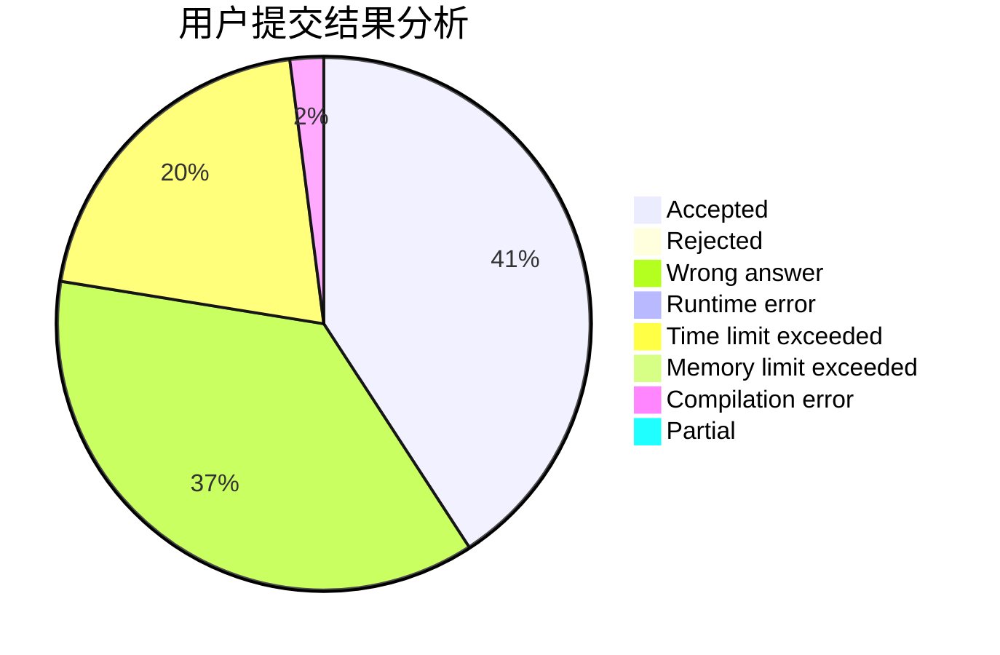
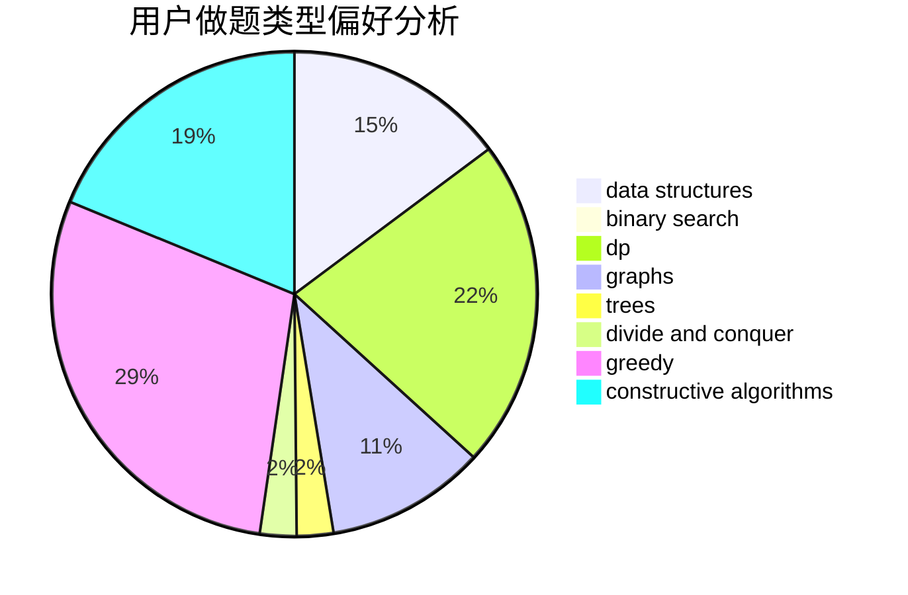
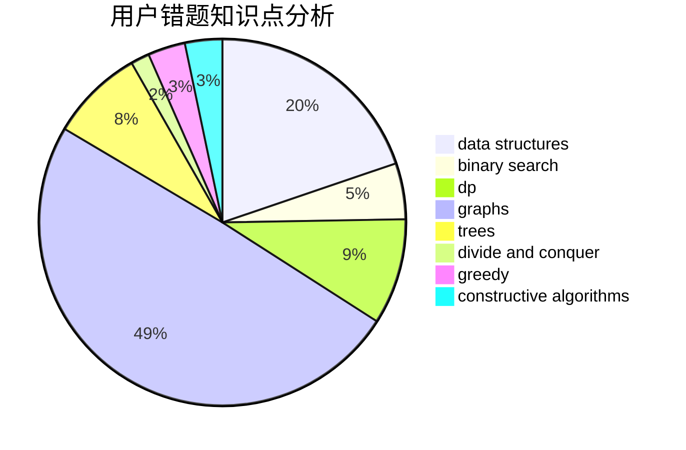

# ZPC2048
<!-- tabs:start -->
#### **用户提交结果分析**

#### **用户做题类型偏好分析**

#### **用户错题知识点分析**

<!-- tabs:end -->
# 推荐题目
[Yet Another Minimization Problem](http://codeforces.com/problemset/problem/868/F)		divide and conquer,
                        dp		  
[Boboniu Walks on Graph](https://codeforces.com/contest/1395/problem/E)		brute force,
                        dfs and similar,
                        graphs,
                        hashing		  
[Wall Bars](http://codeforces.com/problemset/problem/268/D)		dp		  
[Berland Army](http://codeforces.com/problemset/problem/883/B)		constructive algorithms,
                        graphs,
                        greedy		  
[MUH and Sticks](http://codeforces.com/problemset/problem/471/A)		implementation		  
[Worms](http://codeforces.com/problemset/problem/474/B)		binary search,
                        implementation		  
[Common ancestor](http://codeforces.com/problemset/problem/49/E)		dp		  
[Interval Cubing](http://codeforces.com/problemset/problem/311/D)		data structures,
                        math		  
[Byteland coins](https://codeforces.com/contest/759/problem/E)		combinatorics,
                        dp,
                        math		  
[Test](http://codeforces.com/problemset/problem/25/E)		hashing,
                        strings		  
<!-- tabs:start -->
#### **data structures**
[Yet Another Minimization Problem](http://codeforces.com/problemset/problem/311/D)		data structures,
                        math		  
[Boboniu Walks on Graph](http://codeforces.com/problemset/problem/331/D3)		data structures,
                        implementation,
                        trees		  
[Wall Bars](http://codeforces.com/problemset/problem/551/E)		binary search,
                        data structures,
                        implementation		  
[Berland Army](http://codeforces.com/problemset/problem/292/D)		data structures,
                        dfs and similar,
                        dp,
                        dsu		  
[MUH and Sticks](http://codeforces.com/problemset/problem/1182/F)		binary search,
                        data structures,
                        number theory		  
[Worms](http://codeforces.com/problemset/problem/1442/B)		combinatorics,
                        data structures,
                        dsu,
                        greedy,
                        implementation		  
[Common ancestor](http://codeforces.com/problemset/problem/1335/E1)		binary search,
                        brute force,
                        data structures,
                        dp,
                        two pointers		  
[Interval Cubing](http://codeforces.com/problemset/problem/1490/F)		binary search,
                        data structures,
                        greedy,
                        math,
                        sortings		  
[Byteland coins](http://codeforces.com/problemset/problem/1492/C)		binary search,
                        data structures,
                        dp,
                        greedy,
                        two pointers		  
[Test](http://codeforces.com/problemset/problem/1490/G)		binary search,
                        data structures,
                        math		  
#### **binary search**
[Yet Another Minimization Problem](http://codeforces.com/problemset/problem/474/B)		binary search,
                        implementation		  
[Boboniu Walks on Graph](http://codeforces.com/problemset/problem/1310/C)		binary search,
                        dp,
                        strings		  
[Wall Bars](http://codeforces.com/problemset/problem/551/E)		binary search,
                        data structures,
                        implementation		  
[Berland Army](http://codeforces.com/problemset/problem/84/C)		binary search,
                        implementation		  
[MUH and Sticks](http://codeforces.com/problemset/problem/1182/F)		binary search,
                        data structures,
                        number theory		  
[Worms](http://codeforces.com/problemset/problem/1443/C)		binary search,
                        greedy,
                        sortings		  
[Common ancestor](http://codeforces.com/problemset/problem/1335/E1)		binary search,
                        brute force,
                        data structures,
                        dp,
                        two pointers		  
[Interval Cubing](http://codeforces.com/problemset/problem/1490/F)		binary search,
                        data structures,
                        greedy,
                        math,
                        sortings		  
[Byteland coins](http://codeforces.com/problemset/problem/1492/C)		binary search,
                        data structures,
                        dp,
                        greedy,
                        two pointers		  
[Test](http://codeforces.com/problemset/problem/1463/D)		binary search,
                        constructive algorithms,
                        greedy,
                        two pointers		  
#### **dp**
[Yet Another Minimization Problem](http://codeforces.com/problemset/problem/868/F)		divide and conquer,
                        dp		  
[Boboniu Walks on Graph](http://codeforces.com/problemset/problem/268/D)		dp		  
[Wall Bars](http://codeforces.com/problemset/problem/49/E)		dp		  
[Berland Army](https://codeforces.com/contest/759/problem/E)		combinatorics,
                        dp,
                        math		  
[MUH and Sticks](http://codeforces.com/problemset/problem/137/D)		dp,
                        strings		  
[Worms](http://codeforces.com/problemset/problem/546/D)		constructive algorithms,
                        dp,
                        math,
                        number theory		  
[Common ancestor](http://codeforces.com/problemset/problem/1310/C)		binary search,
                        dp,
                        strings		  
[Interval Cubing](http://codeforces.com/problemset/problem/292/D)		data structures,
                        dfs and similar,
                        dp,
                        dsu		  
[Byteland coins](http://codeforces.com/problemset/problem/1384/B1)		brute force,
                        dp,
                        greedy		  
[Test](http://codeforces.com/problemset/problem/416/E)		dp,
                        graphs,
                        shortest paths		  
#### **graph**
[Yet Another Minimization Problem](https://codeforces.com/contest/1395/problem/E)		brute force,
                        dfs and similar,
                        graphs,
                        hashing		  
[Boboniu Walks on Graph](http://codeforces.com/problemset/problem/883/B)		constructive algorithms,
                        graphs,
                        greedy		  
[Wall Bars](http://codeforces.com/problemset/problem/821/D)		dfs and similar,
                        graphs,
                        shortest paths		  
[Berland Army](http://codeforces.com/problemset/problem/416/E)		dp,
                        graphs,
                        shortest paths		  
[MUH and Sticks](http://codeforces.com/problemset/problem/1364/D)		constructive algorithms,
                        dfs and similar,
                        graphs,
                        greedy,
                        implementation,
                        trees		  
[Worms](https://codeforces.com/contest/1496/problem/E)		constructive algorithms,
                        graphs		  
[Common ancestor](http://codeforces.com/problemset/problem/613/D)		dfs and similar,
                        divide and conquer,
                        dp,
                        graphs,
                        sortings,
                        trees		  
[Interval Cubing](http://codeforces.com/problemset/problem/1487/C)		brute force,
                        constructive algorithms,
                        dfs and similar,
                        graphs,
                        greedy,
                        implementation,
                        math		  
[Byteland coins](http://codeforces.com/problemset/problem/1437/C)		dp,
                        flows,
                        graph matchings,
                        greedy,
                        math,
                        sortings		  
[Test](http://codeforces.com/problemset/problem/1470/D)		constructive algorithms,
                        dfs and similar,
                        graph matchings,
                        graphs,
                        greedy		  
#### **trees**
[Yet Another Minimization Problem](http://codeforces.com/problemset/problem/1387/B2)		*special problem,
                        dfs and similar,
                        trees		  
[Boboniu Walks on Graph](http://codeforces.com/problemset/problem/331/D3)		data structures,
                        implementation,
                        trees		  
[Wall Bars](http://codeforces.com/problemset/problem/1364/D)		constructive algorithms,
                        dfs and similar,
                        graphs,
                        greedy,
                        implementation,
                        trees		  
[Berland Army](http://codeforces.com/problemset/problem/613/D)		dfs and similar,
                        divide and conquer,
                        dp,
                        graphs,
                        sortings,
                        trees		  
[MUH and Sticks](http://codeforces.com/problemset/problem/1479/D)		binary search,
                        bitmasks,
                        brute force,
                        data structures,
                        probabilities,
                        trees		  
[Worms](http://codeforces.com/problemset/problem/1511/C)		brute force,
                        data structures,
                        implementation,
                        trees		  
[Common ancestor](http://codeforces.com/problemset/problem/1499/F)		combinatorics,
                        dfs and similar,
                        dp,
                        trees		  
[Interval Cubing](http://codeforces.com/problemset/problem/1491/E)		brute force,
                        dfs and similar,
                        divide and conquer,
                        number theory,
                        trees		  
[Byteland coins](http://codeforces.com/problemset/problem/1466/D)		data structures,
                        greedy,
                        sortings,
                        trees		  
[Test](http://codeforces.com/problemset/problem/1495/D)		combinatorics,
                        dfs and similar,
                        graphs,
                        math,
                        shortest paths,
                        trees		  
#### **divide and conquer**
[Yet Another Minimization Problem](http://codeforces.com/problemset/problem/868/F)		divide and conquer,
                        dp		  
[Boboniu Walks on Graph](http://codeforces.com/problemset/problem/613/D)		dfs and similar,
                        divide and conquer,
                        dp,
                        graphs,
                        sortings,
                        trees		  
[Wall Bars](http://codeforces.com/problemset/problem/1461/D)		binary search,
                        brute force,
                        data structures,
                        divide and conquer,
                        implementation,
                        sortings		  
[Berland Army](http://codeforces.com/problemset/problem/1466/G)		combinatorics,
                        divide and conquer,
                        hashing,
                        math,
                        string suffix structures,
                        strings		  
[MUH and Sticks](http://codeforces.com/problemset/problem/1490/D)		dfs and similar,
                        divide and conquer,
                        implementation		  
[Worms](https://codeforces.com/contest/1483/problem/C)		data structures,
                        divide and conquer,
                        dp		  
[Common ancestor](http://codeforces.com/problemset/problem/1491/E)		brute force,
                        dfs and similar,
                        divide and conquer,
                        number theory,
                        trees		  
[Interval Cubing](http://codeforces.com/problemset/problem/1303/G)		data structures,
                        divide and conquer,
                        geometry,
                        trees		  
[Byteland coins](http://codeforces.com/problemset/problem/1494/D)		constructive algorithms,
                        data structures,
                        dfs and similar,
                        divide and conquer,
                        dsu,
                        greedy,
                        sortings,
                        trees		  
[Test](http://codeforces.com/problemset/problem/1482/E)		data structures,
                        divide and conquer,
                        dp		  
#### **greedy**
[Yet Another Minimization Problem](http://codeforces.com/problemset/problem/883/B)		constructive algorithms,
                        graphs,
                        greedy		  
[Boboniu Walks on Graph](http://codeforces.com/problemset/problem/91/A)		greedy,
                        strings		  
[Wall Bars](http://codeforces.com/problemset/problem/1384/B1)		brute force,
                        dp,
                        greedy		  
[Berland Army](http://codeforces.com/problemset/problem/1107/A)		greedy,
                        strings		  
[MUH and Sticks](http://codeforces.com/problemset/problem/529/B)		brute force,
                        greedy,
                        sortings		  
[Worms](https://codeforces.com/contest/1350/problem/D)		constructive algorithms,
                        greedy,
                        math		  
[Common ancestor](http://codeforces.com/problemset/problem/1077/B)		greedy		  
[Interval Cubing](http://codeforces.com/problemset/problem/1442/B)		combinatorics,
                        data structures,
                        dsu,
                        greedy,
                        implementation		  
[Byteland coins](http://codeforces.com/problemset/problem/1364/D)		constructive algorithms,
                        dfs and similar,
                        graphs,
                        greedy,
                        implementation,
                        trees		  
[Test](http://codeforces.com/problemset/problem/1292/B)		brute force,
                        constructive algorithms,
                        geometry,
                        greedy,
                        implementation		  
#### **constructive algorithms**
[Yet Another Minimization Problem](http://codeforces.com/problemset/problem/883/B)		constructive algorithms,
                        graphs,
                        greedy		  
[Boboniu Walks on Graph](http://codeforces.com/problemset/problem/546/D)		constructive algorithms,
                        dp,
                        math,
                        number theory		  
[Wall Bars](http://codeforces.com/problemset/problem/347/A)		constructive algorithms,
                        implementation,
                        sortings		  
[Berland Army](http://codeforces.com/problemset/problem/746/C)		constructive algorithms,
                        implementation,
                        math		  
[MUH and Sticks](https://codeforces.com/contest/1350/problem/D)		constructive algorithms,
                        greedy,
                        math		  
[Worms](http://codeforces.com/problemset/problem/949/B)		constructive algorithms,
                        math		  
[Common ancestor](http://codeforces.com/problemset/problem/1364/D)		constructive algorithms,
                        dfs and similar,
                        graphs,
                        greedy,
                        implementation,
                        trees		  
[Interval Cubing](https://codeforces.com/contest/1496/problem/E)		constructive algorithms,
                        graphs		  
[Byteland coins](http://codeforces.com/problemset/problem/1421/C)		constructive algorithms,
                        strings		  
[Test](http://codeforces.com/problemset/problem/1292/B)		brute force,
                        constructive algorithms,
                        geometry,
                        greedy,
                        implementation		  
#### **sortings**
[Yet Another Minimization Problem](http://codeforces.com/problemset/problem/347/A)		constructive algorithms,
                        implementation,
                        sortings		  
[Boboniu Walks on Graph](http://codeforces.com/problemset/problem/529/B)		brute force,
                        greedy,
                        sortings		  
[Wall Bars](http://codeforces.com/problemset/problem/792/A)		implementation,
                        sortings		  
[Berland Army](http://codeforces.com/problemset/problem/613/D)		dfs and similar,
                        divide and conquer,
                        dp,
                        graphs,
                        sortings,
                        trees		  
[MUH and Sticks](http://codeforces.com/problemset/problem/1443/C)		binary search,
                        greedy,
                        sortings		  
[Worms](http://codeforces.com/problemset/problem/1490/F)		binary search,
                        data structures,
                        greedy,
                        math,
                        sortings		  
[Common ancestor](https://codeforces.com/contest/1496/problem/C)		geometry,
                        greedy,
                        math,
                        sortings		  
[Interval Cubing](http://codeforces.com/problemset/problem/1495/A)		geometry,
                        greedy,
                        math,
                        sortings		  
[Byteland coins](http://codeforces.com/problemset/problem/1497/A)		brute force,
                        data structures,
                        greedy,
                        sortings		  
[Test](http://codeforces.com/problemset/problem/1427/A)		math,
                        sortings		  
<!-- tabs:end -->
