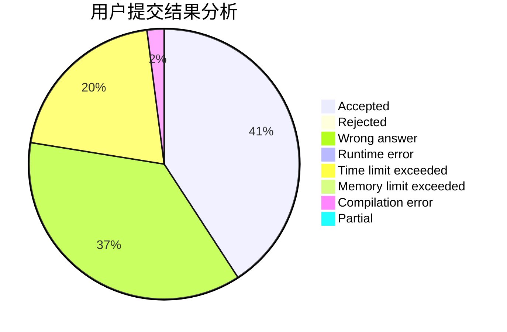
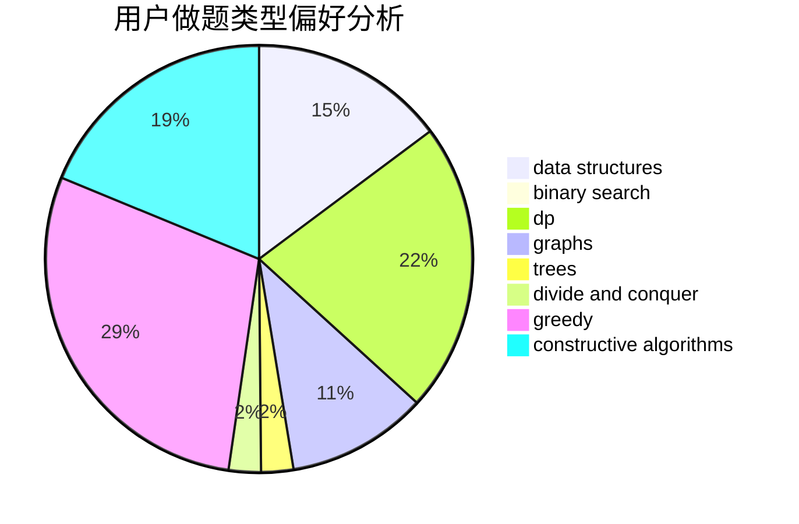
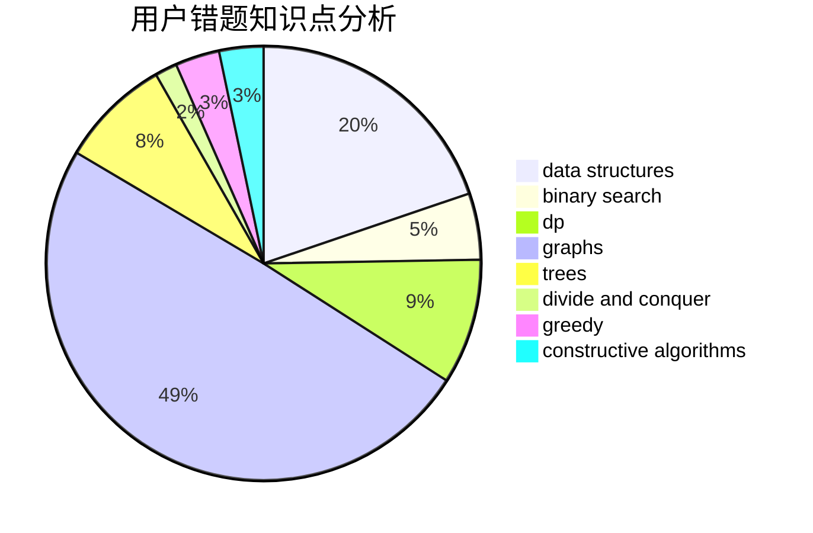

# ZPC2048

<!-- tabs:start -->

#### **用户提交结果分析**

#### **用户做题类型偏好分析**

#### **用户错题知识点分析**

<!-- tabs:end -->
# 推荐题目
[49E](https://codeforces.com/contest/49/problem/E)		dp		  
[1350D](https://codeforces.com/contest/1350/problem/D)		dsu,graphs,sortings,trees		  
[551E](https://codeforces.com/contest/551/problem/E)		binary search,
                        data structures,
                        implementation		  
[868F](https://codeforces.com/contest/868/problem/F)		divide and conquer,
                        dp		  
[471A](https://codeforces.com/contest/471/problem/A)		implementation		  
[759E](https://codeforces.com/contest/759/problem/E)		dsu,graphs,sortings,trees		  
[474B](https://codeforces.com/contest/474/problem/B)		binary search,
                        implementation		  
[268D](https://codeforces.com/contest/268/problem/D)		dp		  
[311D](https://codeforces.com/contest/311/problem/D)		data structures,
                        math		  
[25E](https://codeforces.com/contest/25/problem/E)		hashing,
                        strings		  
