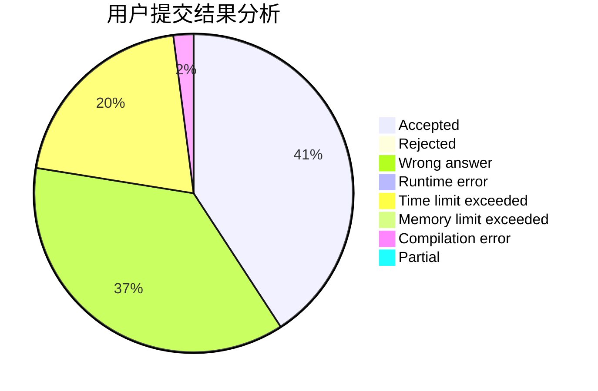
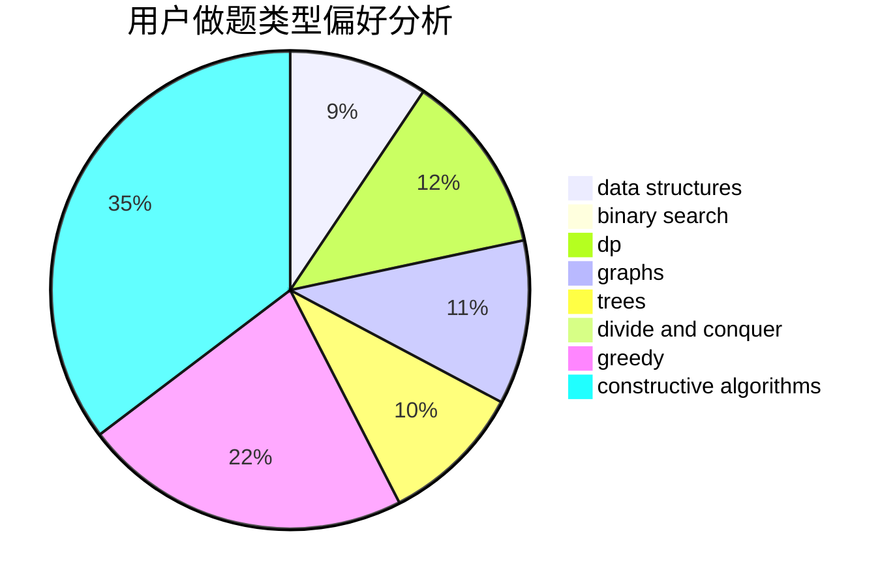
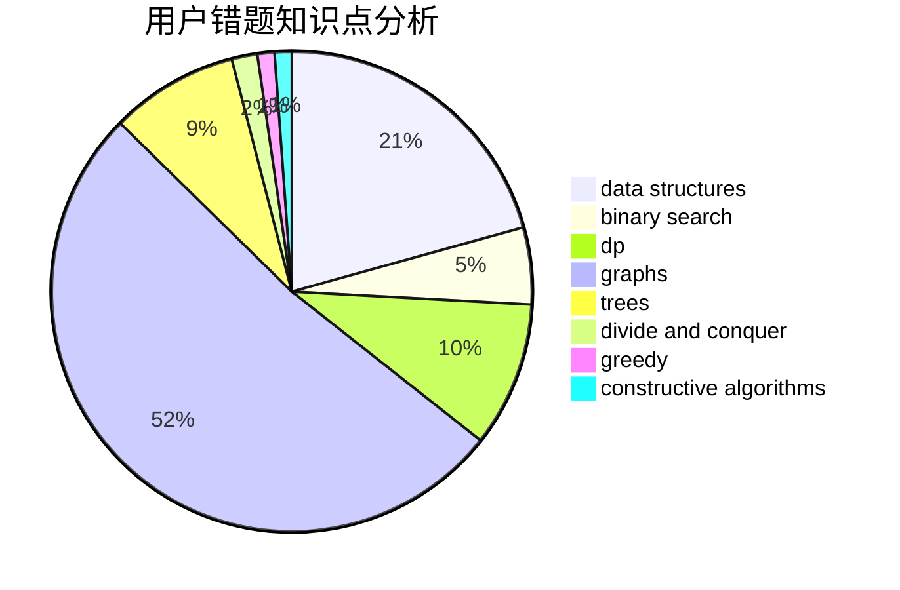

# ZPC2048

<!-- tabs:start -->

#### **用户提交结果分析**

#### **用户做题类型偏好分析**

#### **用户错题知识点分析**

<!-- tabs:end -->
# 推荐题目
[51F](https://codeforces.com/contest/51/problem/F)		dfs and similar,
                        dp,
                        graphs,
                        trees		  
[13577](https://codeforces.com/contest/1357/problem/7)		dsu,graphs,sortings,trees		  
[577A](https://codeforces.com/contest/577/problem/A)		implementation,
                        number theory		  
[888B](https://codeforces.com/contest/888/problem/B)		greedy		  
[489F](https://codeforces.com/contest/489/problem/F)		combinatorics,
                        dp		  
[779C](https://codeforces.com/contest/779/problem/C)		constructive algorithms,
                        greedy,
                        sortings		  
[492C](https://codeforces.com/contest/492/problem/C)		greedy,
                        sortings		  
[283E](https://codeforces.com/contest/283/problem/E)		combinatorics,
                        data structures,
                        math		  
[335A](https://codeforces.com/contest/335/problem/A)		binary search,
                        constructive algorithms,
                        greedy		  
[277E](https://codeforces.com/contest/277/problem/E)		flows,
                        trees		  
