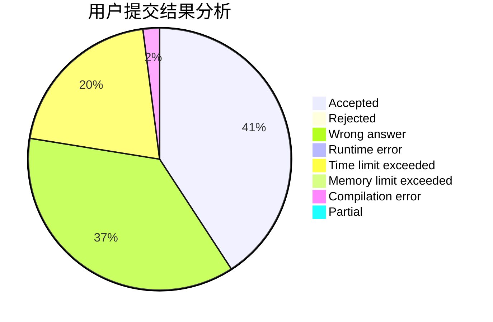
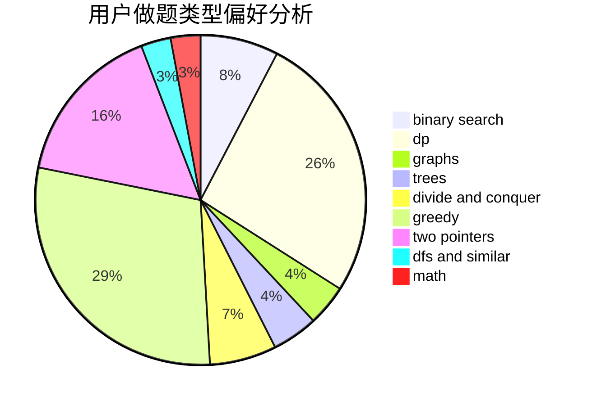

# ZPC2048

<!-- tabs:start -->

#### **用户提交结果分析**

#### **用户做题类型偏好分析**

<!-- tabs:end -->
# 推荐题目
[51F](https://codeforces.com/contest/51/problem/F)
[13577](https://codeforces.com/contest/1357/problem/7)
[577A](https://codeforces.com/contest/577/problem/A)
[888B](https://codeforces.com/contest/888/problem/B)
[489F](https://codeforces.com/contest/489/problem/F)
[779C](https://codeforces.com/contest/779/problem/C)
[492C](https://codeforces.com/contest/492/problem/C)
[283E](https://codeforces.com/contest/283/problem/E)
[335A](https://codeforces.com/contest/335/problem/A)
[277E](https://codeforces.com/contest/277/problem/E)
