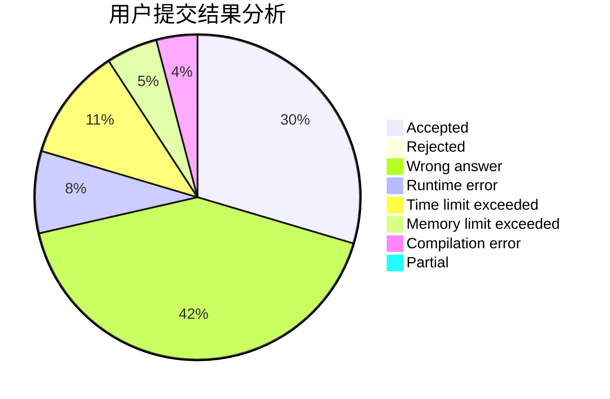
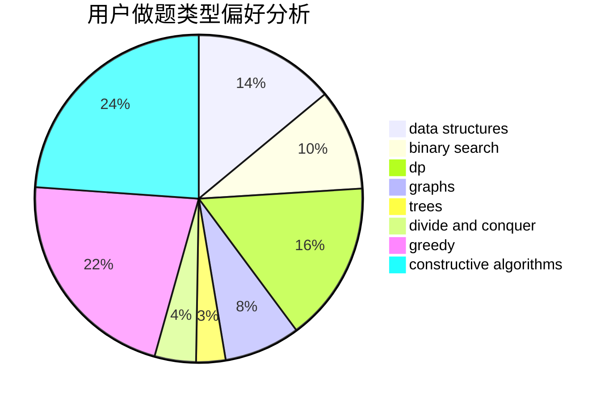
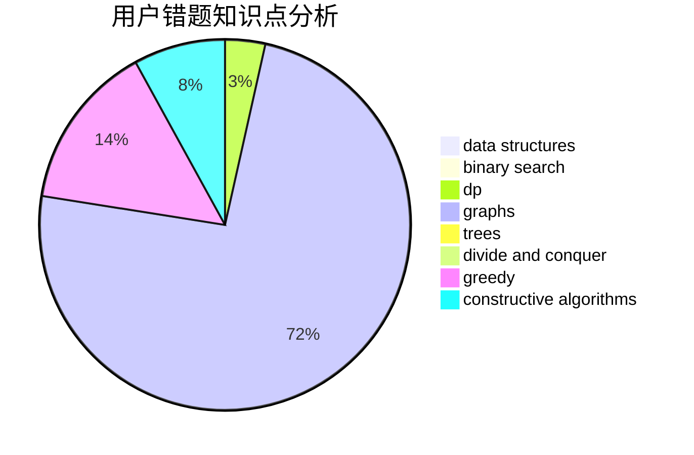

# ZSH_ZSH
<!-- tabs:start -->
#### **用户提交结果分析**

#### **用户做题类型偏好分析**

#### **用户错题知识点分析**

<!-- tabs:end -->
# 推荐题目
[Pairs of Paths](http://codeforces.com/problemset/problem/1486/F)		combinatorics,
                        data structures,
                        dfs and similar,
                        dp,
                        trees		  
[Don't fear, DravDe is kind](http://codeforces.com/problemset/problem/28/D)		binary search,
                        data structures,
                        dp,
                        hashing		  
[Vasya and Golden Ticket](http://codeforces.com/problemset/problem/1030/C)		implementation		  
[Video Posts](http://codeforces.com/problemset/problem/1070/K)		implementation		  
[Wrong Answer on test 233 (Hard Version)](https://codeforces.com/contest/1261/problem/D2)		combinatorics,
                        math		  
[Tree Diameter](http://codeforces.com/problemset/problem/1146/C)		bitmasks,
                        graphs,
                        interactive		  
[Berland Beauty](http://codeforces.com/problemset/problem/1296/F)		constructive algorithms,
                        dfs and similar,
                        greedy,
                        sortings,
                        trees		  
[Queue at the School](http://codeforces.com/problemset/problem/266/B)		constructive algorithms,
                        graph matchings,
                        implementation,
                        shortest paths		  
[Wrong Answer on test 233 (Easy Version)](https://codeforces.com/contest/1262/problem/F1)		dp		  
[Substring](http://codeforces.com/problemset/problem/919/D)		dfs and similar,
                        dp,
                        graphs		  
<!-- tabs:start -->
#### **data structures**
[Pairs of Paths](http://codeforces.com/problemset/problem/1486/F)		combinatorics,
                        data structures,
                        dfs and similar,
                        dp,
                        trees		  
[Don't fear, DravDe is kind](http://codeforces.com/problemset/problem/28/D)		binary search,
                        data structures,
                        dp,
                        hashing		  
[Vasya and Golden Ticket](http://codeforces.com/problemset/problem/1348/F)		data structures,
                        dfs and similar,
                        graphs,
                        greedy		  
[Video Posts](http://codeforces.com/problemset/problem/571/D)		binary search,
                        data structures,
                        dsu,
                        trees		  
[Wrong Answer on test 233 (Hard Version)](https://codeforces.com/contest/651/problem/C)		data structures,
                        geometry,
                        math		  
[Tree Diameter](http://codeforces.com/problemset/problem/212/D)		binary search,
                        data structures,
                        dsu		  
[Berland Beauty](http://codeforces.com/problemset/problem/474/F)		data structures,
                        math,
                        number theory		  
[Queue at the School](http://codeforces.com/problemset/problem/187/D)		data structures		  
[Wrong Answer on test 233 (Easy Version)](http://codeforces.com/problemset/problem/375/D)		data structures,
                        dfs and similar,
                        trees		  
[Substring](http://codeforces.com/problemset/problem/1329/D)		constructive algorithms,
                        data structures		  
#### **binary search**
[Pairs of Paths](http://codeforces.com/problemset/problem/28/D)		binary search,
                        data structures,
                        dp,
                        hashing		  
[Don't fear, DravDe is kind](https://codeforces.com/contest/480/problem/A)		binary search,
                        greedy,
                        sortings		  
[Vasya and Golden Ticket](http://codeforces.com/problemset/problem/815/E)		binary search,
                        constructive algorithms,
                        implementation		  
[Video Posts](http://codeforces.com/problemset/problem/571/D)		binary search,
                        data structures,
                        dsu,
                        trees		  
[Wrong Answer on test 233 (Hard Version)](http://codeforces.com/problemset/problem/1103/B)		binary search,
                        constructive algorithms,
                        interactive		  
[Tree Diameter](http://codeforces.com/problemset/problem/212/D)		binary search,
                        data structures,
                        dsu		  
[Berland Beauty](http://codeforces.com/problemset/problem/609/D)		binary search,
                        greedy,
                        two pointers		  
[Queue at the School](http://codeforces.com/problemset/problem/1408/D)		binary search,
                        brute force,
                        data structures,
                        dp,
                        implementation,
                        sortings,
                        two pointers		  
[Wrong Answer on test 233 (Easy Version)](http://codeforces.com/problemset/problem/1153/E)		binary search,
                        brute force,
                        interactive		  
[Substring](http://codeforces.com/problemset/problem/1492/C)		binary search,
                        data structures,
                        dp,
                        greedy,
                        two pointers		  
#### **dp**
[Pairs of Paths](http://codeforces.com/problemset/problem/1486/F)		combinatorics,
                        data structures,
                        dfs and similar,
                        dp,
                        trees		  
[Don't fear, DravDe is kind](http://codeforces.com/problemset/problem/28/D)		binary search,
                        data structures,
                        dp,
                        hashing		  
[Vasya and Golden Ticket](https://codeforces.com/contest/1262/problem/F1)		dp		  
[Video Posts](http://codeforces.com/problemset/problem/919/D)		dfs and similar,
                        dp,
                        graphs		  
[Wrong Answer on test 233 (Hard Version)](http://codeforces.com/problemset/problem/1153/F)		combinatorics,
                        dp,
                        math,
                        probabilities		  
[Tree Diameter](https://codeforces.com/contest/284/problem/E)		dp		  
[Berland Beauty](http://codeforces.com/problemset/problem/963/B)		constructive algorithms,
                        dfs and similar,
                        dp,
                        greedy,
                        trees		  
[Queue at the School](http://codeforces.com/problemset/problem/1209/E2)		bitmasks,
                        dp,
                        greedy,
                        sortings		  
[Wrong Answer on test 233 (Easy Version)](http://codeforces.com/problemset/problem/1237/F)		combinatorics,
                        dp		  
[Substring](http://codeforces.com/problemset/problem/1368/H1)		dp,
                        flows,
                        greedy		  
#### **graph**
[Pairs of Paths](http://codeforces.com/problemset/problem/1146/C)		bitmasks,
                        graphs,
                        interactive		  
[Don't fear, DravDe is kind](http://codeforces.com/problemset/problem/266/B)		constructive algorithms,
                        graph matchings,
                        implementation,
                        shortest paths		  
[Vasya and Golden Ticket](http://codeforces.com/problemset/problem/919/D)		dfs and similar,
                        dp,
                        graphs		  
[Video Posts](http://codeforces.com/problemset/problem/1213/G)		divide and conquer,
                        dsu,
                        graphs,
                        sortings,
                        trees		  
[Wrong Answer on test 233 (Hard Version)](http://codeforces.com/problemset/problem/871/E)		graphs,
                        greedy,
                        trees		  
[Tree Diameter](http://codeforces.com/problemset/problem/1348/F)		data structures,
                        dfs and similar,
                        graphs,
                        greedy		  
[Berland Beauty](http://codeforces.com/problemset/problem/1037/E)		graphs		  
[Queue at the School](http://codeforces.com/problemset/problem/612/E)		combinatorics,
                        constructive algorithms,
                        dfs and similar,
                        graphs,
                        math		  
[Wrong Answer on test 233 (Easy Version)](http://codeforces.com/problemset/problem/821/D)		dfs and similar,
                        graphs,
                        shortest paths		  
[Substring](http://codeforces.com/problemset/problem/1322/C)		graphs,
                        hashing,
                        math,
                        number theory		  
#### **trees**
[Pairs of Paths](http://codeforces.com/problemset/problem/1486/F)		combinatorics,
                        data structures,
                        dfs and similar,
                        dp,
                        trees		  
[Don't fear, DravDe is kind](http://codeforces.com/problemset/problem/1296/F)		constructive algorithms,
                        dfs and similar,
                        greedy,
                        sortings,
                        trees		  
[Vasya and Golden Ticket](http://codeforces.com/problemset/problem/1213/G)		divide and conquer,
                        dsu,
                        graphs,
                        sortings,
                        trees		  
[Video Posts](http://codeforces.com/problemset/problem/871/E)		graphs,
                        greedy,
                        trees		  
[Wrong Answer on test 233 (Hard Version)](http://codeforces.com/problemset/problem/571/D)		binary search,
                        data structures,
                        dsu,
                        trees		  
[Tree Diameter](http://codeforces.com/problemset/problem/963/B)		constructive algorithms,
                        dfs and similar,
                        dp,
                        greedy,
                        trees		  
[Berland Beauty](http://codeforces.com/problemset/problem/375/D)		data structures,
                        dfs and similar,
                        trees		  
[Queue at the School](http://codeforces.com/problemset/problem/1479/D)		binary search,
                        bitmasks,
                        brute force,
                        data structures,
                        probabilities,
                        trees		  
[Wrong Answer on test 233 (Easy Version)](http://codeforces.com/problemset/problem/1511/C)		brute force,
                        data structures,
                        implementation,
                        trees		  
[Substring](http://codeforces.com/problemset/problem/1499/F)		combinatorics,
                        dfs and similar,
                        dp,
                        trees		  
#### **divide and conquer**
[Pairs of Paths](http://codeforces.com/problemset/problem/1213/G)		divide and conquer,
                        dsu,
                        graphs,
                        sortings,
                        trees		  
[Don't fear, DravDe is kind](http://codeforces.com/problemset/problem/1461/D)		binary search,
                        brute force,
                        data structures,
                        divide and conquer,
                        implementation,
                        sortings		  
[Vasya and Golden Ticket](http://codeforces.com/problemset/problem/1466/G)		combinatorics,
                        divide and conquer,
                        hashing,
                        math,
                        string suffix structures,
                        strings		  
[Video Posts](http://codeforces.com/problemset/problem/1490/D)		dfs and similar,
                        divide and conquer,
                        implementation		  
[Wrong Answer on test 233 (Hard Version)](https://codeforces.com/contest/1483/problem/C)		data structures,
                        divide and conquer,
                        dp		  
[Tree Diameter](http://codeforces.com/problemset/problem/1491/E)		brute force,
                        dfs and similar,
                        divide and conquer,
                        number theory,
                        trees		  
[Berland Beauty](http://codeforces.com/problemset/problem/1303/G)		data structures,
                        divide and conquer,
                        geometry,
                        trees		  
[Queue at the School](http://codeforces.com/problemset/problem/1494/D)		constructive algorithms,
                        data structures,
                        dfs and similar,
                        divide and conquer,
                        dsu,
                        greedy,
                        sortings,
                        trees		  
[Wrong Answer on test 233 (Easy Version)](http://codeforces.com/problemset/problem/1482/E)		data structures,
                        divide and conquer,
                        dp		  
[Substring](http://codeforces.com/problemset/problem/566/C)		dfs and similar,
                        divide and conquer,
                        trees		  
#### **greedy**
[Pairs of Paths](http://codeforces.com/problemset/problem/1296/F)		constructive algorithms,
                        dfs and similar,
                        greedy,
                        sortings,
                        trees		  
[Don't fear, DravDe is kind](http://codeforces.com/problemset/problem/381/A)		greedy,
                        implementation,
                        two pointers		  
[Vasya and Golden Ticket](https://codeforces.com/contest/480/problem/A)		binary search,
                        greedy,
                        sortings		  
[Video Posts](http://codeforces.com/problemset/problem/871/E)		graphs,
                        greedy,
                        trees		  
[Wrong Answer on test 233 (Hard Version)](http://codeforces.com/problemset/problem/1348/F)		data structures,
                        dfs and similar,
                        graphs,
                        greedy		  
[Tree Diameter](http://codeforces.com/problemset/problem/1372/B)		greedy,
                        math,
                        number theory		  
[Berland Beauty](http://codeforces.com/problemset/problem/963/B)		constructive algorithms,
                        dfs and similar,
                        dp,
                        greedy,
                        trees		  
[Queue at the School](http://codeforces.com/problemset/problem/1209/E2)		bitmasks,
                        dp,
                        greedy,
                        sortings		  
[Wrong Answer on test 233 (Easy Version)](http://codeforces.com/problemset/problem/609/D)		binary search,
                        greedy,
                        two pointers		  
[Substring](http://codeforces.com/problemset/problem/1368/H1)		dp,
                        flows,
                        greedy		  
#### **constructive algorithms**
[Pairs of Paths](http://codeforces.com/problemset/problem/1296/F)		constructive algorithms,
                        dfs and similar,
                        greedy,
                        sortings,
                        trees		  
[Don't fear, DravDe is kind](http://codeforces.com/problemset/problem/266/B)		constructive algorithms,
                        graph matchings,
                        implementation,
                        shortest paths		  
[Vasya and Golden Ticket](http://codeforces.com/problemset/problem/815/E)		binary search,
                        constructive algorithms,
                        implementation		  
[Video Posts](http://codeforces.com/problemset/problem/417/E)		constructive algorithms,
                        math,
                        probabilities		  
[Wrong Answer on test 233 (Hard Version)](http://codeforces.com/problemset/problem/612/E)		combinatorics,
                        constructive algorithms,
                        dfs and similar,
                        graphs,
                        math		  
[Tree Diameter](http://codeforces.com/problemset/problem/1028/E)		constructive algorithms		  
[Berland Beauty](http://codeforces.com/problemset/problem/963/B)		constructive algorithms,
                        dfs and similar,
                        dp,
                        greedy,
                        trees		  
[Queue at the School](http://codeforces.com/problemset/problem/1103/B)		binary search,
                        constructive algorithms,
                        interactive		  
[Wrong Answer on test 233 (Easy Version)](http://codeforces.com/problemset/problem/1038/B)		constructive algorithms,
                        math		  
[Substring](http://codeforces.com/problemset/problem/272/E)		combinatorics,
                        constructive algorithms,
                        graphs		  
#### **sortings**
[Pairs of Paths](http://codeforces.com/problemset/problem/1296/F)		constructive algorithms,
                        dfs and similar,
                        greedy,
                        sortings,
                        trees		  
[Don't fear, DravDe is kind](http://codeforces.com/problemset/problem/1213/G)		divide and conquer,
                        dsu,
                        graphs,
                        sortings,
                        trees		  
[Vasya and Golden Ticket](https://codeforces.com/contest/480/problem/A)		binary search,
                        greedy,
                        sortings		  
[Video Posts](http://codeforces.com/problemset/problem/1209/E2)		bitmasks,
                        dp,
                        greedy,
                        sortings		  
[Wrong Answer on test 233 (Hard Version)](http://codeforces.com/problemset/problem/291/A)		*special problem,
                        implementation,
                        sortings		  
[Tree Diameter](http://codeforces.com/problemset/problem/1408/D)		binary search,
                        brute force,
                        data structures,
                        dp,
                        implementation,
                        sortings,
                        two pointers		  
[Berland Beauty](https://codeforces.com/contest/1321/problem/B)		data structures,
                        dp,
                        greedy,
                        math,
                        sortings		  
[Queue at the School](https://codeforces.com/contest/1496/problem/C)		geometry,
                        greedy,
                        math,
                        sortings		  
[Wrong Answer on test 233 (Easy Version)](http://codeforces.com/problemset/problem/1495/A)		geometry,
                        greedy,
                        math,
                        sortings		  
[Substring](http://codeforces.com/problemset/problem/1497/A)		brute force,
                        data structures,
                        greedy,
                        sortings		  
<!-- tabs:end -->
