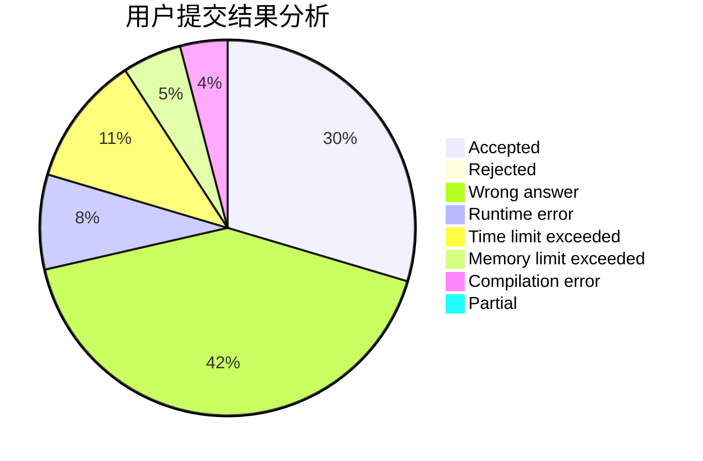
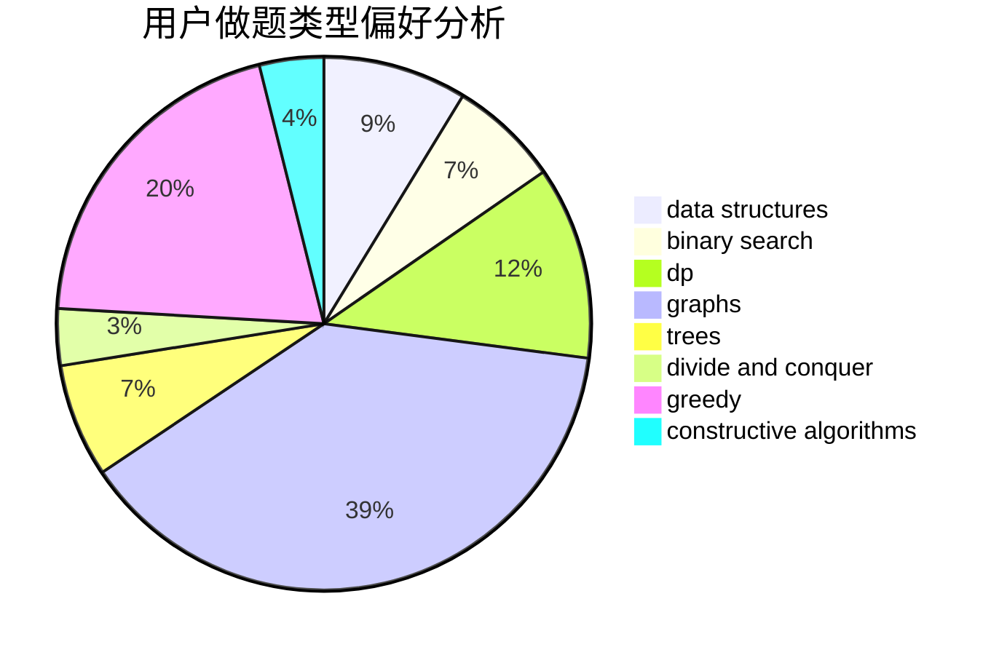
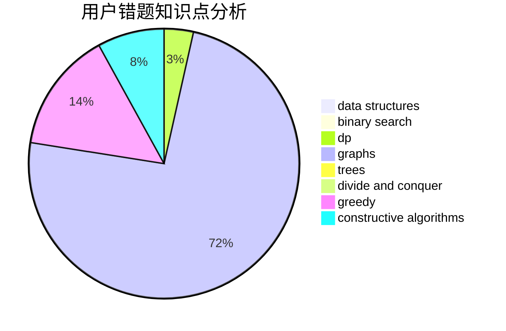

# ZSH_ZSH

<!-- tabs:start -->

#### **用户提交结果分析**

#### **用户做题类型偏好分析**

#### **用户错题知识点分析**

<!-- tabs:end -->
# 推荐题目
[500A](https://codeforces.com/contest/500/problem/A)		dfs and similar,
                        graphs,
                        implementation		  
[304D](https://codeforces.com/contest/304/problem/D)		dsu,graphs,sortings,trees		  
[1355D](https://codeforces.com/contest/1355/problem/D)		constructive algorithms,
                        math		  
[1494C](https://codeforces.com/contest/1494/problem/C)		binary search,
                        dp,
                        greedy,
                        implementation,
                        two pointers		  
[1029A](https://codeforces.com/contest/1029/problem/A)		implementation,
                        strings		  
[1215B](https://codeforces.com/contest/1215/problem/B)		combinatorics,
                        dp,
                        implementation		  
[1462C](https://codeforces.com/contest/1462/problem/C)		brute force,
                        greedy,
                        math		  
[592A](https://codeforces.com/contest/592/problem/A)		implementation		  
[1030G](https://codeforces.com/contest/1030/problem/G)		number theory		  
[288E](https://codeforces.com/contest/288/problem/E)		dp,
                        implementation,
                        math		  
