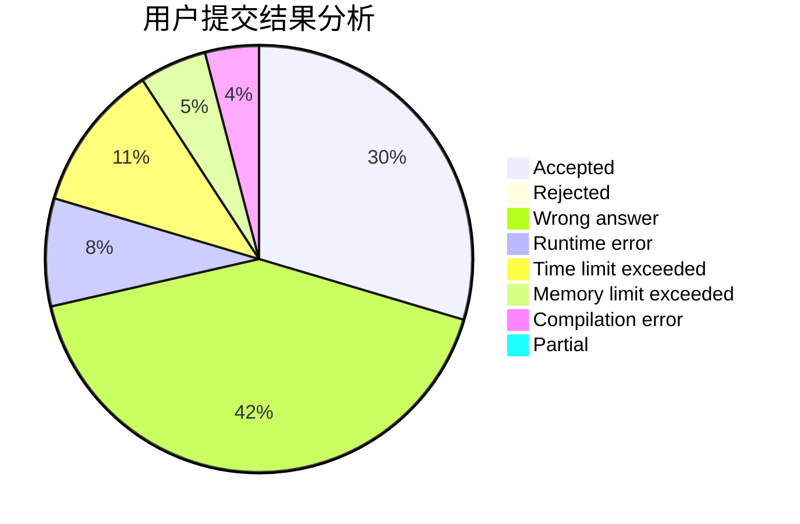
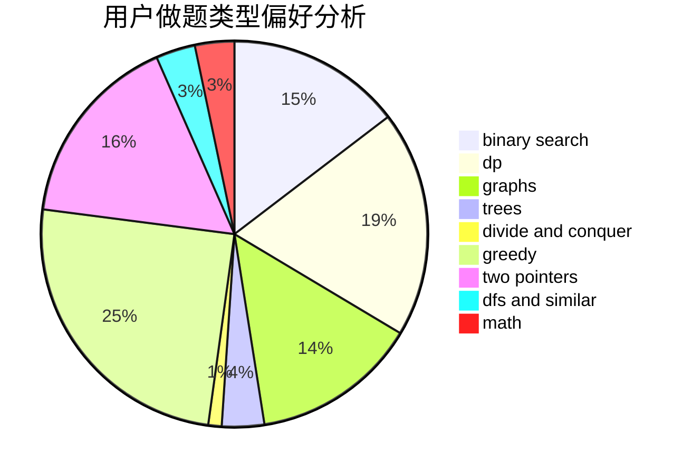

# ZSH_ZSH

<!-- tabs:start -->

#### **用户提交结果分析**

#### **用户做题类型偏好分析**

<!-- tabs:end -->
# 推荐题目
[500A](https://codeforces.com/contest/500/problem/A)
[304D](https://codeforces.com/contest/304/problem/D)
[1355D](https://codeforces.com/contest/1355/problem/D)
[1494C](https://codeforces.com/contest/1494/problem/C)
[1029A](https://codeforces.com/contest/1029/problem/A)
[1215B](https://codeforces.com/contest/1215/problem/B)
[1462C](https://codeforces.com/contest/1462/problem/C)
[592A](https://codeforces.com/contest/592/problem/A)
[1030G](https://codeforces.com/contest/1030/problem/G)
[288E](https://codeforces.com/contest/288/problem/E)
