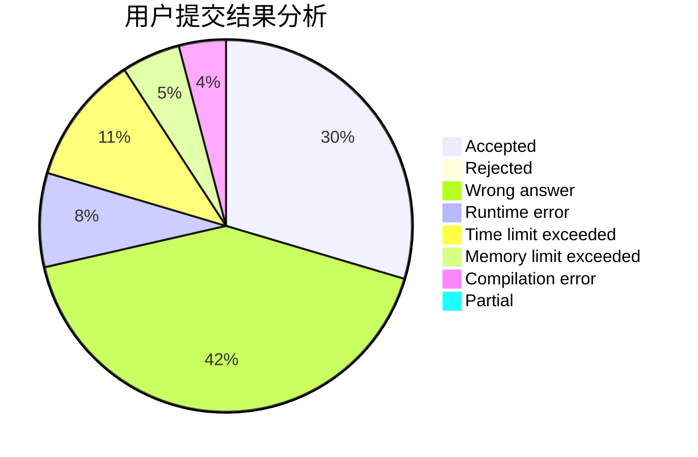
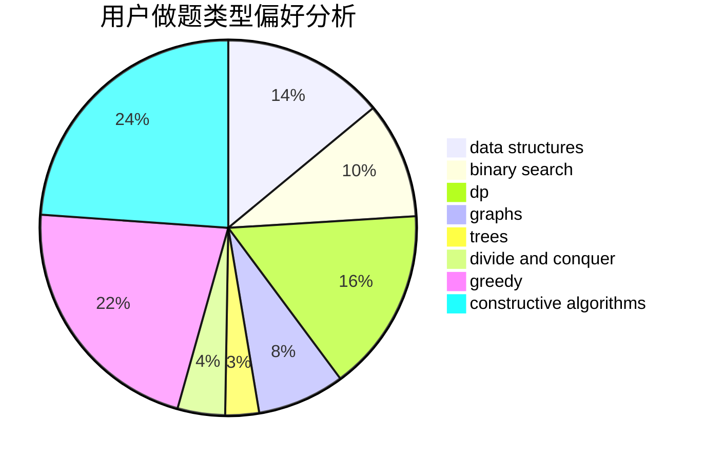
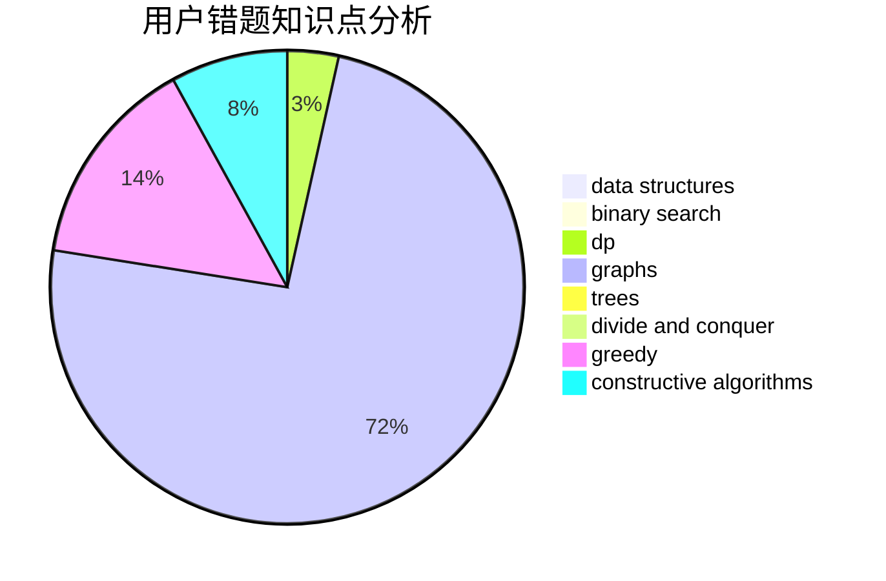

# ZSH_ZSH

<!-- tabs:start -->

#### **用户提交结果分析**

#### **用户做题类型偏好分析**

#### **用户错题知识点分析**

<!-- tabs:end -->
# 推荐题目
[480A](https://codeforces.com/contest/480/problem/A)		dsu,graphs,sortings,trees		  
[28D](https://codeforces.com/contest/28/problem/D)		binary search,
                        data structures,
                        dp,
                        hashing		  
[1348F](https://codeforces.com/contest/1348/problem/F)		data structures,
                        dfs and similar,
                        graphs,
                        greedy		  
[1486F](https://codeforces.com/contest/1486/problem/F)		combinatorics,
                        data structures,
                        dfs and similar,
                        dp,
                        trees		  
[1028E](https://codeforces.com/contest/1028/problem/E)		constructive algorithms		  
[1209E2](https://codeforces.com/contest/1209E/problem/2)		bitmasks,
                        dp,
                        greedy,
                        sortings		  
[1453A](https://codeforces.com/contest/1453/problem/A)		implementation		  
[571D](https://codeforces.com/contest/571/problem/D)		binary search,
                        data structures,
                        dsu,
                        trees		  
[1030C](https://codeforces.com/contest/1030/problem/C)		implementation		  
[272E](https://codeforces.com/contest/272/problem/E)		combinatorics,
                        constructive algorithms,
                        graphs		  
