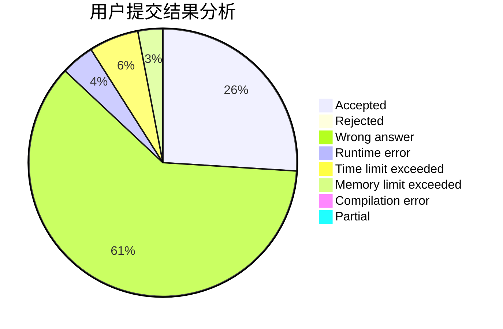
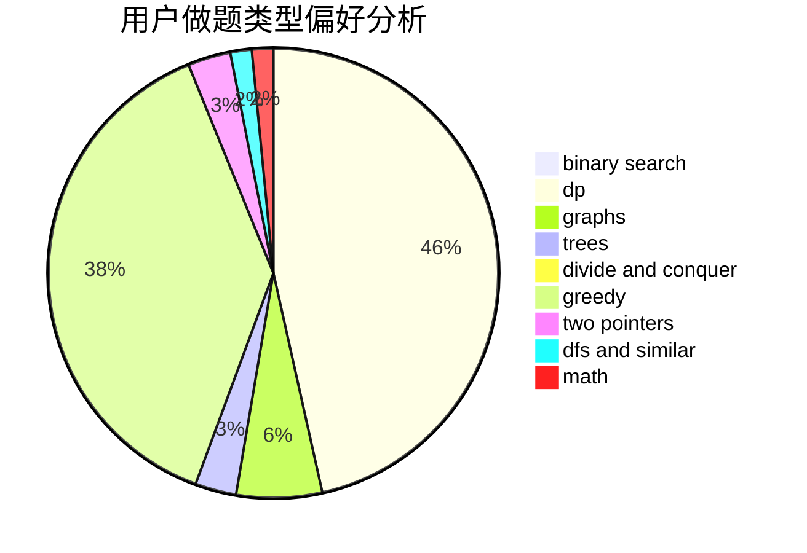

# ZXyang

<!-- tabs:start -->

#### **用户提交结果分析**

#### **用户做题类型偏好分析**

<!-- tabs:end -->
# 推荐题目
[1370C](https://codeforces.com/contest/1370/problem/C)
[1279A](https://codeforces.com/contest/1279/problem/A)
[25A](https://codeforces.com/contest/25/problem/A)
[317A](https://codeforces.com/contest/317/problem/A)
[14D](https://codeforces.com/contest/14/problem/D)
[916D](https://codeforces.com/contest/916/problem/D)
[924D](https://codeforces.com/contest/924/problem/D)
[501C](https://codeforces.com/contest/501/problem/C)
[113C](https://codeforces.com/contest/113/problem/C)
[344A](https://codeforces.com/contest/344/problem/A)
