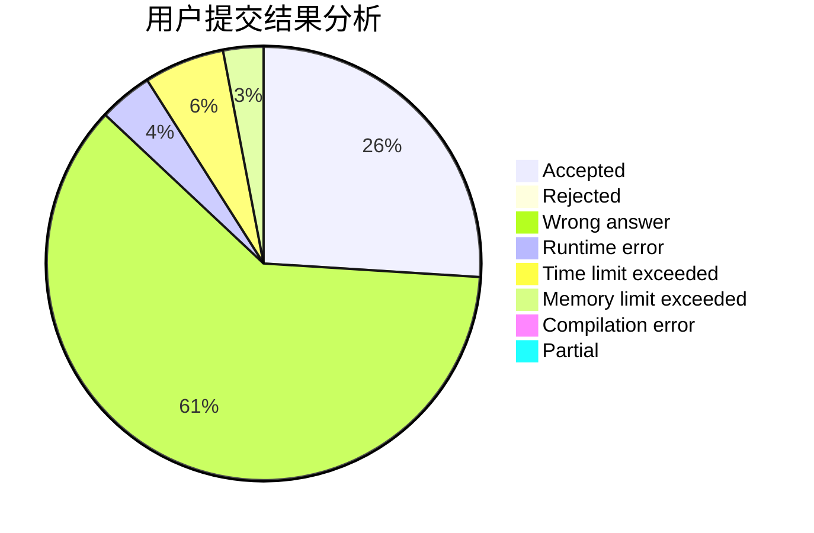
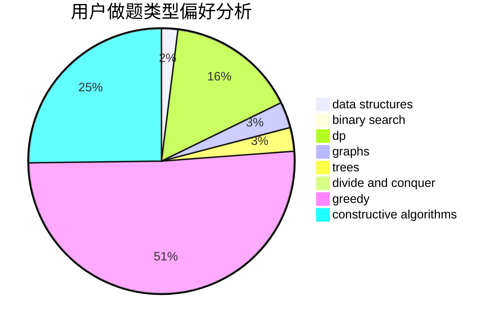
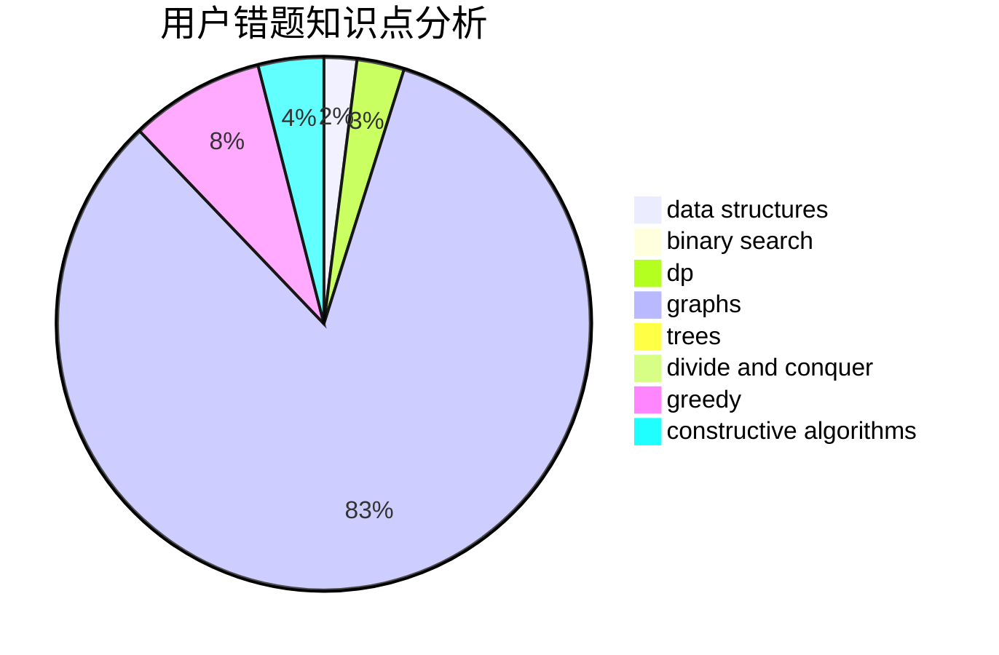

# ZXyang
<!-- tabs:start -->
#### **用户提交结果分析**

#### **用户做题类型偏好分析**

#### **用户错题知识点分析**

<!-- tabs:end -->
# 推荐题目
[Card Game](http://codeforces.com/problemset/problem/1270/A)		games,
                        greedy,
                        math		  
[Let's Play Osu!](https://codeforces.com/contest/236/problem/D)		dp,
                        math,
                        probabilities		  
[Traffic Lights](http://codeforces.com/problemset/problem/29/B)		implementation		  
[AND-permutations](http://codeforces.com/problemset/problem/909/F)		constructive algorithms		  
[Find Extra One](http://codeforces.com/problemset/problem/900/A)		geometry,
                        implementation		  
[Guess The Maximums](http://codeforces.com/problemset/problem/1363/D)		binary search,
                        implementation,
                        interactive,
                        math		  
[Magic Gems](http://codeforces.com/problemset/problem/1117/D)		dp,
                        math,
                        matrices		  
[Random Function and Tree](http://codeforces.com/problemset/problem/482/D)		combinatorics,
                        dp,
                        trees		  
[Round Marriage](http://codeforces.com/problemset/problem/981/F)		binary search,
                        graph matchings,
                        greedy		  
[The Brand New Function](https://codeforces.com/contest/244/problem/C)		bitmasks		  
<!-- tabs:start -->
#### **data structures**
[Card Game](http://codeforces.com/problemset/problem/413/E)		data structures,
                        divide and conquer		  
[Let's Play Osu!](http://codeforces.com/problemset/problem/570/C)		constructive algorithms,
                        data structures,
                        implementation		  
[Traffic Lights](http://codeforces.com/problemset/problem/1408/H)		binary search,
                        data structures,
                        flows,
                        greedy		  
[AND-permutations](http://codeforces.com/problemset/problem/464/E)		data structures,
                        graphs,
                        shortest paths		  
[Find Extra One](http://codeforces.com/problemset/problem/817/F)		binary search,
                        data structures,
                        trees		  
[Guess The Maximums](http://codeforces.com/problemset/problem/1492/C)		binary search,
                        data structures,
                        dp,
                        greedy,
                        two pointers		  
[Magic Gems](http://codeforces.com/problemset/problem/1490/G)		binary search,
                        data structures,
                        math		  
[Random Function and Tree](http://codeforces.com/problemset/problem/1479/D)		binary search,
                        bitmasks,
                        brute force,
                        data structures,
                        probabilities,
                        trees		  
[Round Marriage](http://codeforces.com/problemset/problem/1497/A)		brute force,
                        data structures,
                        greedy,
                        sortings		  
[The Brand New Function](http://codeforces.com/problemset/problem/1491/C)		brute force,
                        data structures,
                        dp,
                        greedy,
                        implementation		  
#### **binary search**
[Card Game](http://codeforces.com/problemset/problem/1363/D)		binary search,
                        implementation,
                        interactive,
                        math		  
[Let's Play Osu!](http://codeforces.com/problemset/problem/981/F)		binary search,
                        graph matchings,
                        greedy		  
[Traffic Lights](http://codeforces.com/problemset/problem/152/B)		binary search,
                        implementation		  
[AND-permutations](http://codeforces.com/problemset/problem/1138/A)		binary search,
                        greedy,
                        implementation		  
[Find Extra One](http://codeforces.com/problemset/problem/883/D)		binary search,
                        dp,
                        math		  
[Guess The Maximums](http://codeforces.com/problemset/problem/1408/H)		binary search,
                        data structures,
                        flows,
                        greedy		  
[Magic Gems](http://codeforces.com/problemset/problem/1103/B)		binary search,
                        constructive algorithms,
                        interactive		  
[Random Function and Tree](http://codeforces.com/problemset/problem/1066/D)		binary search,
                        implementation		  
[Round Marriage](http://codeforces.com/problemset/problem/1279/B)		binary search,
                        brute force,
                        implementation		  
[The Brand New Function](http://codeforces.com/problemset/problem/817/F)		binary search,
                        data structures,
                        trees		  
#### **dp**
[Card Game](https://codeforces.com/contest/236/problem/D)		dp,
                        math,
                        probabilities		  
[Let's Play Osu!](http://codeforces.com/problemset/problem/1117/D)		dp,
                        math,
                        matrices		  
[Traffic Lights](http://codeforces.com/problemset/problem/482/D)		combinatorics,
                        dp,
                        trees		  
[AND-permutations](https://codeforces.com/contest/861/problem/C)		dp,
                        greedy,
                        implementation		  
[Find Extra One](http://codeforces.com/problemset/problem/567/F)		dp		  
[Guess The Maximums](http://codeforces.com/problemset/problem/431/C)		dp,
                        implementation,
                        trees		  
[Magic Gems](http://codeforces.com/problemset/problem/295/D)		combinatorics,
                        dp		  
[Random Function and Tree](http://codeforces.com/problemset/problem/883/D)		binary search,
                        dp,
                        math		  
[Round Marriage](http://codeforces.com/problemset/problem/478/D)		dp		  
[The Brand New Function](http://codeforces.com/problemset/problem/161/D)		dfs and similar,
                        dp,
                        trees		  
#### **graph**
[Card Game](http://codeforces.com/problemset/problem/981/F)		binary search,
                        graph matchings,
                        greedy		  
[Let's Play Osu!](http://codeforces.com/problemset/problem/1152/E)		constructive algorithms,
                        dfs and similar,
                        graphs		  
[Traffic Lights](http://codeforces.com/problemset/problem/246/D)		brute force,
                        dfs and similar,
                        graphs		  
[AND-permutations](http://codeforces.com/problemset/problem/1045/C)		dfs and similar,
                        graphs,
                        trees		  
[Find Extra One](http://codeforces.com/problemset/problem/1411/C)		dfs and similar,
                        dsu,
                        graphs		  
[Guess The Maximums](http://codeforces.com/problemset/problem/464/E)		data structures,
                        graphs,
                        shortest paths		  
[Magic Gems](http://codeforces.com/problemset/problem/1250/E)		graphs,
                        implementation		  
[Random Function and Tree](http://codeforces.com/problemset/problem/1491/G)		constructive algorithms,
                        graphs,
                        math		  
[Round Marriage](http://codeforces.com/problemset/problem/1307/G)		flows,
                        graphs,
                        shortest paths		  
[The Brand New Function](http://codeforces.com/problemset/problem/1487/C)		brute force,
                        constructive algorithms,
                        dfs and similar,
                        graphs,
                        greedy,
                        implementation,
                        math		  
#### **trees**
[Card Game](http://codeforces.com/problemset/problem/482/D)		combinatorics,
                        dp,
                        trees		  
[Let's Play Osu!](http://codeforces.com/problemset/problem/431/C)		dp,
                        implementation,
                        trees		  
[Traffic Lights](http://codeforces.com/problemset/problem/1045/C)		dfs and similar,
                        graphs,
                        trees		  
[AND-permutations](http://codeforces.com/problemset/problem/817/F)		binary search,
                        data structures,
                        trees		  
[Find Extra One](http://codeforces.com/problemset/problem/161/D)		dfs and similar,
                        dp,
                        trees		  
[Guess The Maximums](http://codeforces.com/problemset/problem/1479/D)		binary search,
                        bitmasks,
                        brute force,
                        data structures,
                        probabilities,
                        trees		  
[Magic Gems](http://codeforces.com/problemset/problem/1511/C)		brute force,
                        data structures,
                        implementation,
                        trees		  
[Random Function and Tree](http://codeforces.com/problemset/problem/1499/F)		combinatorics,
                        dfs and similar,
                        dp,
                        trees		  
[Round Marriage](http://codeforces.com/problemset/problem/1491/E)		brute force,
                        dfs and similar,
                        divide and conquer,
                        number theory,
                        trees		  
[The Brand New Function](http://codeforces.com/problemset/problem/1466/D)		data structures,
                        greedy,
                        sortings,
                        trees		  
#### **divide and conquer**
[Card Game](http://codeforces.com/problemset/problem/413/E)		data structures,
                        divide and conquer		  
[Let's Play Osu!](http://codeforces.com/problemset/problem/120/J)		divide and conquer,
                        geometry,
                        sortings		  
[Traffic Lights](http://codeforces.com/problemset/problem/1461/D)		binary search,
                        brute force,
                        data structures,
                        divide and conquer,
                        implementation,
                        sortings		  
[AND-permutations](http://codeforces.com/problemset/problem/1466/G)		combinatorics,
                        divide and conquer,
                        hashing,
                        math,
                        string suffix structures,
                        strings		  
[Find Extra One](http://codeforces.com/problemset/problem/1490/D)		dfs and similar,
                        divide and conquer,
                        implementation		  
[Guess The Maximums](https://codeforces.com/contest/1483/problem/C)		data structures,
                        divide and conquer,
                        dp		  
[Magic Gems](http://codeforces.com/problemset/problem/1491/E)		brute force,
                        dfs and similar,
                        divide and conquer,
                        number theory,
                        trees		  
[Random Function and Tree](http://codeforces.com/problemset/problem/1303/G)		data structures,
                        divide and conquer,
                        geometry,
                        trees		  
[Round Marriage](http://codeforces.com/problemset/problem/1494/D)		constructive algorithms,
                        data structures,
                        dfs and similar,
                        divide and conquer,
                        dsu,
                        greedy,
                        sortings,
                        trees		  
[The Brand New Function](http://codeforces.com/problemset/problem/1482/E)		data structures,
                        divide and conquer,
                        dp		  
#### **greedy**
[Card Game](http://codeforces.com/problemset/problem/1270/A)		games,
                        greedy,
                        math		  
[Let's Play Osu!](http://codeforces.com/problemset/problem/981/F)		binary search,
                        graph matchings,
                        greedy		  
[Traffic Lights](https://codeforces.com/contest/861/problem/C)		dp,
                        greedy,
                        implementation		  
[AND-permutations](http://codeforces.com/problemset/problem/1138/A)		binary search,
                        greedy,
                        implementation		  
[Find Extra One](http://codeforces.com/problemset/problem/1408/H)		binary search,
                        data structures,
                        flows,
                        greedy		  
[Guess The Maximums](http://codeforces.com/problemset/problem/1407/B)		brute force,
                        greedy,
                        math,
                        number theory		  
[Magic Gems](http://codeforces.com/problemset/problem/1451/A)		greedy,
                        math		  
[Random Function and Tree](http://codeforces.com/problemset/problem/1366/C)		greedy,
                        math		  
[Round Marriage](http://codeforces.com/problemset/problem/1144/B)		greedy,
                        implementation,
                        sortings		  
[The Brand New Function](http://codeforces.com/problemset/problem/1492/C)		binary search,
                        data structures,
                        dp,
                        greedy,
                        two pointers		  
#### **constructive algorithms**
[Card Game](http://codeforces.com/problemset/problem/909/F)		constructive algorithms		  
[Let's Play Osu!](http://codeforces.com/problemset/problem/1152/E)		constructive algorithms,
                        dfs and similar,
                        graphs		  
[Traffic Lights](http://codeforces.com/problemset/problem/1038/B)		constructive algorithms,
                        math		  
[AND-permutations](http://codeforces.com/problemset/problem/282/C)		constructive algorithms,
                        implementation,
                        math		  
[Find Extra One](http://codeforces.com/problemset/problem/570/C)		constructive algorithms,
                        data structures,
                        implementation		  
[Guess The Maximums](http://codeforces.com/problemset/problem/1103/B)		binary search,
                        constructive algorithms,
                        interactive		  
[Magic Gems](http://codeforces.com/problemset/problem/1491/G)		constructive algorithms,
                        graphs,
                        math		  
[Random Function and Tree](http://codeforces.com/problemset/problem/1493/A)		constructive algorithms,
                        greedy		  
[Round Marriage](http://codeforces.com/problemset/problem/1463/D)		binary search,
                        constructive algorithms,
                        greedy,
                        two pointers		  
[The Brand New Function](https://codeforces.com/contest/1456/problem/B)		bitmasks,
                        brute force,
                        constructive algorithms		  
#### **sortings**
[Card Game](http://codeforces.com/problemset/problem/120/J)		divide and conquer,
                        geometry,
                        sortings		  
[Let's Play Osu!](http://codeforces.com/problemset/problem/1213/D2)		brute force,
                        math,
                        sortings		  
[Traffic Lights](http://codeforces.com/problemset/problem/1144/B)		greedy,
                        implementation,
                        sortings		  
[AND-permutations](https://codeforces.com/contest/1496/problem/C)		geometry,
                        greedy,
                        math,
                        sortings		  
[Find Extra One](http://codeforces.com/problemset/problem/1495/A)		geometry,
                        greedy,
                        math,
                        sortings		  
[Guess The Maximums](http://codeforces.com/problemset/problem/1497/A)		brute force,
                        data structures,
                        greedy,
                        sortings		  
[Magic Gems](http://codeforces.com/problemset/problem/1427/A)		math,
                        sortings		  
[Random Function and Tree](http://codeforces.com/problemset/problem/1461/D)		binary search,
                        brute force,
                        data structures,
                        divide and conquer,
                        implementation,
                        sortings		  
[Round Marriage](http://codeforces.com/problemset/problem/1437/C)		dp,
                        flows,
                        graph matchings,
                        greedy,
                        math,
                        sortings		  
[The Brand New Function](http://codeforces.com/problemset/problem/1473/A)		greedy,
                        implementation,
                        math,
                        sortings		  
<!-- tabs:end -->
