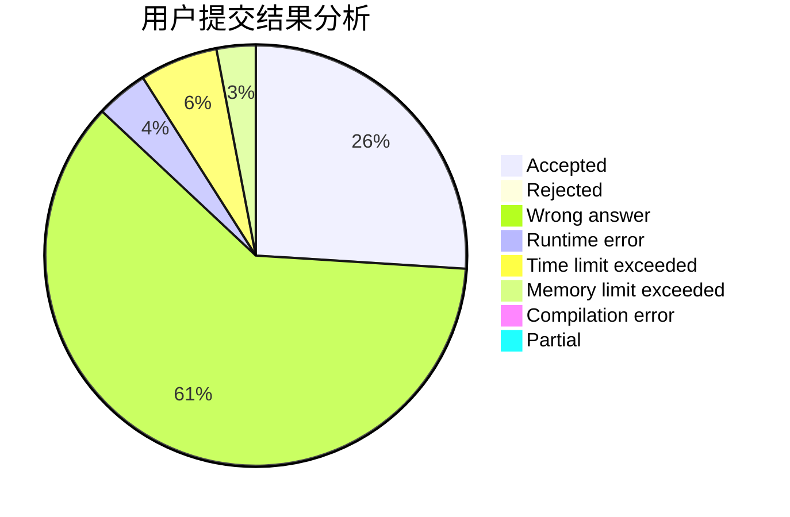
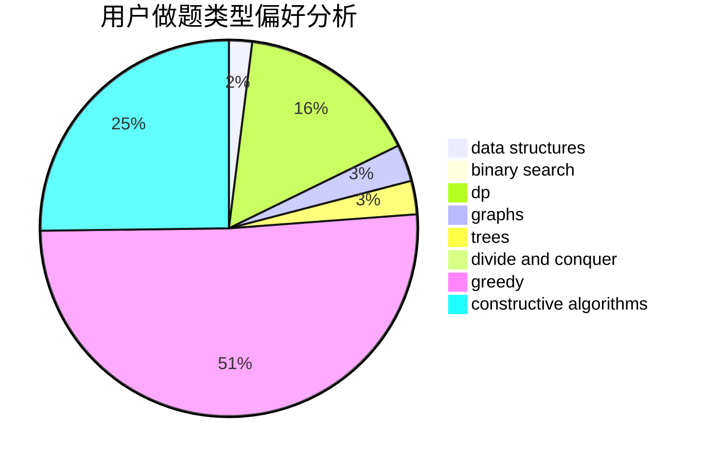
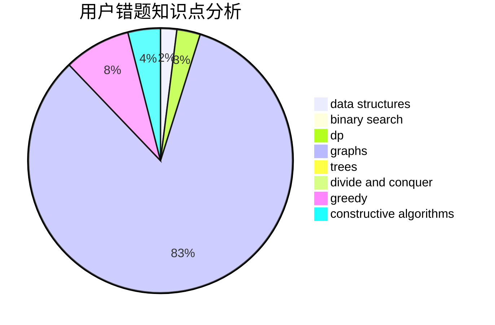

# ZXyang

<!-- tabs:start -->

#### **用户提交结果分析**

#### **用户做题类型偏好分析**

#### **用户错题知识点分析**

<!-- tabs:end -->
# 推荐题目
[1363D](https://codeforces.com/contest/1363/problem/D)		binary search,
                        implementation,
                        interactive,
                        math		  
[1270A](https://codeforces.com/contest/1270/problem/A)		games,
                        greedy,
                        math		  
[236D](https://codeforces.com/contest/236/problem/D)		dsu,graphs,sortings,trees		  
[29B](https://codeforces.com/contest/29/problem/B)		implementation		  
[1491G](https://codeforces.com/contest/1491/problem/G)		constructive algorithms,
                        graphs,
                        math		  
[900A](https://codeforces.com/contest/900/problem/A)		geometry,
                        implementation		  
[909F](https://codeforces.com/contest/909/problem/F)		constructive algorithms		  
[482D](https://codeforces.com/contest/482/problem/D)		combinatorics,
                        dp,
                        trees		  
[1138A](https://codeforces.com/contest/1138/problem/A)		binary search,
                        greedy,
                        implementation		  
[316G1](https://codeforces.com/contest/316G/problem/1)		hashing,
                        strings		  
