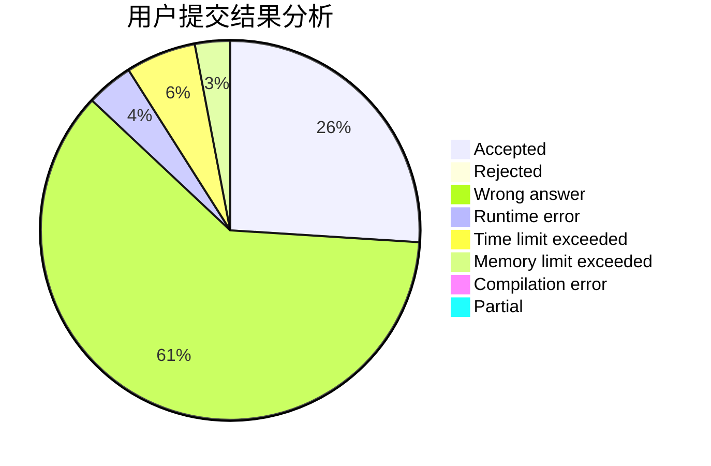
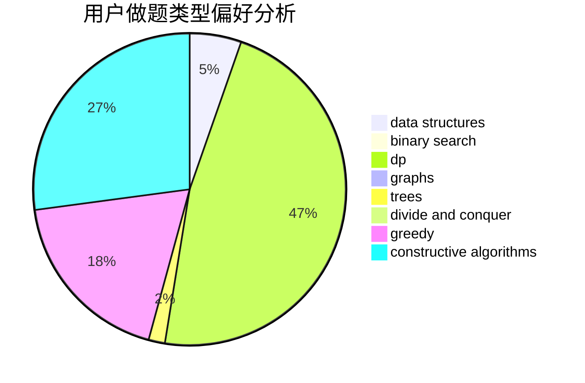

# ZXyang

<!-- tabs:start -->

#### **用户提交结果分析**

#### **用户做题类型偏好分析**

#### **用户错题知识点分析**

<!-- tabs:end -->
# 推荐题目
[1370C](https://codeforces.com/contest/1370/problem/C)		games,
                        math,
                        number theory		  
[1279A](https://codeforces.com/contest/1279/problem/A)		math		  
[25A](https://codeforces.com/contest/25/problem/A)		brute force		  
[317A](https://codeforces.com/contest/317/problem/A)		brute force		  
[14D](https://codeforces.com/contest/14/problem/D)		dfs and similar,
                        dp,
                        graphs,
                        shortest paths,
                        trees,
                        two pointers		  
[916D](https://codeforces.com/contest/916/problem/D)		data structures,
                        interactive,
                        trees		  
[924D](https://codeforces.com/contest/924/problem/D)		nan		  
[501C](https://codeforces.com/contest/501/problem/C)		constructive algorithms,
                        data structures,
                        greedy,
                        sortings,
                        trees		  
[113C](https://codeforces.com/contest/113/problem/C)		brute force,
                        math,
                        number theory		  
[344A](https://codeforces.com/contest/344/problem/A)		implementation		  
