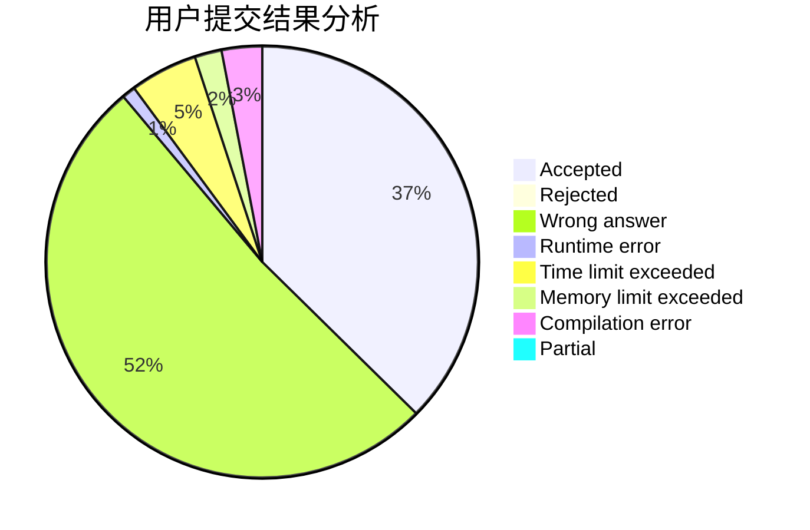
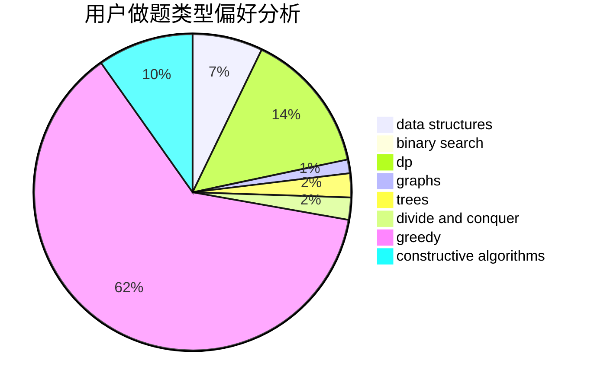
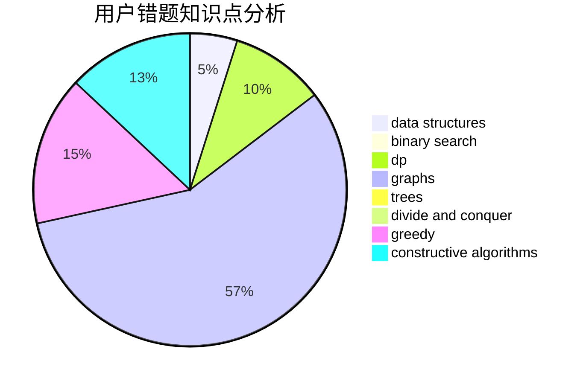

# ZZHzzh0_0

<!-- tabs:start -->

#### **用户提交结果分析**

#### **用户做题类型偏好分析**

#### **用户错题知识点分析**

<!-- tabs:end -->
# 推荐题目
[1303E](https://codeforces.com/contest/1303/problem/E)		dp,
                        strings		  
[594E](https://codeforces.com/contest/594/problem/E)		string suffix structures,
                        strings		  
[160D](https://codeforces.com/contest/160/problem/D)		dfs and similar,
                        dsu,
                        graphs,
                        sortings		  
[760B](https://codeforces.com/contest/760/problem/B)		binary search,
                        greedy		  
[878E](https://codeforces.com/contest/878/problem/E)		combinatorics,
                        dp		  
[424D](https://codeforces.com/contest/424/problem/D)		binary search,
                        brute force,
                        constructive algorithms,
                        data structures,
                        dp		  
[866E](https://codeforces.com/contest/866/problem/E)		dsu,graphs,sortings,trees		  
[386C](https://codeforces.com/contest/386/problem/C)		dp,
                        strings,
                        two pointers		  
[1151E](https://codeforces.com/contest/1151/problem/E)		combinatorics,
                        data structures,
                        dp,
                        math		  
[892A](https://codeforces.com/contest/892/problem/A)		greedy,
                        implementation		  
