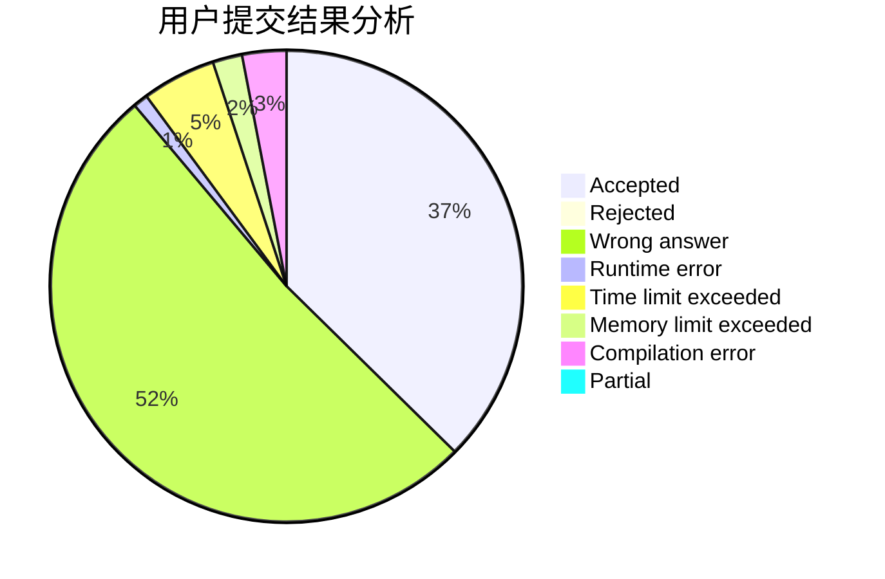
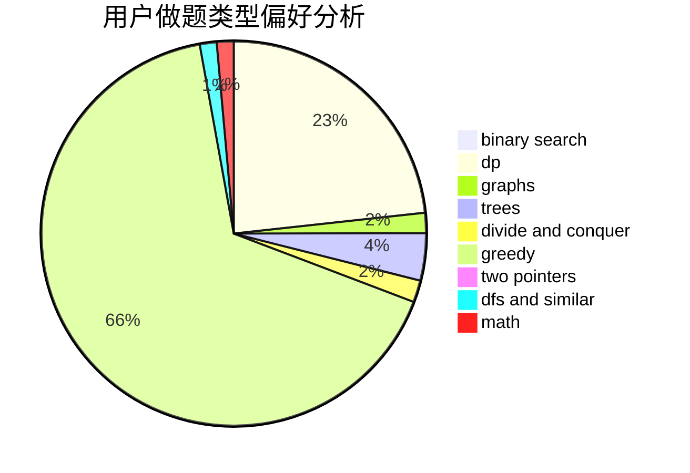

# ZZHzzh0_0

<!-- tabs:start -->

#### **用户提交结果分析**

#### **用户做题类型偏好分析**

<!-- tabs:end -->
# 推荐题目
[1303E](https://codeforces.com/contest/1303/problem/E)
[594E](https://codeforces.com/contest/594/problem/E)
[160D](https://codeforces.com/contest/160/problem/D)
[760B](https://codeforces.com/contest/760/problem/B)
[878E](https://codeforces.com/contest/878/problem/E)
[424D](https://codeforces.com/contest/424/problem/D)
[866E](https://codeforces.com/contest/866/problem/E)
[386C](https://codeforces.com/contest/386/problem/C)
[1151E](https://codeforces.com/contest/1151/problem/E)
[892A](https://codeforces.com/contest/892/problem/A)
