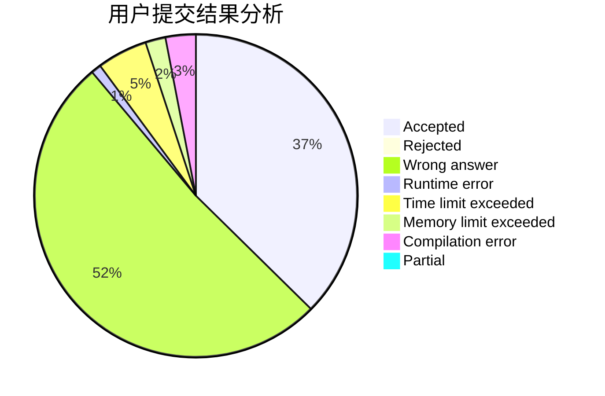
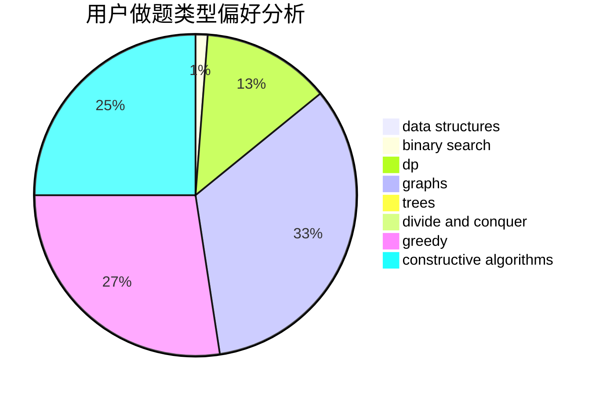
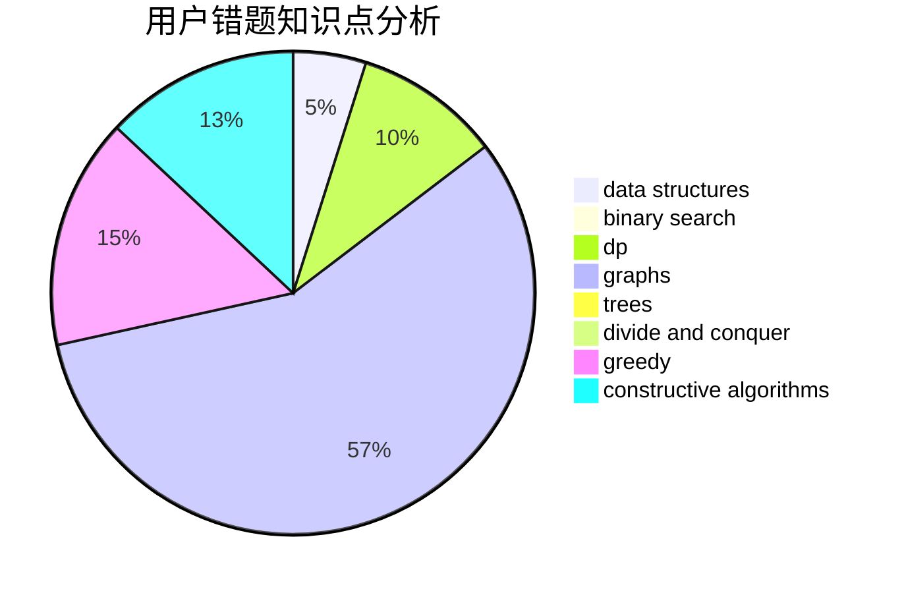

# ZZHzzh0_0

<!-- tabs:start -->

#### **用户提交结果分析**

#### **用户做题类型偏好分析**

#### **用户错题知识点分析**

<!-- tabs:end -->
# 推荐题目
[1296C](https://codeforces.com/contest/1296/problem/C)		data structures,
                        implementation		  
[574D](https://codeforces.com/contest/574/problem/D)		dsu,graphs,sortings,trees		  
[1509F](https://codeforces.com/contest/1509/problem/F)		dsu,graphs,sortings,trees		  
[73B](https://codeforces.com/contest/73/problem/B)		binary search,
                        greedy,
                        sortings		  
[860E](https://codeforces.com/contest/860/problem/E)		data structures,
                        dfs and similar,
                        trees		  
[398A](https://codeforces.com/contest/398/problem/A)		constructive algorithms,
                        implementation		  
[848B](https://codeforces.com/contest/848/problem/B)		constructive algorithms,
                        data structures,
                        geometry,
                        implementation,
                        sortings,
                        two pointers		  
[359C](https://codeforces.com/contest/359/problem/C)		math,
                        number theory		  
[114B](https://codeforces.com/contest/114/problem/B)		bitmasks,
                        brute force,
                        graphs		  
[871C](https://codeforces.com/contest/871/problem/C)		dsu,graphs,sortings,trees		  
