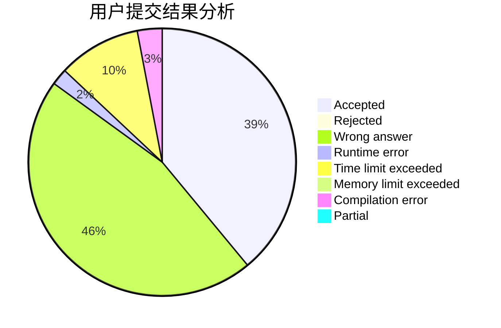
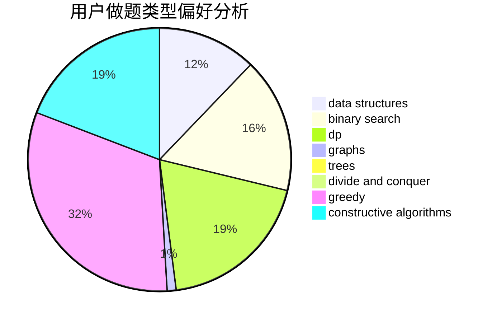
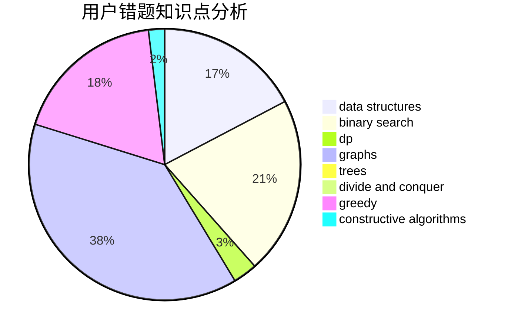

# ZZUPeanut

<!-- tabs:start -->

#### **用户提交结果分析**

#### **用户做题类型偏好分析**

#### **用户错题知识点分析**

<!-- tabs:end -->
# 推荐题目
[383A](https://codeforces.com/contest/383/problem/A)		data structures,
                        greedy		  
[1058C](https://codeforces.com/contest/1058/problem/C)		dsu,graphs,sortings,trees		  
[269D](https://codeforces.com/contest/269/problem/D)		data structures,
                        dp,
                        graphs,
                        sortings		  
[54A](https://codeforces.com/contest/54/problem/A)		implementation		  
[364D](https://codeforces.com/contest/364/problem/D)		brute force,
                        math,
                        probabilities		  
[1248D2](https://codeforces.com/contest/1248D/problem/2)		dsu,graphs,sortings,trees		  
[190E](https://codeforces.com/contest/190/problem/E)		data structures,
                        dsu,
                        graphs,
                        hashing,
                        sortings		  
[732F](https://codeforces.com/contest/732/problem/F)		dfs and similar,
                        graphs		  
[1409A](https://codeforces.com/contest/1409/problem/A)		greedy,
                        math		  
[1505C](https://codeforces.com/contest/1505/problem/C)		implementation		  
