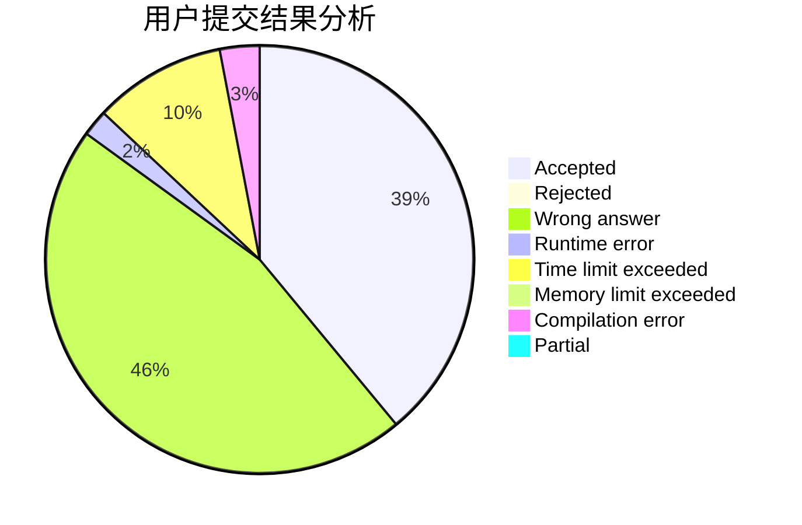
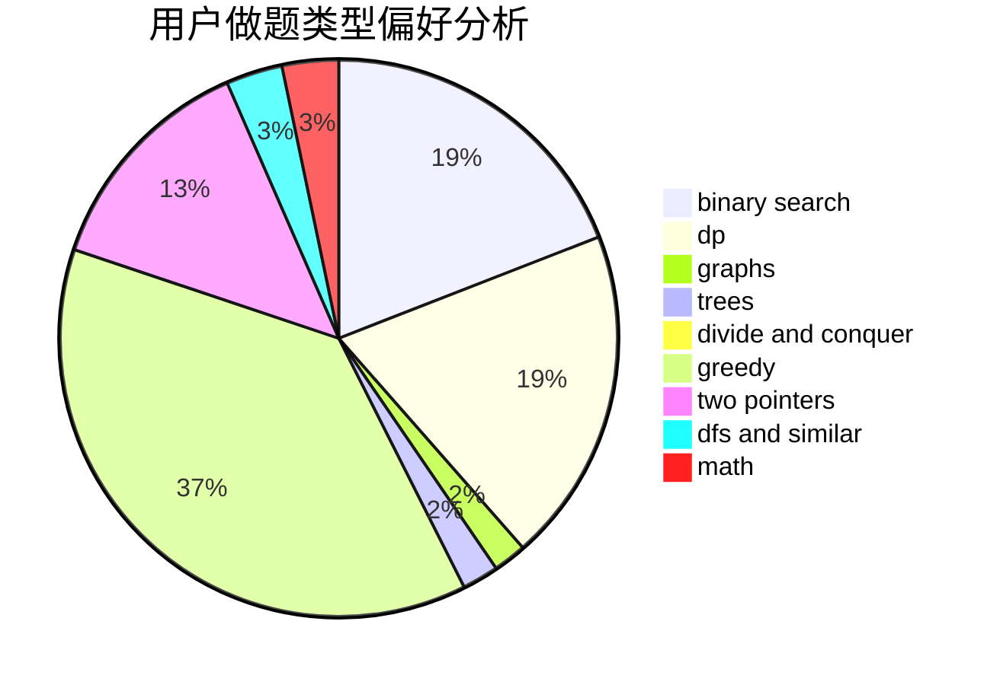

# ZZUPeanut

<!-- tabs:start -->

#### **用户提交结果分析**

#### **用户做题类型偏好分析**

<!-- tabs:end -->
# 推荐题目
[414B](https://codeforces.com/contest/414/problem/B)
[1059A](https://codeforces.com/contest/1059/problem/A)
[285E](https://codeforces.com/contest/285/problem/E)
[575A](https://codeforces.com/contest/575/problem/A)
[392A](https://codeforces.com/contest/392/problem/A)
[1252F](https://codeforces.com/contest/1252/problem/F)
[215E](https://codeforces.com/contest/215/problem/E)
[750E](https://codeforces.com/contest/750/problem/E)
[1419F](https://codeforces.com/contest/1419/problem/F)
[152D](https://codeforces.com/contest/152/problem/D)
